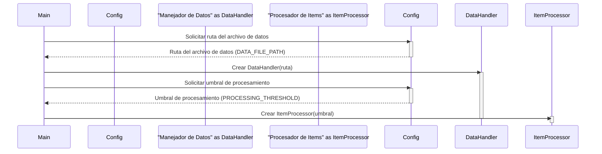

> Previously, we looked at [Clases y Objetos](01_clases-y-objetos.md).

# Chapter 5: Configuración de la Aplicación
Let's begin exploring this concept. El objetivo de este capítulo es entender cómo se maneja la configuración de la aplicación `20250704_1324_code-javascript-sample-project`, su importancia y cómo modificarla.
La configuración de una aplicación es como el panel de control de un coche.  Define cómo se comporta la aplicación en diferentes situaciones.  ¿Dónde busca los datos? ¿Cuál es el nivel de detalle que debe mostrar en los registros (logs)? ¿Qué valores umbral debe usar para procesar información? En lugar de cambiar el motor (el código fuente) cada vez que queremos ajustar algo, simplemente ajustamos el panel de control (la configuración).  Esto facilita mucho el mantenimiento y la adaptación de la aplicación a diferentes entornos.
En nuestro proyecto, la "Configuración de la Aplicación" es el componente que centraliza y gestiona todos estos parámetros globales.  Esto significa que, en lugar de tener estos valores "hardcodeados" (directamente escritos en el código), los definimos en un solo lugar. Esto permite:
*   **Facilidad de modificación:** Cambiar la configuración sin tocar el código.
*   **Control centralizado:**  Tener una visión clara de todos los parámetros configurables.
*   **Adaptabilidad:**  Ajustar la aplicación a diferentes entornos (desarrollo, pruebas, producción) fácilmente.
El archivo principal que contiene la configuración en nuestro proyecto es `config.js`. Examinemos algunos de sus componentes clave.
```javascript
// Copyright (C) 2025 Jozef Darida (LinkedIn/Xing)
//
// Este programa es software libre: puede redistribuirlo y/o modificarlo
// bajo los términos de la Licencia Pública General GNU publicada por
// la Free Software Foundation, ya sea la versión 3 de la Licencia, o
// (a su elección) cualquier versión posterior.
//
// Este programa se distribuye con la esperanza de que sea útil,
// pero SIN NINGUNA GARANTÍA; ni siquiera la garantía implícita de
// COMERCIABILIDAD o APTITUD PARA UN PROPÓSITO PARTICULAR. Consulte la
// Licencia Pública General GNU para obtener más detalles.
//
// Debería haber recibido una copia de la Licencia Pública General GNU
// junto con este programa. Si no, consulte <https://www.gnu.org/licenses/>.
/**
 * @file Configuration settings for the Sample Project.
 * This module stores configuration values used by other parts of the application.
 * @module config
 */
// --- Constants for Configuration ---
/**
 * Path to a data file (used by DataHandler).
 * @type {string}
 * @const
 */
export const DATA_FILE_PATH = "data/items.json";
/**
 * A processing parameter (used by ItemProcessor).
 * @type {number}
 * @const
 */
export const PROCESSING_THRESHOLD = 100;
/**
 * Example setting for logging level (could be used by main).
 * @type {string}
 * @const
 */
export const LOG_LEVEL = "INFO"; // In JS, this might map to console methods e.g. info, warn, error
/**
 * Returns the configured path for the data file.
 * @returns {string} The path string for the data file.
 */
export function getDataPath() {
    // In a real app, this might involve more complex logic,
    // like checking environment variables first.
    console.log(`Config: Providing data file path: ${DATA_FILE_PATH}`);
    return DATA_FILE_PATH;
}
/**
 * Returns the configured processing threshold.
 * @returns {number} The integer threshold value.
 */
export function getThreshold() {
    console.log(`Config: Providing processing threshold: ${PROCESSING_THRESHOLD}`);
    return PROCESSING_THRESHOLD;
}
// End of javascript_sample_project/config.js
```
En el código anterior, podemos observar:
*   **`DATA_FILE_PATH`**:  Define la ruta al archivo `JSON` que contiene los datos que nuestra aplicación va a procesar.  En este caso, apunta a `"data/items.json"`.
*   **`PROCESSING_THRESHOLD`**: Establece un umbral para el procesamiento de los items.  El `ItemProcessor` (que veremos en [Procesador de Items](07_procesador-de-items.md)) usará este valor.
*   **`LOG_LEVEL`**:  Indica el nivel de registro (logging) que la aplicación debe usar.  `"INFO"` significa que se mostrarán mensajes informativos, de advertencia y de error. Otros valores podrían ser `"DEBUG"`, `"WARNING"` o `"ERROR"`.  Esto influenciará lo que se muestra en la consola.
*   **`getDataPath()`**: Una función que devuelve la ruta configurada para el archivo de datos. Imprime en la consola un mensaje informativo. En una aplicación real, esta función podría incluir lógica más compleja, como leer la ruta desde una variable de entorno (environment variable).
*   **`getThreshold()`**: Una función que devuelve el umbral de procesamiento configurado. También imprime un mensaje informativo en la consola.
El diagrama siguiente ilustra cómo diferentes componentes de la aplicación podrían acceder a la configuración:

Este diagrama de secuencia muestra cómo el componente `Main` (orquestador principal) solicita la ruta del archivo de datos y el umbral de procesamiento al componente `Configuración`. Luego, utiliza esta información para crear instancias del `Manejador de Datos` y del `Procesador de Items`, respectivamente. Cada componente es activado y luego desactivado.
En la práctica, para usar la configuración, importarías el módulo `config.js` y accederías a las constantes o funciones. Por ejemplo, dentro del `Manejador de Datos` (que se describe en [Manejador de Datos](06_manejador-de-datos.md)), usarías algo como:
```javascript
import { DATA_FILE_PATH, getDataPath } from './config.js';
// ... dentro del manejador de datos ...
const filePath = getDataPath(); // O DATA_FILE_PATH
console.log("Usando archivo de datos: " + filePath);
```
Esto asegura que el `Manejador de Datos` siempre utilice la ruta configurada para el archivo, incluso si cambia en el futuro.
Es importante notar que esta configuración es estática.  Si necesitas una configuración más dinámica (por ejemplo, que se pueda modificar en tiempo de ejecución a través de una API), necesitarías implementar un mecanismo más sofisticado, como la lectura de variables de entorno o el uso de un archivo de configuración externo que se recargue automáticamente.
This concludes our look at this topic.

> Next, we will examine [Definición del Proyecto (package.json)](03_definición-del-proyecto-package.json.md).


---

*Generated by [SourceLens AI](https://github.com/openXFlow/sourceLensAI) using LLM: `gemini` (cloud) - model: `gemini-2.0-flash` | Language Profile: `Python`*