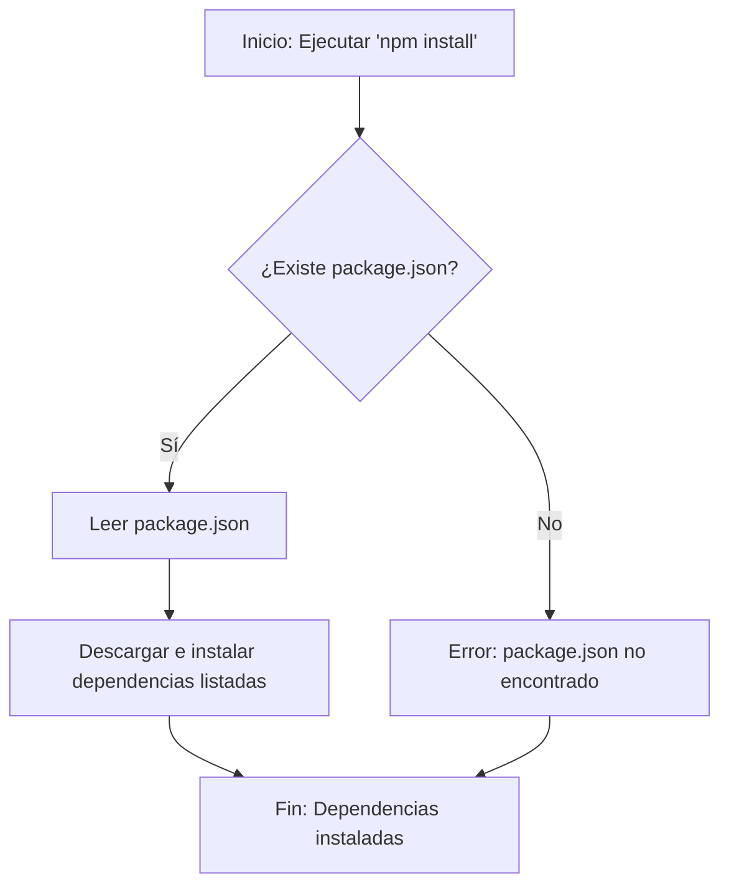

> Previously, we looked at [Configuración de la Aplicación](02_configuración-de-la-aplicación.md).

# Chapter 1: Definición del Proyecto (package.json)
¡Comencemos a explorar este concepto! El objetivo de este capítulo es entender el propósito y la estructura del archivo `package.json`, que es fundamental para cualquier proyecto de JavaScript moderno.
El archivo `package.json` es como el "carnet de identidad" de nuestro proyecto.  Imagina que estás construyendo una casa. Necesitas un plano, un registro de los materiales (ladrillos, cemento, madera) y las instrucciones de cómo ensamblar todo. El `package.json` cumple una función similar: describe tu proyecto, lista sus dependencias (las bibliotecas o módulos que necesita para funcionar) y define los scripts para ejecutar tareas comunes, como iniciar la aplicación o correr pruebas.  Sin él, sería muy difícil organizar, gestionar y compartir nuestro código.
**Conceptos Clave:**
*   **`name` (nombre):**  El nombre de tu proyecto. Debe ser único, especialmente si planeas publicarlo en un registro como npm (Node Package Manager). En nuestro caso, es `javascript-sample-project`.
*   **`version` (versión):** La versión actual del proyecto.  Sigue un esquema de versionamiento semántico (SemVer), típicamente `MAJOR.MINOR.PATCH` (por ejemplo, `1.0.0`).
*   **`description` (descripción):** Una breve descripción del proyecto. Ayuda a otros desarrolladores a entender de qué se trata.
*   **`main` (principal):** Especifica el punto de entrada de la aplicación. En nuestro caso, es `main.js`, lo que significa que este archivo se ejecutará cuando iniciemos el proyecto.
*   **`type` (tipo):** Define el tipo de módulo que utiliza el proyecto. Con `"type": "module"`, indicamos que estamos utilizando módulos ES (ES Modules), que permiten usar `import` y `export` para organizar nuestro código.
*   **`scripts` (scripts):**  Un objeto que define comandos que podemos ejecutar usando `npm run <nombre_del_script>`.  Por ejemplo, `"start": "node main.js"` significa que podemos iniciar la aplicación ejecutando `npm run start`. El script `"test"` generalmente se usa para ejecutar pruebas unitarias, pero en este ejemplo solo muestra un mensaje de error.
*   **`keywords` (palabras clave):** Una lista de palabras clave que describen el proyecto. Útil para la búsqueda en repositorios de paquetes.
*   **`author` (autor):**  El nombre del autor o autores del proyecto.
*   **`license` (licencia):** La licencia bajo la cual se distribuye el proyecto.  Indica las condiciones de uso, modificación y distribución del código.  `GPL-3.0-or-later` es una licencia de código abierto.
*   **`private` (privado):** Si se establece en `true`, impide que el proyecto se publique accidentalmente en un registro público como npm.
**Uso y Funcionamiento:**
El archivo `package.json` es utilizado principalmente por herramientas como npm (Node Package Manager) o yarn para gestionar las dependencias del proyecto, ejecutar scripts definidos y construir la aplicación. Cuando ejecutas `npm install`, npm lee el `package.json` para descargar e instalar todas las dependencias necesarias.
**Ejemplo de Código:**
```json
{
  "name": "javascript-sample-project",
  "version": "1.0.0",
  "description": "JavaScript equivalent of the Python sample project for SourceLens.",
  "main": "main.js",
  "type": "module",
  "scripts": {
    "start": "node main.js", // Inicia la aplicación ejecutando main.js con Node.js
    "test": "echo \"Error: no test specified\" && exit 1" // Muestra un error si intentas ejecutar pruebas
  },
  "keywords": [
    "sample",
    "javascript",
    "es6",
    "modules"
  ],
  "author": "SourceLens AI Generator",
  "license": "GPL-3.0-or-later",
  "private": true
}
```
**Diagrama de Flujo:**
Aquí hay un diagrama simple que ilustra cómo se utiliza el archivo `package.json` durante la instalación de dependencias:

Este diagrama muestra el flujo básico. El proceso comienza cuando se ejecuta el comando `npm install`. Si el archivo `package.json` existe, se lee para obtener la lista de dependencias. Luego, npm descarga e instala estas dependencias. Si el archivo no existe, se produce un error.
**Relaciones y Enlaces:**
Como mencionamos, `package.json` define el uso de módulos (`"type": "module"`). Para entender mejor cómo se importan y utilizan los módulos en este proyecto, consulta el [Importación de Módulos](02_importación-de-módulos.md).
This concludes our look at this topic.

> Next, we will examine [Importación de Módulos](04_importación-de-módulos.md).


---

*Generated by [SourceLens AI](https://github.com/openXFlow/sourceLensAI) using LLM: `gemini` (cloud) - model: `gemini-2.0-flash` | Language Profile: `Python`*