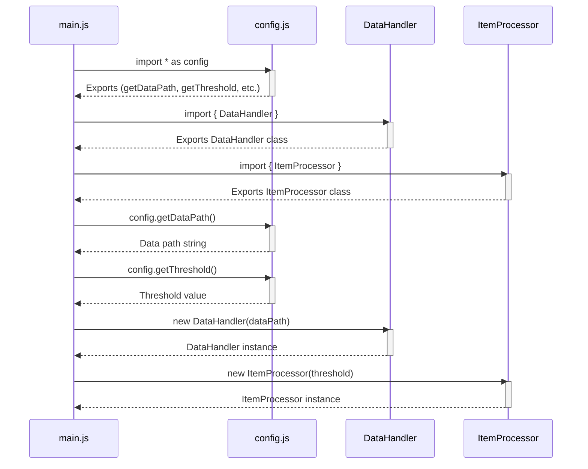

> Previously, we looked at [Definición del Proyecto (package.json)](03_definición-del-proyecto-package.json.md).

# Chapter 2: Importación de Módulos
Let's begin exploring this concept. El objetivo de este capítulo es entender cómo el proyecto `20250704_1324_code-javascript-sample-project` utiliza la declaración `import` para organizar el código en partes más pequeñas y reutilizables, llamadas módulos.
La importación de módulos es una técnica fundamental en la programación moderna.  Piénsalo como organizar las herramientas en tu taller.  En lugar de tener todas las herramientas desparramadas por todas partes, las guardas en cajas separadas (módulos) y las etiquetas claramente.  Cuando necesitas una herramienta específica, sabes exactamente en qué caja (módulo) buscarla.  En la programación, los módulos nos permiten organizar nuestro código, haciéndolo más fácil de entender, mantener y reutilizar.  Sin módulos, el código se vuelve rápidamente un caos inmanejable, como un taller sin organizar. Imagina tratar de encontrar la llave correcta en un llavero gigante sin etiquetas!
En este proyecto, usamos `import` para acceder al código que está definido en otros archivos.  Esto ayuda a dividir el proyecto en componentes más pequeños y enfocados.
**Conceptos Clave:**
*   **Módulo:** Un archivo que contiene código (funciones, clases, variables) con un propósito específico. En JavaScript, un módulo a menudo corresponde a un archivo `.js`.
*   **`import`:** La palabra clave utilizada para incluir el código de un módulo en otro archivo.  Piensa en `import` como el acto de "pedir prestado" una herramienta específica de otra caja en tu taller.
*   **`export`:** (Aunque no es el foco principal de *importación*, es esencial para entender cómo funciona `import`).  La palabra clave utilizada para hacer que el código de un módulo esté disponible para ser importado por otros módulos.  Es como etiquetar una herramienta en tu caja para que otros sepan que la pueden usar.
*   **`* as`:** Una forma de importar *todos* los *exports* de un módulo y agruparlos bajo un único nombre. Por ejemplo, `import * as config from './config.js';` importa todo lo que se *exporta* desde `config.js` y lo pone a disposición a través del objeto `config`.
*   **`{ ... }`:**  Usado para importar elementos específicos desde un módulo *export*ados individualmente. Por ejemplo, `import { DataHandler } from './dataHandler.js';` solo importa la clase `DataHandler` desde el módulo `dataHandler.js`.
**Uso / Cómo Funciona:**
El `import` nos permite utilizar las funciones, clases y variables definidas en otros módulos. La sintaxis básica es:
```javascript
import { nombreDelElemento } from './ruta/al/modulo.js';
```
O, para importar todos los elementos exportados bajo un nombre:
```javascript
import * as nombreDelModulo from './ruta/al/modulo.js';
```
Aquí, `'./ruta/al/modulo.js'` es la ruta al archivo que contiene el módulo que queremos importar. La ruta puede ser relativa (como en los ejemplos anteriores) o absoluta, dependiendo de la configuración del proyecto.  El `.js` al final *es requerido* en este proyecto.
**Ejemplos de Código:**
Veamos algunos ejemplos del proyecto `20250704_1324_code-javascript-sample-project`.
```javascript
// En dataHandler.js:
import { Item } from './item.js'; // Importa la clase Item desde item.js
```
```javascript
// En main.js:
import * as config from './config.js'; // Importa todo de config.js bajo el nombre 'config'
import { DataHandler } from './dataHandler.js'; // Importa DataHandler desde dataHandler.js
import { ItemProcessor } from './itemProcessor.js'; // Importa ItemProcessor desde itemProcessor.js
```
En `dataHandler.js`, importamos la clase `Item` directamente, lo que significa que podemos crear instancias de la clase `Item` dentro de `dataHandler.js`. El comentario dice: `// Assuming Item is in item.js in the same directory`, lo que significa que el archivo `item.js` debe estar en la misma carpeta que `dataHandler.js` para que la importación funcione.
En `main.js`, importamos todo el módulo `config.js` usando `* as config`. Esto crea un objeto llamado `config` que contiene todas las *exportaciones* de `config.js`.  Luego, importamos `DataHandler` e `ItemProcessor` directamente, lo que significa que podemos usar esos nombres directamente en `main.js`.
A continuación, un diagrama de secuencia simplificado que ilustra cómo `main.js` importa y utiliza los módulos `config.js`, `DataHandler` e `ItemProcessor`:

Este diagrama muestra cómo el archivo `main.js` depende de otros módulos (`config.js`, `DataHandler`, `ItemProcessor`). Cada flecha con la etiqueta "import" indica una relación de dependencia. Luego, `main.js` usa las funciones y clases importadas de estos módulos para realizar su tarea.
**Relaciones y Enlaces:**
Este concepto de importación de módulos es fundamental para entender cómo están organizados los componentes del proyecto.  Está directamente relacionado con [Definición del Proyecto (package.json)](01_definición-del-proyecto-package.json.md) porque `package.json` declara las dependencias del proyecto, y este capítulo muestra como estas dependencias se implementan en el código. También se relaciona con los capítulos sobre los componentes individuales como [Manejador de Datos](06_manejador-de-datos.md) y [Procesador de Items](07_procesador-de-items.md), ya que estos componentes son definidos en sus propios módulos y luego importados y utilizados en otras partes del proyecto.
This concludes our look at this topic.

> Next, we will examine [Manejador de Datos](05_manejador-de-datos.md).


---

*Generated by [SourceLens AI](https://github.com/openXFlow/sourceLensAI) using LLM: `gemini` (cloud) - model: `gemini-2.0-flash` | Language Profile: `Python`*