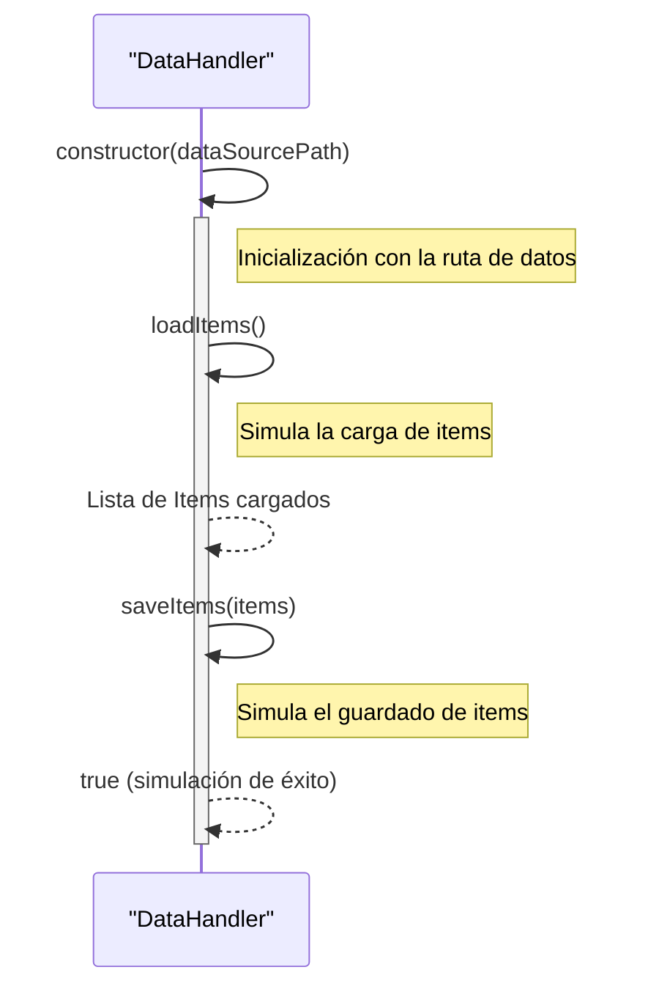

> Previously, we looked at [Importación de Módulos](04_importación-de-módulos.md).

# Chapter 6: Manejador de Datos
Let's begin exploring this concept. Este capítulo tiene como objetivo explicar el propósito y la funcionalidad del `Manejador de Datos` dentro de nuestro proyecto.  Aprenderemos cómo este componente se encarga de la carga y el guardado de información.
El `Manejador de Datos` es un componente crucial porque actúa como un intermediario entre nuestra aplicación y la fuente de datos (que en este caso está simulada). Imaginen que tienen una biblioteca llena de libros (nuestros datos).  En lugar de que cada persona (cada componente de la aplicación) vaya directamente a buscar los libros, hay un bibliotecario (`Manejador de Datos`).  Este bibliotecario sabe dónde encontrar los libros (cargar datos) y dónde guardarlos cuando terminamos de usarlos (guardar datos).  Esto simplifica mucho el trabajo de todos los demás y nos permite cambiar la forma en que almacenamos los datos (por ejemplo, de un archivo JSON a una base de datos) sin tener que cambiar el resto de la aplicación.
En nuestro caso, el `Manejador de Datos` simula la interacción con un archivo JSON. En una aplicación real, este componente podría interactuar con una API REST, una base de datos o cualquier otro tipo de almacenamiento de datos. La principal ventaja de esta abstracción es que el resto de la aplicación no necesita conocer los detalles de cómo se almacenan los datos; solo necesita saber cómo pedirle al `Manejador de Datos` que los cargue o los guarde.
El `Manejador de Datos` en nuestro proyecto tiene las siguientes partes principales:
*   **`_dataSourcePath`:** Una variable privada que guarda la ruta (o el identificador) de la fuente de datos. En nuestro ejemplo, es simplemente una cadena de texto.
*   **Constructor:** El método que se llama cuando creamos una nueva instancia del `Manejador de Datos`. Recibe la ruta de la fuente de datos como argumento y la guarda en la variable `_dataSourcePath`. También muestra un mensaje en la consola informando de la inicialización.
*   **`loadItems()`:** Un método que simula la carga de elementos desde la fuente de datos. En nuestro ejemplo, crea datos simulados directamente en el código, los transforma en objetos `Item` (ver [Modelo de Datos 'Item'](04_modelo-de-datos-item.md)), e informa cuántos items cargó. Maneja errores y valida la integridad de los datos.
*   **`saveItems()`:** Un método que simula el guardado de elementos en la fuente de datos.  En nuestro ejemplo, simplemente imprime mensajes en la consola mostrando los elementos que se están guardando. En una aplicación real, aquí se serializarían los objetos `Item` y se escribirían en la fuente de datos.
Ahora, veamos cómo funciona en la práctica. El `Manejador de Datos` se instancia con una ruta (simulada) a un archivo de datos. Luego, cuando la aplicación necesita datos, llama al método `loadItems()`. Cuando la aplicación ha procesado los datos y necesita guardarlos, llama al método `saveItems()`.
Aquí hay un fragmento de código del archivo `dataHandler.js` que muestra la clase `DataHandler`:
```javascript
/**
 * Manages loading and saving Item data.
 * In this simple example, it simulates these operations.
 */
export class DataHandler {
    /**
     * The path to the data source.
     * @type {string}
     * @private
     */
    _dataSourcePath;
    /**
     * Initializes the DataHandler with the path to the data source.
     * @param {string} dataSourcePath - The configured path to the data source.
     */
    constructor(dataSourcePath) {
        this._dataSourcePath = dataSourcePath;
        console.info(`DataHandler initialized for source: ${this._dataSourcePath}`);
    }
    /**
     * Simulates loading items from the data source.
     * @returns {Item[]} A list of Item objects.
     */
    loadItems() {
        console.info(`Simulating loading items from ${this._dataSourcePath}...`);
        // ... (Lógica de carga simulada) ...
    }
    /**
     * Simulates saving processed items back to the data source.
     * @param {Item[]} items - A list of Item objects to save.
     * @returns {boolean} True if saving was simulated successfully.
     */
    saveItems(items) {
        console.info(`Simulating saving ${items.length} items to ${this._dataSourcePath}...`);
        // ... (Lógica de guardado simulada) ...
    }
}
```
El siguiente diagrama de secuencia ilustra cómo el `Manejador de Datos` interactúa con otros componentes (aunque aquí solo se representa a sí mismo para simplificar).

Este diagrama muestra el flujo básico de la interacción con el `DataHandler`: primero se inicializa, luego se cargan los items, y finalmente, se guardan los items.
La configuración de la ruta de datos se realiza en el capítulo de [Configuración de la Aplicación](05_configuración-de-la-aplicación.md).  El `Manejador de Datos` utiliza la clase `Item` definida en [Modelo de Datos 'Item'](04_modelo-de-datos-item.md) para representar los datos. El `Procesador de Items` (capítulo siguiente: [Procesador de Items](07_procesador-de-items.md)) utiliza el `Manejador de Datos` para cargar y guardar los items. El [Orquestador Principal (Main)](08_orquestador-principal-main.md) coordina estas acciones.
En resumen, el `Manejador de Datos` es un componente fundamental para aislar la lógica de acceso a datos del resto de la aplicación, facilitando el mantenimiento y la extensibilidad del código.
This concludes our look at this topic.

> Next, we will examine [Modelo de Datos 'Item'](06_modelo-de-datos-item.md).


---

*Generated by [SourceLens AI](https://github.com/openXFlow/sourceLensAI) using LLM: `gemini` (cloud) - model: `gemini-2.0-flash` | Language Profile: `Python`*