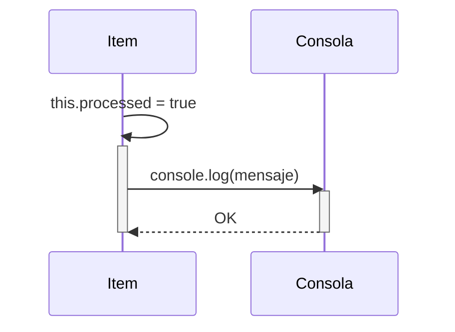

> Previously, we looked at [Manejador de Datos](05_manejador-de-datos.md).

# Chapter 4: Modelo de Datos 'Item'
Let's begin exploring this concept. In this capítulo, definiremos el modelo de datos `Item`, que es una pieza fundamental de nuestra aplicación. El objetivo principal es entender cómo se representa un item individual dentro del sistema y cómo interactuamos con él.
**Motivación y Propósito**
¿Por qué necesitamos un modelo de datos para `Item`? Imagina que estás organizando una lista de tareas. Cada tarea tiene un nombre, una descripción, una prioridad, y un estado (ej: pendiente, en progreso, completada). El modelo de datos `Item` es como una plantilla para cada una de esas tareas.  Nos permite definir de forma consistente qué información necesitamos almacenar para cada item que nuestra aplicación procesa.  Sin un modelo, la información estaría dispersa y sería difícil trabajar con ella. El modelo de datos `Item` provee estructura y facilita la manipulación de la información.
**Conceptos Clave**
El modelo `Item` en nuestro proyecto tiene los siguientes atributos principales:
*   **`itemId`:** Un identificador único para cada item. Piensa en ello como el número de identificación de un producto.
*   **`name`:** El nombre del item, por ejemplo, "Procesar Archivo A".
*   **`value`:** Un valor numérico asociado con el item. Podría representar el tamaño de un archivo, la cantidad de un producto, etc.
*   **`processed`:** Una bandera (booleano) que indica si el item ya ha sido procesado o no.  `true` significa que ya se procesó, `false` significa que aún está pendiente.
Además de estos atributos, el modelo `Item` también incluye un método importante:
*   **`markAsProcessed()`:** Este método cambia el estado del item a "procesado", estableciendo la bandera `processed` a `true`.
**Uso / Cómo Funciona**
El modelo `Item` se utiliza para crear objetos que representan los items individuales que nuestra aplicación necesita procesar. Cada vez que nuestra aplicación recibe un nuevo item, se crea una instancia del modelo `Item` con la información relevante (ID, nombre, valor).  Luego, el item es procesado, y finalmente, se llama al método `markAsProcessed()` para indicar que el item ha sido completado.
**Ejemplo de Código**
Aquí hay un fragmento del código que define la clase `Item`:
```javascript
/**
 * Represents a single data item to be processed.
 */
export class Item {
    /**
     * Constructs an Item object.
     * @param {number} itemId - A unique integer identifier for the item.
     * @param {string} name - The name of the item.
     * @param {number} value - A numerical value associated with the item.
     */
    constructor(itemId, name, value) {
        this.itemId = itemId;
        this.name = name;
        this.value = value;
        this.processed = false; // Valor predeterminado
    }
    /**
     * Sets the processed flag to True.
     * This method updates the item's state to indicate that it has
     * undergone processing.
     */
    markAsProcessed() {
        console.log(`Model Item ${this.itemId}: Marking '${this.name}' as processed.`);
        this.processed = true;
    }
}
```
**Diagrama de Secuencia (Opcional)**
El siguiente diagrama de secuencia muestra el flujo básico cuando un item es marcado como procesado:

El diagrama ilustra cómo el método `markAsProcessed` del objeto `Item` actualiza su estado interno (`this.processed = true`) y luego envía un mensaje a la Consola para registrar la acción.
**Relaciones y Referencias**
Este modelo `Item` es utilizado por el [Manejador de Datos](06_manejador-de-datos.md) y el [Procesador de Items](07_procesador-de-items.md) para interactuar con los datos. Su definición es crucial para el funcionamiento correcto de la [Configuración de la Aplicación](05_configuración-de-la-aplicación.md).
**Conclusión**
En este capítulo, hemos definido el modelo de datos `Item`, que es la base para representar y manipular los datos en nuestra aplicación. Hemos visto sus atributos, su método principal (`markAsProcessed()`), y cómo se utiliza en el contexto general del proyecto. Este modelo proporciona una estructura consistente y facilita el procesamiento de la información. This concludes our look at this topic.

> Next, we will examine [Orquestador Principal (Main)](07_orquestador-principal-main.md).


---

*Generated by [SourceLens AI](https://github.com/openXFlow/sourceLensAI) using LLM: `gemini` (cloud) - model: `gemini-2.0-flash` | Language Profile: `Python`*