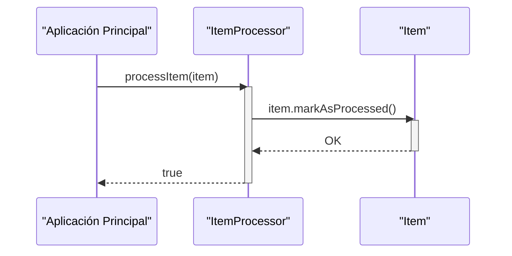

> Previously, we looked at [Orquestador Principal (Main)](07_orquestador-principal-main.md).

# Chapter 7: Procesador de Items
Let's begin exploring this concept. Este capítulo se centra en el `Procesador de Items`, un componente clave responsable de aplicar la lógica de negocio a los elementos individuales dentro de nuestro proyecto. El objetivo es entender su función, cómo se configura y cómo interactúa con los otros componentes.
¿Por qué necesitamos un `Procesador de Items`? Imaginen una fábrica donde cada producto (Item) necesita pasar por una inspección antes de ser enviado. El `Procesador de Items` es como esa estación de inspección. Recibe el producto, evalúa si cumple con ciertos criterios (basados en un umbral o *threshold*), y luego lo marca como "inspeccionado" (procesado). En términos más técnicos, este componente implementa una transformación de datos, aplicando reglas y marcando cada `Item` como completado. Sin este componente, no podríamos asegurar que nuestros `Items` sean procesados correctamente antes de ser utilizados por otros componentes.
El `Procesador de Items` tiene dos partes fundamentales:
1.  **El Umbral (Threshold):** Un valor numérico que se utiliza como referencia para la toma de decisiones durante el procesamiento del `Item`. Este umbral se establece al crear una instancia del `ItemProcessor`.
2.  **La Lógica de Procesamiento:** La función `processItem` que evalúa las propiedades de un `Item` en relación al umbral y realiza acciones específicas. En nuestro caso, simplemente muestra mensajes informativos, pero podría incluir transformaciones más complejas en el futuro. También marca el `Item` como procesado.
A continuación, se muestra el código del `itemProcessor.js`:
```javascript
// Copyright (C) 2025 Jozef Darida (LinkedIn/Xing)
//
// This program is free software: you can redistribute it and/or modify
// it under the terms of the GNU General Public License as published by
// the Free Software Foundation, either version 3 of the License, or
// (at your option) any later version.
//
// This program is distributed in the hope that it will be useful,
// but WITHOUT ANY WARRANTY; without even the implied warranty of
// MERCHANTABILITY or FITNESS FOR A PARTICULAR PURPOSE. See the
// GNU General Public License for more details.
//
// You should have received a copy of the GNU General Public License
// along with this program. If not, see <https://www.gnu.org/licenses/>.
/**
 * @file Contains the logic for processing Item objects.
 * @module itemProcessor
 */
import { Item } from './item.js'; // Assuming Item is in item.js
/**
 * Processes individual Item objects based on configured rules.
 */
export class ItemProcessor {
    /**
     * The numerical threshold used in processing.
     * @type {number}
     * @private
     */
    _threshold;
    /**
     * Initializes the ItemProcessor with a processing threshold.
     * @param {number} threshold - The numerical threshold.
     */
    constructor(threshold) {
        this._threshold = threshold;
        console.info(`ItemProcessor initialized with threshold: ${this._threshold}`);
    }
    /**
     * Processes a single item.
     * Marks the item as processed and applies logic based on the threshold.
     * @param {Item} item - The Item object to process.
     * @returns {boolean} True if processing was successful, False otherwise.
     */
    processItem(item) {
        if (!(item instanceof Item)) {
            console.error(`Invalid object passed to processItem. Expected Item, got ${item ? item.constructor.name : typeof item}.`);
            return false;
        }
        console.debug(`Processing item ID: ${item.itemId}, Name: '${item.name}', Value: ${item.value.toFixed(2)}`);
        if (item.value > this._threshold) {
            console.info(`Item '${item.name}' (ID: ${item.itemId}) value ${item.value.toFixed(2)} exceeds threshold ${this._threshold}.`);
        } else {
            console.info(`Item '${item.name}' (ID: ${item.itemId}) value ${item.value.toFixed(2)} is within threshold ${this._threshold}.`);
        }
        item.markAsProcessed();
        return true;
    }
}
// End of javascript_sample_project/itemProcessor.js
```
Para usar el `ItemProcessor`, primero necesitamos crear una instancia, proporcionando el valor del umbral.  Luego, podemos llamar a la función `processItem` pasando un objeto `Item` como argumento.
```javascript
// Ejemplo de uso del ItemProcessor
import { ItemProcessor } from './itemProcessor.js';
import { Item } from './item.js';
// Creamos un ItemProcessor con un umbral de 10
const itemProcessor = new ItemProcessor(10);
// Creamos un Item
const item = new Item(1, "Producto A", 12);
// Procesamos el Item
const resultado = itemProcessor.processItem(item);
// Verificamos el resultado
if (resultado) {
    console.log("Item procesado correctamente."); // Item processed correctly
} else {
    console.error("Error al procesar el Item."); // Error processing Item
}
```
El siguiente diagrama de secuencia ilustra cómo se procesa un `Item`:

Este diagrama muestra la interacción básica: la aplicación principal llama al `ItemProcessor` para procesar un `Item`. El `ItemProcessor` a su vez llama al método `markAsProcessed` del `Item` para marcarlo como procesado y luego regresa `true` a la aplicación indicando que el proceso fue exitoso.
El `Procesador de Items` depende del [Modelo de Datos 'Item'](04_modelo-de-datos-item.md) ya que opera directamente sobre objetos `Item`.  Además, el umbral de procesamiento se define en la [Configuración de la Aplicación](05_configuración-de-la-aplicación.md). Finalmente, el [Orquestador Principal (Main)](08_orquestador-principal-main.md) utiliza el `ItemProcessor` para procesar los Items.
This concludes our look at this topic.

> Next, we will examine [Architecture Diagrams](09_diagrams.md).


---

*Generated by [SourceLens AI](https://github.com/openXFlow/sourceLensAI) using LLM: `gemini` (cloud) - model: `gemini-2.0-flash` | Language Profile: `Python`*