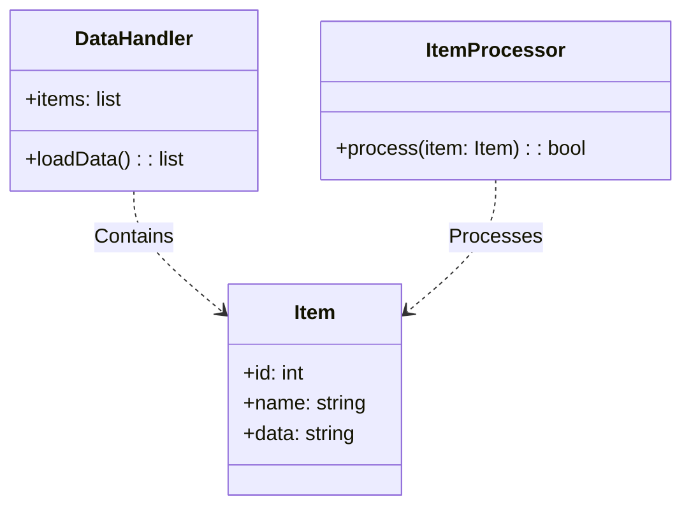
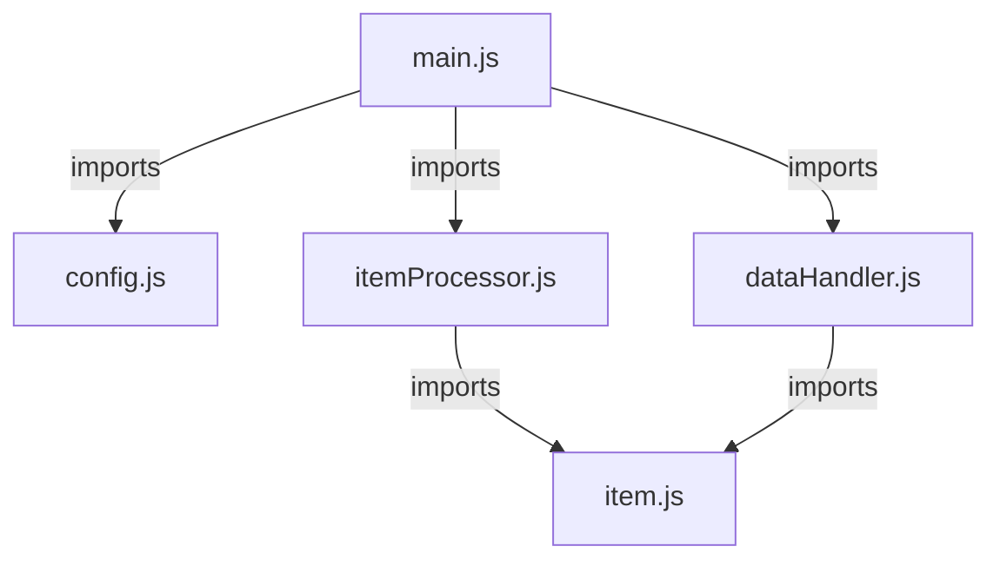
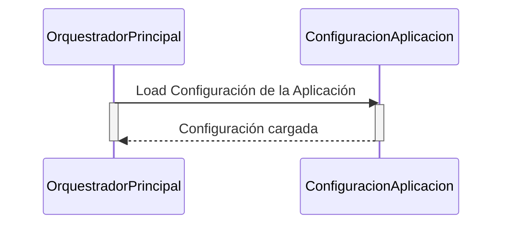
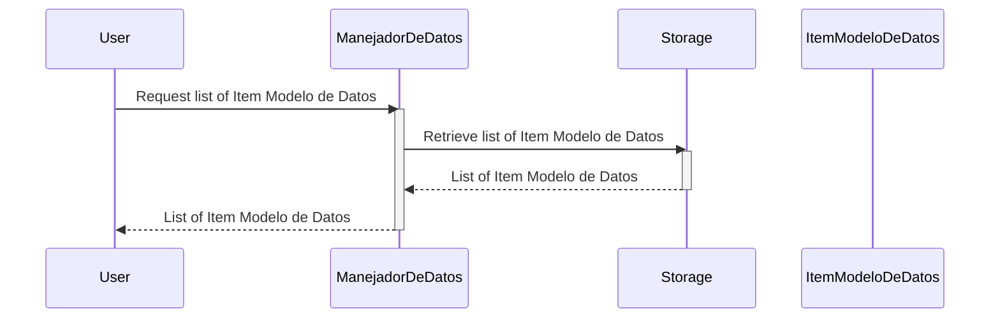
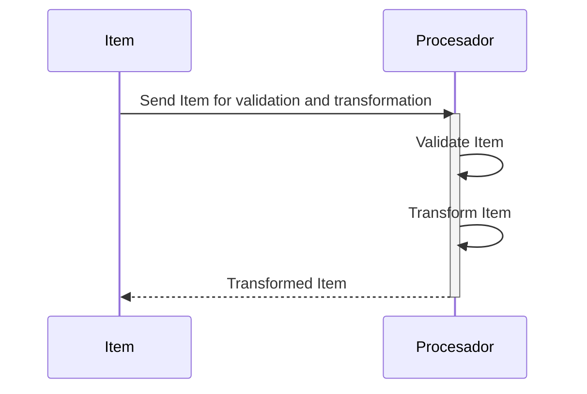
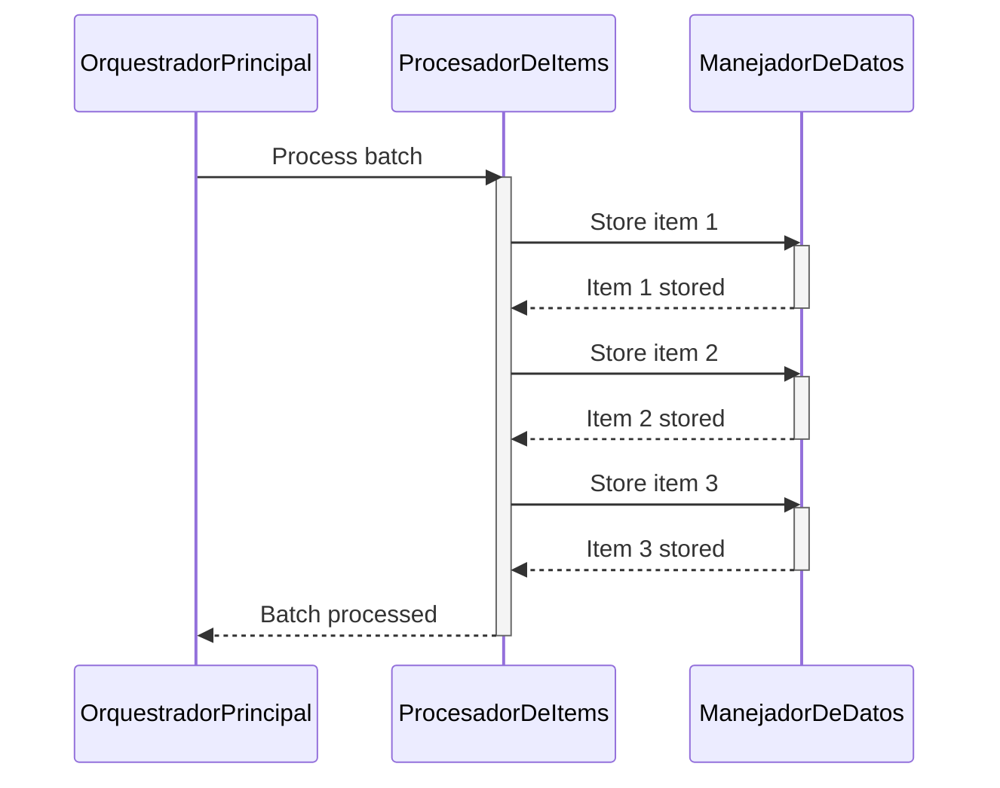
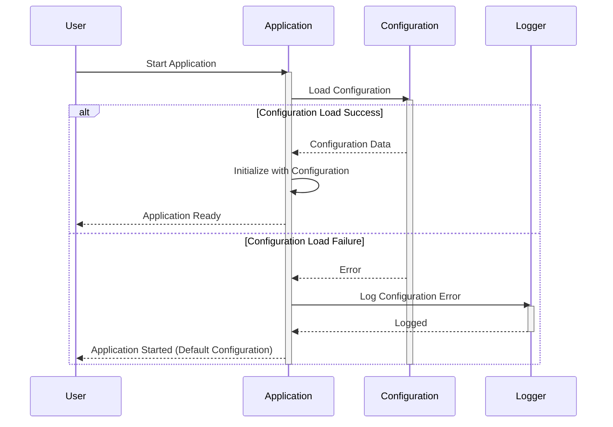

> Previously, we looked at [Procesador de Items](08_procesador-de-items.md).

# Architecture Diagrams
## Class Diagram
Key classes and their relationships in **20250704_1324_code-javascript-sample-project**.

## Package Dependencies
High-level module and package structure of **20250704_1324_code-javascript-sample-project**.

## Sequence Diagrams
These diagrams illustrate various interaction scenarios, showcasing operations between components for specific use cases.
### The Orquestrador Principal initiates the application by loading the Configuración de la Aplicación.

### The Manejador de Datos retrieves a list of 'Item' Modelo de Datos from storage.

### The Procesador de Items validates and transforms an 'Item' Modelo de Datos.

### The Orquestrador Principal processes a batch of items using the Procesador de Items and stores them with the Manejador de Datos.

### The application gracefully handles a failure in loading configuration from the Configuración de la Aplicación.

> Next, we will examine [Code Inventory](10_code_inventory.md).

---

*Generated by [SourceLens AI](https://github.com/openXFlow/sourceLensAI) using LLM: `gemini` (cloud) - model: `gemini-2.0-flash` | Language Profile: `Python`*