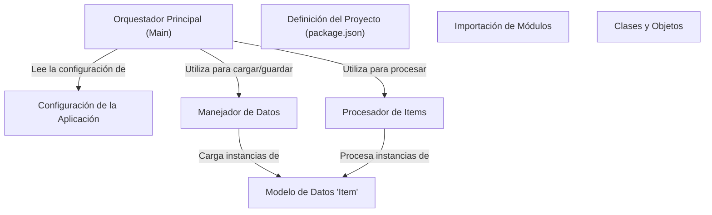

# Tutorial: 20250704_1324_code-javascript-sample-project

Este proyecto procesa elementos de datos cargándolos, transformándolos y guardándolos. La **Configuración de la Aplicación** define parámetros como rutas de archivos y umbrales. El *Orquestador Principal* usa estos parámetros para coordinar el *Manejador de Datos* y el *Procesador de Items*, permitiendo la ejecución del flujo principal de la aplicación.

**Source Directory:** `C:\_jd_programming\python\11_sourceLens_project\sourceLens\tests\javascript_sample_project`

## Abstraction Relationships

## Chapters

1. [Clases y Objetos](01_clases-y-objetos.md)
2. [Configuración de la Aplicación](02_configuración-de-la-aplicación.md)
3. [Definición del Proyecto (package.json)](03_definición-del-proyecto-package.json.md)
4. [Importación de Módulos](04_importación-de-módulos.md)
5. [Manejador de Datos](05_manejador-de-datos.md)
6. [Modelo de Datos 'Item'](06_modelo-de-datos-item.md)
7. [Orquestador Principal (Main)](07_orquestador-principal-main.md)
8. [Procesador de Items](08_procesador-de-items.md)
9. [Architecture Diagrams](09_diagrams.md)
10. [Code Inventory](10_code_inventory.md)
11. [Project Review](11_project_review.md)

---

*Generated by [SourceLens AI](https://github.com/openXFlow/sourceLensAI) using LLM: `gemini` (cloud) - model: `gemini-2.0-flash` | Language Profile: `Python`*