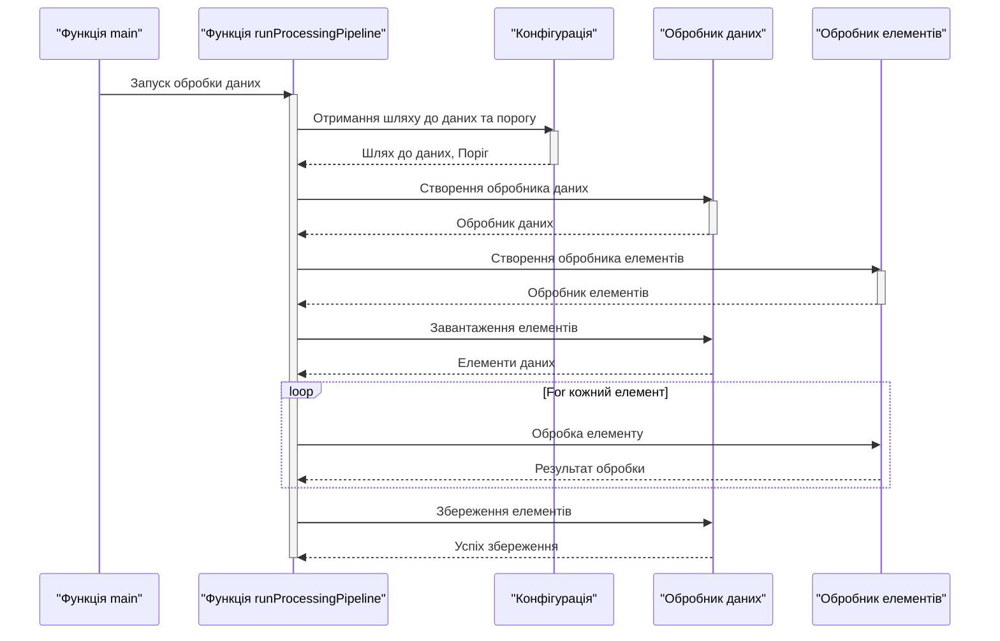

> Previously, we looked at the [Project Overview](index.md).

# Chapter 1: Запуск та ініціалізація програми
Let's begin exploring this concept. У цьому розділі ми детально розглянемо процес запуску та ініціалізації програми `20250704_1326_code-go-sample-project`. Нашою метою є зрозуміти, як програма починає свою роботу, які компоненти ініціалізуються першими та як це впливає на подальший процес обробки даних.
Чому це важливо? Уявіть собі двигун автомобіля. Без правильного запуску та ініціалізації, жодна інша частина автомобіля не зможе працювати належним чином. Так само і з програмним забезпеченням. Фаза запуску та ініціалізації задає тон для всієї програми, визначаючи, як будуть завантажені дані, налаштовані параметри та координуватись різні компоненти. Цей етап гарантує, що всі необхідні ресурси доступні та готові до роботи, дозволяючи програмі виконувати свої функції ефективно та без помилок.
Ключовим поняттям тут є точка входу в програму, тобто функція `main`. Саме з цієї функції починається виконання будь-якої Go програми. Вона відповідає за:
*   **Запуск основного потоку:**  Функція `main` запускає основний потік обробки даних, координуючи виконання програми.
*   **Ініціалізацію компонентів:**  Вона ініціалізує необхідні компоненти програми, такі як обробники даних, обробники елементів та інші сервіси.
*   **Налаштування конфігурації:**  Функція `main` може завантажувати та застосовувати конфігураційні параметри, які впливають на роботу програми.
Тепер розглянемо, як це працює на практиці. У файлі `main.go` знаходиться функція `main`, яка і є точкою входу. Вона викликає функцію `runProcessingPipeline`, яка відповідає за основний потік обробки даних.
```go
// tests/sample_project2/main.go
package main
import (
	"log"
	"sourcelens/sampleproject2/config"
	"sourcelens/sampleproject2/datahandler"
	"sourcelens/sampleproject2/itemprocessor"
)
// runProcessingPipeline executes the main data processing logic.
// runProcessingPipeline виконує основну логіку обробки даних.
func runProcessingPipeline() {
	log.Println("Starting Sample Project 2 processing pipeline...")
	// 1. Initialize components using configuration
	// 1. Ініціалізація компонентів на основі конфігурації
	dataPath := config.GetDataPath()
	threshold := config.GetThreshold()
	dh := datahandler.NewDataHandler(dataPath)
	ip := itemprocessor.NewItemProcessor(threshold)
	// 2. Load data
	// 2. Завантаження даних
	itemsToProcess, err := dh.LoadItems()
	if err != nil {
		log.Fatalf("Failed to load items: %v", err)
	}
	if len(itemsToProcess) == 0 {
		log.Println("No items loaded. Exiting pipeline.")
		return
	}
	log.Printf("Successfully loaded %d items.", len(itemsToProcess))
	// 3. Process data items
	// 3. Обробка елементів даних
	for i := range itemsToProcess {
		item := &itemsToProcess[i] // Get a pointer to the item in the slice
		// Отримання вказівника на елемент у зрізі
		log.Printf("Passing item to processor: %s", item.String())
		_, err := ip.ProcessItem(item)
		if err != nil {
			log.Printf("Failed to process item %d: %v", item.ItemID, err)
		}
	}
	// 4. Save processed data
	// 4. Збереження оброблених даних
	saveSuccess, err := dh.SaveItems(itemsToProcess)
	if err != nil {
		log.Fatalf("Error during save operation: %v", err)
	}
	if saveSuccess {
		log.Println("Processed items saved successfully.")
	} else {
		log.Println("Failed to save processed items.")
	}
	log.Println("Sample Project 2 processing pipeline finished.")
}
func main() {
	// In a real app, you would configure the logger here based on config.GetLogLevel()
	// У реальному додатку тут можна було б налаштувати logger на основі config.GetLogLevel()
	runProcessingPipeline()
}
```
Розглянемо цей код покроково:
1.  **Імпорт пакетів:** Програма імпортує необхідні пакети, такі як `log` для ведення журналів, `config` для отримання конфігурації, `datahandler` для обробки даних та `itemprocessor` для обробки елементів.
2.  **Функція `runProcessingPipeline`:** Ця функція містить основну логіку обробки даних.
    *   **Ініціалізація компонентів:**  Отримує шлях до даних та поріг з конфігурації та створює екземпляри `DataHandler` та `ItemProcessor`.
    *   **Завантаження даних:** Завантажує елементи даних за допомогою `DataHandler`.
    *   **Обробка елементів:** Перебирає елементи та обробляє кожен з них за допомогою `ItemProcessor`.
    *   **Збереження даних:** Зберігає оброблені дані за допомогою `DataHandler`.
3.  **Функція `main`:** Викликає функцію `runProcessingPipeline` для запуску основного потоку обробки.
Цей процес можна візуалізувати за допомогою наступної діаграми:

Ця діаграма показує послідовність викликів функцій та взаємодію між компонентами під час запуску та ініціалізації програми.
У цьому розділі ми зосередилися на точці входу програми та процесі ініціалізації. Щоб дізнатися більше про конфігурацію, перейдіть до розділу [Конфігурація](02_конфігурація.md).
This concludes our look at this topic.

> Next, we will examine [Конфігурація](02_конфігурація.md).


---

*Generated by [SourceLens AI](https://github.com/openXFlow/sourceLensAI) using LLM: `gemini` (cloud) - model: `gemini-2.0-flash` | Language Profile: `Python`*