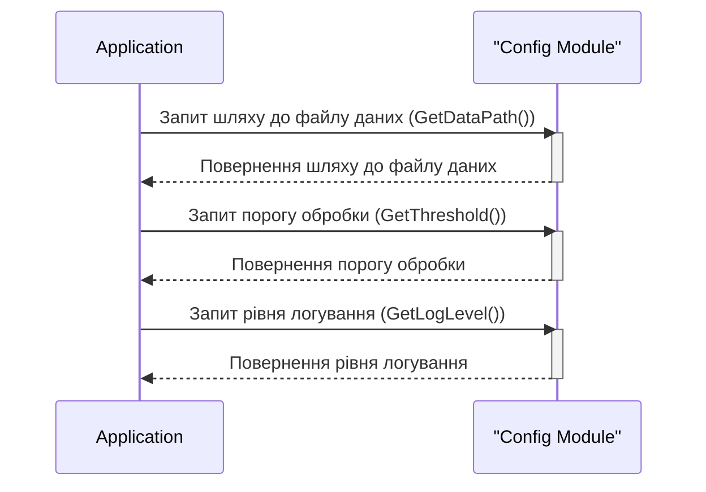

> Previously, we looked at [Запуск та ініціалізація програми](01_запуск-та-ініціалізація-програми.md).

# Chapter 2: Конфігурація
Let's begin exploring this concept. У цьому розділі ми розглянемо, як працює конфігурація у нашому проєкті, та навчимося отримувати доступ до конфігураційних параметрів. Наша мета – зрозуміти, як централізовано керувати налаштуваннями програми.
Концепція конфігурації існує для того, щоб дозволити нам змінювати поведінку програми без необхідності змінювати її код.  Уявіть собі, що у вас є автомобіль. Конфігурація – це як панель управління з налаштуваннями: ви можете регулювати гучність радіо, налаштовувати дзеркала або змінювати режим освітлення. Все це впливає на роботу автомобіля, але не вимагає розбирання двигуна. В нашому проєкті, конфігурація дозволяє нам вказувати шлях до файлу даних, задавати поріг обробки даних та визначати рівень логування. Це робить наш код більш гнучким та адаптованим до різних середовищ та потреб. Без конфігурації, кожну зміну параметрів програми довелося б вносити безпосередньо в код, що ускладнює підтримку та розширення.
Ключові концепції:
*   **Конфігураційні параметри:** Це змінні, які впливають на поведінку програми. В нашому випадку це `dataFilePath`, `processingThreshold` та `logLevel`.
*   **Централізоване управління:**  Всі конфігураційні параметри зберігаються в одному місці (у файлі `config/config.go`), що полегшує їх зміну та відстеження.
*   **Абстрагування:** Код, який використовує конфігурацію, не повинен знати, *як* зберігаються конфігураційні параметри, він лише повинен знати, *як* їх отримати.  В нашому випадку, ми використовуємо функції `GetDataPath()`, `GetThreshold()` та `GetLogLevel()` для отримання конфігураційних значень.
Як це працює:
1.  Ми визначаємо конфігураційні параметри у файлі `config/config.go`.
2.  Для кожного параметру ми створюємо функцію, яка повертає значення цього параметра. Ці функції забезпечують доступ до конфігураційних значень з інших частин програми.
3.  Інші частини програми викликають ці функції, щоб отримати значення конфігураційних параметрів і використовувати їх для налаштування своєї поведінки.
Ось приклад коду з файлу `config/config.go`:
```go
--- File: config/config.go ---
package config
import "fmt"
// Constants for Configuration (un-exported)
const (
	dataFilePath       = "data/items.json" // Шлях до файлу з даними
	processingThreshold = 100           // Поріг обробки
	logLevel           = "INFO"            // Рівень логування
)
// GetDataPath returns the configured path for the data file.
func GetDataPath() string {
	fmt.Printf("Config: Providing data file path: %s\n", dataFilePath) // Виводимо шлях до файлу даних у консоль
	return dataFilePath
}
// GetThreshold returns the configured processing threshold.
func GetThreshold() int {
	fmt.Printf("Config: Providing processing threshold: %d\n", processingThreshold) // Виводимо поріг обробки у консоль
	return processingThreshold
}
// GetLogLevel returns the configured logging level.
func GetLogLevel() string {
    return logLevel
}
```
Цей код демонструє, як ми визначаємо конфігураційні параметри як константи та створюємо функції для їх отримання. Функції `GetDataPath()`, `GetThreshold()` та `GetLogLevel()`  виводять значення параметрів в консоль (для відладки), а потім повертають їх.
Нижче наведено просту діаграму, яка демонструє потік запиту конфігурації:

Діаграма показує, як додаток взаємодіє з модулем конфігурації, щоб отримати значення різних конфігураційних параметрів. Додаток робить запит до модуля конфігурації, а модуль конфігурації повертає відповідне значення.
Конфігурація відіграє важливу роль у багатьох інших частинах нашого проєкту. Наприклад, [Обробник даних](04_обробник-даних.md) використовує поріг обробки, отриманий з конфігурації.  Також, зверніться до [Запуск та ініціалізація програми](01_запуск-та-ініціалізація-програми.md) щоб побачити як конфігураційні параметри використовуються на самому початку виконання програми.
This concludes our look at this topic.

> Next, we will examine [Модель даних 'Елемент'](03_модель-даних-елемент.md).


---

*Generated by [SourceLens AI](https://github.com/openXFlow/sourceLensAI) using LLM: `gemini` (cloud) - model: `gemini-2.0-flash` | Language Profile: `Python`*