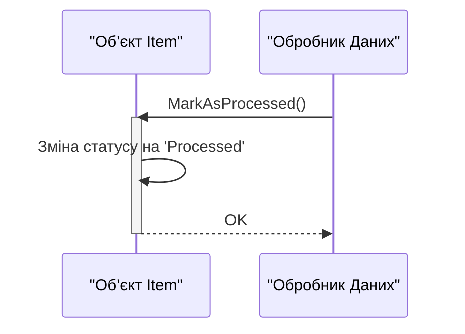

> Previously, we looked at [Конфігурація](02_конфігурація.md).

# Chapter 3: Модель даних 'Елемент'
Let's begin exploring this concept. У цьому розділі ми розглянемо модель даних 'Елемент', яка є фундаментальною для роботи нашої програми. Мета цього розділу – зрозуміти структуру даних, яку ми використовуємо для представлення елементів, що підлягають обробці, а також її методи.
Чому нам потрібна модель даних 'Елемент'? Уявіть собі, що ви працюєте на конвеєрі, де кожен об'єкт потребує певного набору характеристик (ID, назва, вартість, статус). Модель 'Елемент' – це як специфікація для кожного об'єкта на цьому конвеєрі. Вона забезпечує стандартизований спосіб представлення даних, що дозволяє легко обробляти їх у програмі. Без чіткої моделі даних код стає важким для читання, підтримки та розширення.
Модель даних 'Елемент' складається з наступних полів:
*   `ItemID` (int): Унікальний ідентифікатор елемента.
*   `Name` (string): Назва елемента.
*   `Value` (float64): Значення елемента.
*   `Processed` (bool): Булеве значення, що вказує, чи був елемент оброблений.
Ось відповідна структура `Item` у коді Go:
```go
// tests/sample_project2/models/item.go
package models
import "fmt"
// Item represents a single data item to be processed.
type Item struct {
	ItemID    int
	Name      string
	Value     float64
	Processed bool
}
```
У Go структура (struct) – це спосіб групування різних полів в один тип даних. У нашому випадку `Item` є структурою, яка містить поля, описані вище.  Зверніть увагу на коментар `// Item represents a single data item to be processed.`. Це опис структури, який допомагає зрозуміти її призначення.  Важливо додавати коментарі до коду, щоб зробити його більш зрозумілим.
Для створення нового елемента використовується конструктор `NewItem`:
```go
// NewItem is a constructor for the Item struct.
func NewItem(id int, name string, value float64) *Item {
	return &Item{
		ItemID:    id,
		Name:      name,
		Value:     value,
		Processed: false, // Default value
	}
}
```
Конструктор `NewItem` приймає ID, назву та значення як аргументи та повертає вказівник на новий об'єкт `Item`.  Він також встановлює поле `Processed` у значення `false` за замовчуванням. Вказівник (`*Item`) використовується для того, щоб можна було змінювати значення оригінального об'єкту `Item`.
Функція `MarkAsProcessed` змінює статус обробки елемента:
```go
// MarkAsProcessed sets the processed flag to true.
// It uses a pointer receiver (*Item) to modify the original struct.
func (i *Item) MarkAsProcessed() {
	fmt.Printf("Model Item %d: Marking '%s' as processed.\n", i.ItemID, i.Name)
	i.Processed = true
}
```
`MarkAsProcessed` встановлює поле `Processed` у значення `true`.  Важливо, що ця функція використовує *receiver* типу `*Item`.  Це означає, що функція працює безпосередньо з оригінальним об'єктом `Item`, а не з його копією. Рядок `fmt.Printf("Model Item %d: Marking '%s' as processed.\n", i.ItemID, i.Name)` виводить повідомлення в консоль, показуючи, який елемент було оброблено.
Функція `String` надає рядкове представлення елемента:
```go
// String provides a user-friendly string representation, satisfying the fmt.Stringer interface.
func (i *Item) String() string {
	status := "Pending"
	if i.Processed {
		status = "Processed"
	}
	return fmt.Sprintf("Item(ID=%d, Name='%s', Value=%.2f, Status=%s)", i.ItemID, i.Name, i.Value, status)
}
```
`String` повертає рядок, що містить інформацію про елемент, включаючи його ID, назву, значення та статус.  Ця функція реалізує інтерфейс `fmt.Stringer`, що дозволяє використовувати функцію `fmt.Println` для друку об'єктів `Item` у зручному для читання форматі. У змінній `status` зберігається поточний статус обробки, який базується на значенні `i.Processed`.
Ось приклад діаграми послідовностей, що показує, як використовується `MarkAsProcessed`:

Ця діаграма показує, що обробник даних викликає метод `MarkAsProcessed` об'єкта `Item`. Об'єкт змінює свій внутрішній статус і повертає підтвердження.
Тепер давайте розглянемо, як 'Елемент' використовується в контексті всієї програми. Обробник даних (розглянутий в [Обробник даних](04_обробник-даних.md)) отримує дані та створює об'єкти 'Елемент'. Потім обробник елементів (розглянутий в [Обробник елементів](05_обробник-елементів.md)) обробляє кожен елемент, використовуючи методи, визначені в моделі 'Елемент'.
This concludes our look at this topic.

> Next, we will examine [Обробник даних](04_обробник-даних.md).


---

*Generated by [SourceLens AI](https://github.com/openXFlow/sourceLensAI) using LLM: `gemini` (cloud) - model: `gemini-2.0-flash` | Language Profile: `Python`*