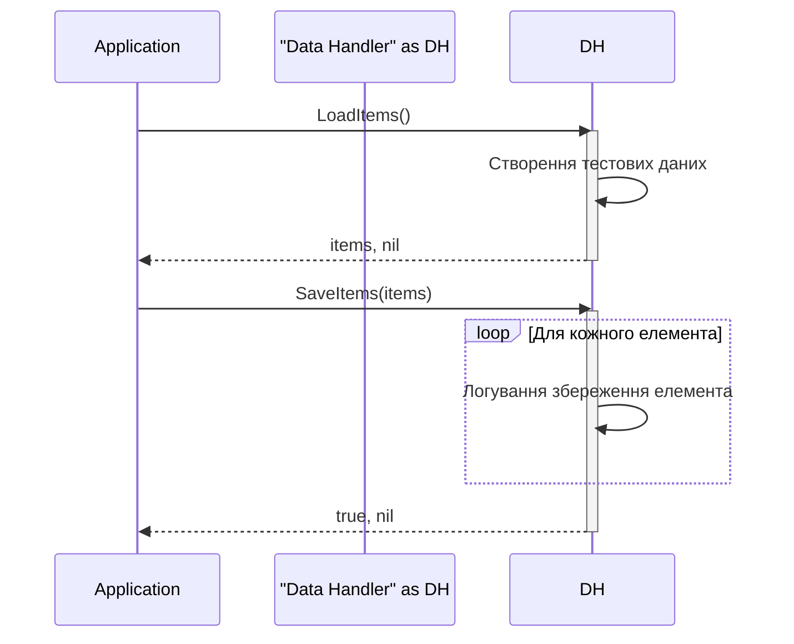

> Previously, we looked at [Модель даних 'Елемент'](03_модель-даних-елемент.md).

# Chapter 4: Обробник даних
Let's begin exploring this concept. У цьому розділі ми розглянемо `Обробник даних`, важливий компонент нашого програмного забезпечення. Мета цього розділу - зрозуміти роль, структуру та функціональність `Обробника даних`.
`Обробник даних` відповідає за управління даними у нашій програмі.  Уявіть його як бібліотекаря, який знає, де зберігаються всі книги (дані), як їх знайти (завантажити) та як повернути назад на полицю (зберегти).  Замість роботи з реальними базами даних або файлами, у цьому прикладі ми імітуємо завантаження та збереження даних.
Основна мета `Обробника даних` - це *абстракція* від конкретного джерела даних.  Це означає, що інші частини програми не повинні знати, звідки саме дані завантажуються (наприклад, з файлу, бази даних, API).  Вони просто взаємодіють з `Обробником даних`, який забезпечує необхідні дані. Це полегшує зміну джерела даних в майбутньому, не змінюючи інший код.
**Ключові концепції:**
*   **Завантаження даних:**  Процес отримання даних з джерела (яке імітується). У нашому випадку, `DataHandler` створює тестові дані.
*   **Збереження даних:** Процес запису змінених або нових даних назад у джерело (яке імітується).
*   **Абстракція джерела даних:** Приховування деталей реалізації джерела даних від інших частин програми.
*   **Інтерфейс:** `DataHandler` надає чітко визначені методи (`LoadItems`, `SaveItems`) для доступу до даних.
**Як це працює:**
`Обробник даних` ініціалізується з шляхом до джерела даних (`dataSourcePath`). У нашому випадку це просто рядок, який використовується для імітації завантаження та збереження. Він надає два основні методи:
*   `LoadItems()`: Цей метод "завантажує" дані з джерела і повертає їх у вигляді слайсу (`[]`) елементів типу `Item`. Він також може повертати помилку (`error`), якщо щось пішло не так (хоча в нашому імітованому випадку помилок немає).
*   `SaveItems(items []models.Item)`: Цей метод "зберігає" наданий слайс елементів `Item` назад у джерело даних. Він повертає булеве значення (`bool`), що вказує на успіх операції, та помилку (`error`), якщо вона виникла.
**Приклад коду:**
```go
--- File: datahandler/datahandler.go ---
package datahandler
import (
	"fmt"
	"log"
	"sourcelens/sampleproject2/models"
)
// DataHandler manages loading and saving Item data.
type DataHandler struct {
	dataSourcePath string
}
// NewDataHandler is a constructor for the DataHandler.
func NewDataHandler(path string) *DataHandler {
	log.Printf("DataHandler initialized for source: %s", path)
	return &DataHandler{dataSourcePath: path}
}
// LoadItems simulates loading items from the data source.
// It returns a slice of Items and an error (idiomatic Go).
func (dh *DataHandler) LoadItems() ([]models.Item, error) {
	log.Printf("Simulating loading items from %s...", dh.dataSourcePath)
	items := []models.Item{
		*models.NewItem(1, "Gadget Alpha", 150.75),
		*models.NewItem(2, "Widget Beta", 85.0),
		*models.NewItem(3, "Thingamajig Gamma", 210.5),
		*models.NewItem(4, "Doohickey Delta", 55.2),
	}
	log.Printf("Loaded %d items.", len(items))
	return items, nil // Return nil for the error to indicate success
}
// SaveItems simulates saving processed items.
func (dh *DataHandler) SaveItems(items []models.Item) (bool, error) {
	log.Printf("Simulating saving %d items to %s...", len(items), dh.dataSourcePath)
	for _, item := range items {
		log.Printf("Saving item: %s", item.String())
	}
	log.Println("Finished simulating save operation.")
	return true, nil
}
```

Ця діаграма показує основний потік взаємодії між програмою та `DataHandler`. Програма викликає `LoadItems()` для отримання даних, а потім `SaveItems()` для їх збереження. `DataHandler` імітує ці операції.
Зв'язок з іншими розділами:
*   У розділі [Модель даних 'Елемент'](03_модель-даних-елемент.md) ми розглянули структуру даних `Item`, яку використовує `Обробник даних`.
*   У розділі [Основний потік обробки](06_основний-потік-обробки.md) ми побачимо, як `Обробник даних` інтегрується в загальний процес обробки даних.
This concludes our look at this topic.

> Next, we will examine [Обробник елементів](05_обробник-елементів.md).


---

*Generated by [SourceLens AI](https://github.com/openXFlow/sourceLensAI) using LLM: `gemini` (cloud) - model: `gemini-2.0-flash` | Language Profile: `Python`*