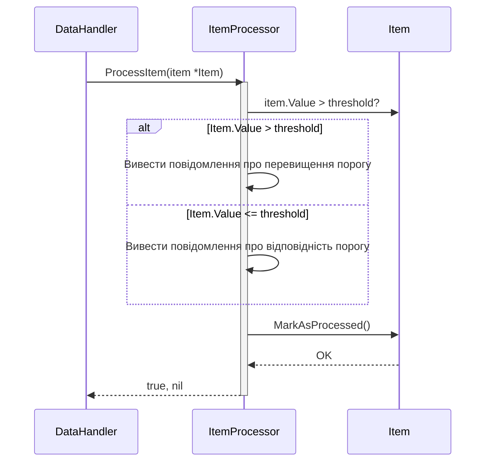

> Previously, we looked at [Обробник даних](04_обробник-даних.md).

# Chapter 5: Обробник елементів
Let's begin exploring this concept. Метою цього розділу є детальне пояснення ролі та функціональності компонента `ItemProcessor`, який відповідає за обробку окремих елементів даних в нашій системі. Ми розглянемо, як він ініціалізується, як він використовується для обробки об’єктів `Item`, та які дії він виконує над цими об’єктами.
Обробник елементів — це ключовий компонент, який гарантує, що кожний елемент даних проходить через певний процес обробки, перш ніж вважатися завершеним. Уявіть собі конвеєр на фабриці: кожна деталь (в нашому випадку, `Item`) проходить через певні етапи обробки, перш ніж бути готовою до відправки. `ItemProcessor` виконує схожу функцію – він гарантує, що кожен `Item` перевірено та позначено як оброблений.
Ключовим аспектом `ItemProcessor` є абстракція логіки обробки окремого елемента. Він ізолює цю логіку від інших частин системи, роблячи код більш модульним та легким для підтримки.
**Ключові Концепції:**
*   **Порогове значення (Threshold):** `ItemProcessor` ініціалізується з пороговим значенням (`threshold`). Це значення використовується для порівняння з полем `Value` об’єкта `Item`.
*   **Метод `ProcessItem`:** Цей метод є основним методом `ItemProcessor`. Він приймає вказівник на об'єкт `Item`, перевіряє значення `Item.Value` на відповідність пороговому значенню та позначає елемент як оброблений за допомогою методу `item.MarkAsProcessed()`.
*   **Маркування як оброблений (Marking as Processed):** Ключова функція `ItemProcessor` полягає в тому, щоб позначати елементи як оброблені. Це може включати зміну внутрішнього стану елемента (наприклад, встановлення прапорця `IsProcessed`), запис інформації до бази даних або відправку повідомлення в чергу.
**Використання / Як це працює:**
`ItemProcessor` використовується для обробки кожного окремого елемента даних, який надходить в систему. Зазвичай, він викликається з іншого компонента, наприклад, `DataHandler` (описаного в розділі [Обробник даних](04_обробник-даних.md)), який відповідає за отримання даних з джерела та передачу їх на обробку.
Розглянемо наступний псевдокод:
1.  Отримати `Item` з джерела даних.
2.  Створити екземпляр `ItemProcessor` з певним пороговим значенням.
3.  Викликати метод `ProcessItem` для передачі `Item` на обробку.
4.  `ProcessItem` перевіряє, чи `Item.Value` перевищує порогове значення.
5.  `ProcessItem` позначає `Item` як оброблений.

*Пояснення діаграми:* Ця діаграма показує взаємодію між `DataHandler` та `ItemProcessor`. `DataHandler` викликає `ProcessItem` для обробки об'єкта `Item`. `ItemProcessor` перевіряє значення `Item` та позначає його як оброблений.
**Приклад Коду:**
Ось фрагмент коду з `itemprocessor/itemprocessor.go`, який ілюструє функціональність `ItemProcessor`:
```go
// ItemProcessor обробляє окремі об'єкти Item.
type ItemProcessor struct {
	threshold int
}
// NewItemProcessor - це конструктор для ItemProcessor.
func NewItemProcessor(threshold int) *ItemProcessor {
	log.Printf("ItemProcessor ініціалізовано з порогом: %d", threshold)
	return &ItemProcessor{threshold: threshold}
}
// ProcessItem обробляє один елемент, позначаючи його як оброблений.
// Приймає вказівник на Item для можливості модифікації.
func (p *ItemProcessor) ProcessItem(item *models.Item) (bool, error) {
	log.Printf("Обробка елемента ID: %d, Name: '%s', Value: %.2f", item.ItemID, item.Name, item.Value)
	if item.Value > float64(p.threshold) {
		fmt.Printf("Значення елемента '%s' (ID: %d) %.2f перевищує поріг %d.\n", item.Name, item.ItemID, item.Value, p.threshold)
	} else {
		fmt.Printf("Значення елемента '%s' (ID: %d) %.2f в межах порогу %d.\n", item.Name, item.ItemID, item.Value, p.threshold)
	}
	item.MarkAsProcessed()
	return true, nil
}
```
В цьому коді:
*   `ItemProcessor` - це структура, яка містить порогове значення `threshold`.
*   `NewItemProcessor` - це конструктор, який ініціалізує `ItemProcessor` з заданим пороговим значенням.
*   `ProcessItem` - це метод, який обробляє окремий елемент `Item`. Він перевіряє значення `Item.Value` на відповідність `threshold` та викликає метод `MarkAsProcessed()` для позначення елемента як обробленого.
Зверніть увагу, що `ProcessItem` приймає *вказівник* на `Item` (`*models.Item`). Це важливо, оскільки дозволяє `ProcessItem` змінювати об’єкт `Item` (наприклад, встановити прапорець `IsProcessed`).
`ItemProcessor` тісно пов'язаний з [Модель даних 'Елемент'](03_модель-даних-елемент.md), оскільки він працює з об'єктами `Item`. Також, він використовується в [Основний потік обробки](06_основний-потік-обробки.md) для обробки даних, отриманих з різних джерел.
This concludes our look at this topic.

> Next, we will examine [Основний потік обробки](06_основний-потік-обробки.md).


---

*Generated by [SourceLens AI](https://github.com/openXFlow/sourceLensAI) using LLM: `gemini` (cloud) - model: `gemini-2.0-flash` | Language Profile: `Python`*