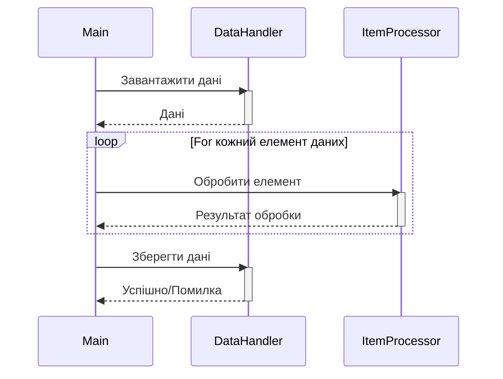

> Previously, we looked at [Обробник елементів](05_обробник-елементів.md).

# Chapter 6: Основний потік обробки
Let's begin exploring this concept. У цьому розділі ми розглянемо основний потік обробки даних у проєкті `20250704_1326_code-go-sample-project`. Ми зосередимося на тому, як програма організовує та виконує всі необхідні кроки для обробки даних, від завантаження до збереження результатів.
Основний потік обробки є "серцем" програми. Він відповідає за координацію всіх інших компонентів для досягнення загальної мети. Уявіть собі диригента оркестру: диригент не грає на жодному інструменті, але він визначає, коли і як кожен музикант повинен грати, щоб створити гармонійну музику. Так само, основний потік обробки не виконує безпосередньо обробку даних, але він організовує та контролює роботу обробників даних, обробників елементів та інших компонентів, щоб забезпечити правильну та ефективну обробку.
Основний потік обробки можна поділити на кілька ключових етапів:
1.  **Ініціалізація компонентів:** На цьому етапі програма створює та налаштовує всі необхідні компоненти, такі як обробник даних (`datahandler`) та обробник елементів (`itemprocessor`). Конфігурація, наприклад, шлях до файлу з даними та порогове значення, також завантажується на цьому етапі.
2.  **Завантаження даних:** Тут програма зчитує дані з джерела, наприклад, з файлу, використовуючи обробник даних.
3.  **Обробка даних:** Це основний етап, на якому кожен елемент даних обробляється. Програма ітерується по кожному елементу даних і передає його обробнику елементів.
4.  **Збереження даних:** Після обробки всіх елементів програма зберігає оброблені дані, знову ж таки, використовуючи обробник даних.
Ці етапи виконуються послідовно, один за одним, щоб забезпечити правильну обробку даних.
Ось як це виглядає в коді (Go):
```go
--- File: main.go ---
// tests/sample_project2/main.go
package main
import (
	"log"
	"sourcelens/sampleproject2/config"
	"sourcelens/sampleproject2/datahandler"
	"sourcelens/sampleproject2/itemprocessor"
)
// runProcessingPipeline виконує основну логіку обробки даних.
func runProcessingPipeline() {
	log.Println("Starting Sample Project 2 processing pipeline...")
	// 1. Ініціалізація компонентів використовуючи конфігурацію
	dataPath := config.GetDataPath()
	threshold := config.GetThreshold()
	dh := datahandler.NewDataHandler(dataPath)
	ip := itemprocessor.NewItemProcessor(threshold)
	// 2. Завантаження даних
	itemsToProcess, err := dh.LoadItems()
	if err != nil {
		log.Fatalf("Failed to load items: %v", err)
	}
	if len(itemsToProcess) == 0 {
		log.Println("No items loaded. Exiting pipeline.")
		return
	}
	log.Printf("Successfully loaded %d items.", len(itemsToProcess))
	// 3. Обробка елементів даних
	for i := range itemsToProcess {
		item := &itemsToProcess[i] // Отримуємо вказівник на елемент в слайсі
		log.Printf("Passing item to processor: %s", item.String())
		_, err := ip.ProcessItem(item)
		if err != nil {
			log.Printf("Failed to process item %d: %v", item.ItemID, err)
		}
	}
	// 4. Збереження оброблених даних
	saveSuccess, err := dh.SaveItems(itemsToProcess)
	if err != nil {
		log.Fatalf("Error during save operation: %v", err)
	}
	if saveSuccess {
		log.Println("Processed items saved successfully.")
	} else {
		log.Println("Failed to save processed items.")
	}
	log.Println("Sample Project 2 processing pipeline finished.")
}
func main() {
	// In a real app, you would configure the logger here based on config.GetLogLevel()
	runProcessingPipeline()
}
```
Цей код показує основну функцію `runProcessingPipeline`, яка виконує всі кроки, описані вище.  Вона ініціалізує обробники даних та елементів, завантажує дані, обробляє кожен елемент і зберігає результати. Логування використовується для відстеження прогресу та виявлення помилок.
Ось діаграма, яка ілюструє цей процес:

На цій діаграмі показано взаємодію між основними компонентами: `Main` (основний потік обробки), `DataHandler` (обробник даних) та `ItemProcessor` (обробник елементів).  Показано, як дані завантажуються, обробляються та зберігаються.
Основний потік обробки тісно пов'язаний з іншими частинами програми. Він використовує [Конфігурація](02_конфігурація.md) для отримання параметрів налаштування, [Модель даних 'Елемент'](03_модель-даних-елемент.md) для представлення даних, [Обробник даних](04_обробник-даних.md) для завантаження та збереження даних, і [Обробник елементів](05_обробник-елементів.md) для обробки окремих елементів даних.
This concludes our look at this topic.

> Next, we will examine [Architecture Diagrams](07_diagrams.md).


---

*Generated by [SourceLens AI](https://github.com/openXFlow/sourceLensAI) using LLM: `gemini` (cloud) - model: `gemini-2.0-flash` | Language Profile: `Python`*