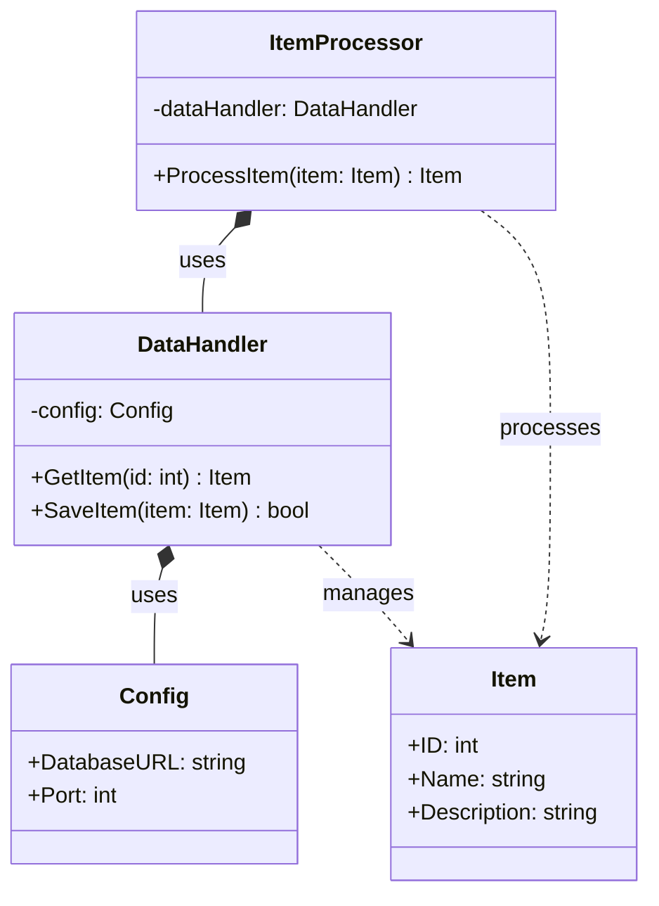
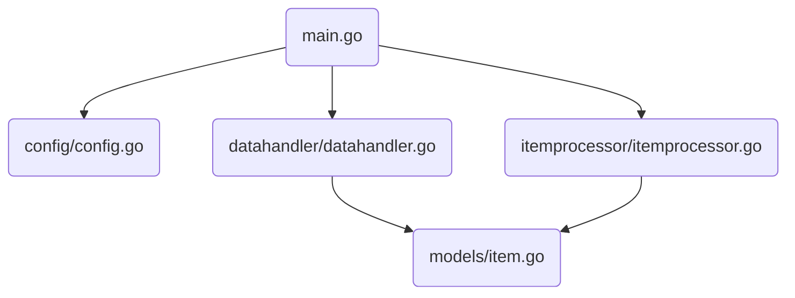
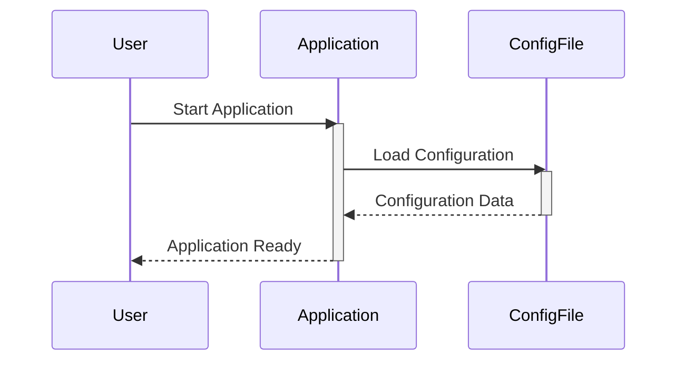
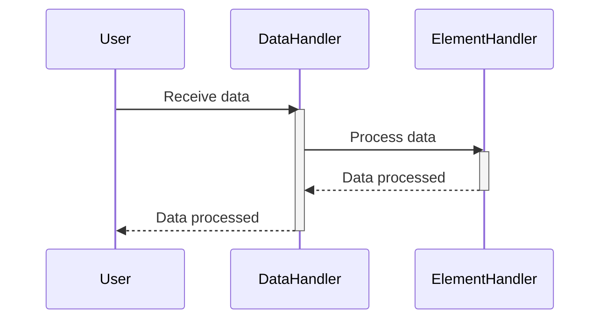
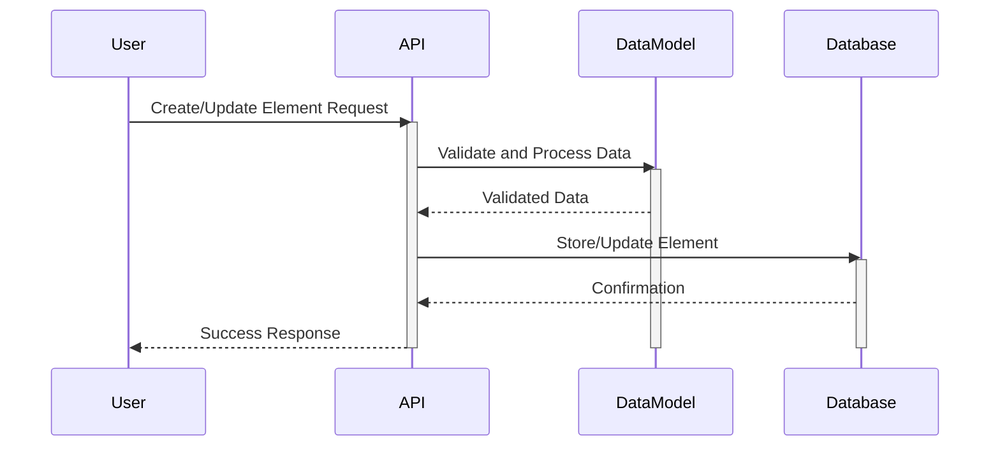
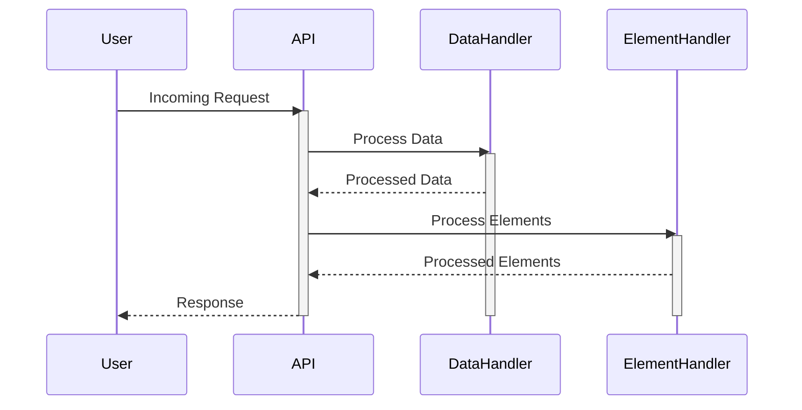
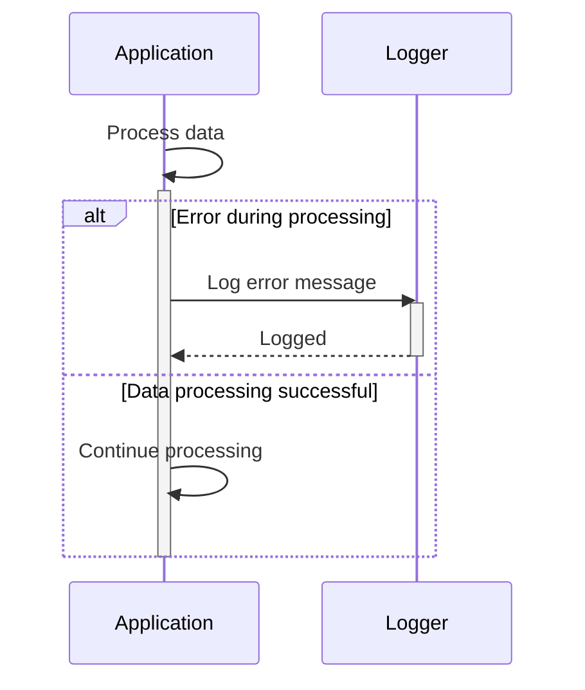

> Previously, we looked at [Основний потік обробки](06_основний-потік-обробки.md).

# Architecture Diagrams
## Class Diagram
Key classes and their relationships in **20250704_1326_code-go-sample-project**.

## Package Dependencies
High-level module and package structure of **20250704_1326_code-go-sample-project**.

## Sequence Diagrams
These diagrams illustrate various interaction scenarios, showcasing operations between components for specific use cases.
### The application starts and loads its configuration.

### Data is received and processed by the data handler, which then interacts with the element handler.

### An individual element is created or updated based on incoming data, involving the data model.

### The main processing flow handles an incoming request and orchestrates the data and element handlers.

### The application encounters an error during data processing and logs the error.

> Next, we will examine [Code Inventory](08_code_inventory.md).

---

*Generated by [SourceLens AI](https://github.com/openXFlow/sourceLensAI) using LLM: `gemini` (cloud) - model: `gemini-2.0-flash` | Language Profile: `Python`*