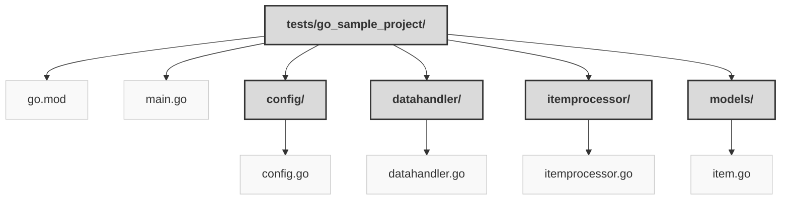

> Previously, we looked at [Architecture Diagrams](07_diagrams.md).

# Code Inventory: 20250704_1326_code-go-sample-project
## File Structure

## File Descriptions Summary
*   **`go.mod`**: module sourcelens/sampleproject2
*   **`main.go`**: // tests/sample_project2/main.go
*   **`config.go`**: // tests/sample_project2/config/config.go
*   **`datahandler.go`**: // tests/sample_project2/datahandler/datahandler.go
*   **`itemprocessor.go`**: // tests/sample_project2/itemprocessor/itemprocessor.go
*   **`item.go`**: // tests/sample_project2/models/item.go
---
## Detailed File Content
No detailed structural information could be generated for the files based on the selected parser.

> Next, we will examine [Project Review](09_project_review.md).

---

*Generated by [SourceLens AI](https://github.com/openXFlow/sourceLensAI) using LLM: `gemini` (cloud) - model: `gemini-2.0-flash` | Language Profile: `Python`*