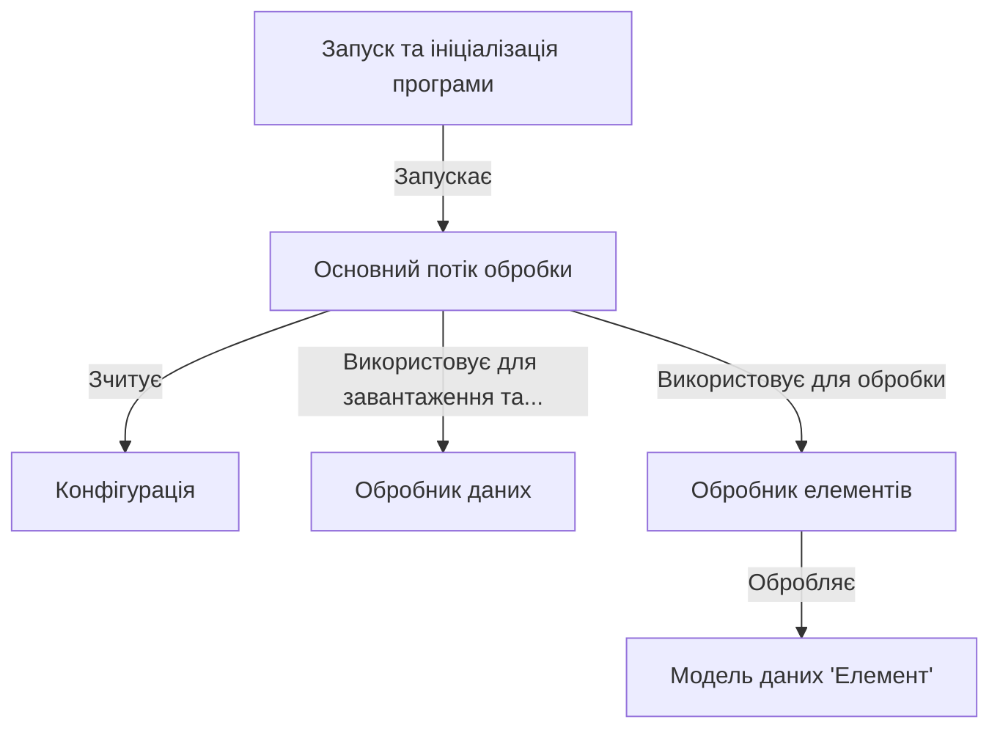

# Tutorial: 20250704_1326_code-go-sample-project

Програма обробляє елементи даних. Спочатку **Конфігурація** визначає параметри обробки. *Основний потік обробки* використовує ці параметри для завантаження елементів за допомогою **Обробника даних**, обробляє їх за допомогою **Обробника елементів**, та зберігає назад за допомогою **Обробника даних**.

**Source Directory:** `C:\_jd_programming\python\11_sourceLens_project\sourceLens\tests\go_sample_project`

## Abstraction Relationships

## Chapters

1. [Запуск та ініціалізація програми](01_запуск-та-ініціалізація-програми.md)
2. [Конфігурація](02_конфігурація.md)
3. [Модель даних 'Елемент'](03_модель-даних-елемент.md)
4. [Обробник даних](04_обробник-даних.md)
5. [Обробник елементів](05_обробник-елементів.md)
6. [Основний потік обробки](06_основний-потік-обробки.md)
7. [Architecture Diagrams](07_diagrams.md)
8. [Code Inventory](08_code_inventory.md)
9. [Project Review](09_project_review.md)

---

*Generated by [SourceLens AI](https://github.com/openXFlow/sourceLensAI) using LLM: `gemini` (cloud) - model: `gemini-2.0-flash` | Language Profile: `Python`*