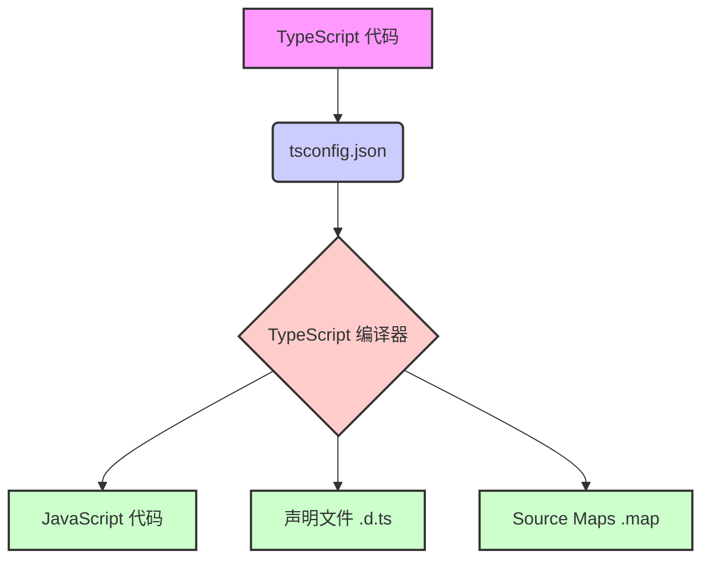

> Previously, we looked at the [Project Overview](index.md).

# Chapter 1: TypeScript 配置 (TypeScript Pèi Zhì)
Let's begin exploring this concept. 本章的目标是理解 `tsconfig.json` 文件，它是 TypeScript 项目的核心配置文件。我们将学习它包含哪些重要的选项，以及如何使用它来定制 TypeScript 编译器的行为，以便生成符合项目需求的 JavaScript 代码。
TypeScript 配置存在的目的是为了控制 TypeScript 编译器如何将 TypeScript 代码转换成 JavaScript 代码。可以将它想象成一个菜谱，告诉编译器用哪些“原料”（TypeScript 代码），以及如何“烹饪”（编译）成最终的“菜肴”（JavaScript 代码）。 如果没有这个菜谱，编译器就不知道你的项目需要什么样的 JavaScript 版本、应该如何处理模块，以及应该进行哪些类型的检查。
`tsconfig.json` 文件包含一系列的配置选项，这些选项可以分为几个主要的类别：
*   **语言和环境 (Yǔ Yán Hé Huán Jìng):** 这些选项控制着目标 JavaScript 版本 (例如 ES2020, ES5) 和运行时可用的库 (例如 DOM, ES2015)。 `target` 选项指定了编译器输出的 JavaScript 版本。 `lib` 选项指定了编译过程中要包含的库文件。
*   **模块 (Mó Kuài):** 这些选项控制着模块系统的使用方式 (例如 ESNext, CommonJS)。 `module` 选项指定了模块系统。 `moduleResolution` 选项指定了模块的解析方式。
*   **JavaScript 支持 (JavaScript Zhī Chí):** 这些选项允许你在 TypeScript 项目中使用现有的 JavaScript 代码，并可以选择对 JavaScript 代码进行类型检查。
*   **Emit:** 这些选项控制着编译输出的设置，例如是否生成声明文件 (`.d.ts`)、 sourcemap 文件，以及输出目录。 `outDir` 选项指定了输出目录。 `declaration` 选项指定是否生成声明文件。
*   **类型检查 (Lèi Xíng Jiǎn Chá):** 这些选项控制着编译器执行的类型检查的严格程度。 `strict` 选项是一个总开关，开启后会启用一系列严格的类型检查选项。启用严格类型检查可以帮助你及早发现代码中的错误。
下面是一个 `tsconfig.json` 文件的示例：
```json
{
  "compilerOptions": {
    /* Language and Environment */
    "target": "ES2020", // Target JavaScript version (ES2020 has good support) - 目标 JavaScript 版本 (ES2020 具有良好的支持)
    "lib": ["ES2020", "DOM"], // Libraries available at runtime (DOM for potential browser use) - 运行时可用的库 (DOM 用于潜在的浏览器使用)
    "experimentalDecorators": true, // Enable if using decorators (e.g., for classes) - 如果使用装饰器 (例如，对于类) 则启用
    "emitDecoratorMetadata": true, // For reflection with decorators - 用于装饰器的反射
    /* Modules */
    "module": "ESNext", // Use modern ES modules - 使用现代 ES 模块
    "moduleResolution": "node", // How modules are resolved (Node.js style) - 如何解析模块 (Node.js 风格)
    "baseUrl": "./", // Base directory for non-relative imports (could be src) - 非相对导入的基本目录 (可以是 src)
    "paths": { // Import aliases (optional) - 导入别名 (可选)
      // "@/*": ["src/*"]
    },
    "resolveJsonModule": true, // Allows importing .json files as modules - 允许将 .json 文件作为模块导入
    "esModuleInterop": true, // Improves interoperability between CommonJS and ES modules - 提高 CommonJS 和 ES 模块之间的互操作性
    "forceConsistentCasingInFileNames": true, // Important for case-sensitive systems - 对于区分大小写的系统很重要
    /* JavaScript Support */
    // "allowJs": true, // If you want to allow .js files in the project - 如果你想在项目中允许 .js 文件
    // "checkJs": true, // If you want to type-check .js files as well - 如果你想也对 .js 文件进行类型检查
    /* Emit */
    "declaration": true, // Generate .d.ts files (type definitions) - 生成 .d.ts 文件 (类型定义)
    "declarationMap": true, // Generate sourcemaps for .d.ts files - 为 .d.ts 文件生成 sourcemap
    "sourceMap": true, // Generate .map files for debugging - 生成 .map 文件以进行调试
    "outDir": "./dist", // Output directory for compiled JavaScript - 编译的 JavaScript 的输出目录
    // "rootDir": "./src", // If source files were in src/ - 如果源文件在 src/ 中
    /* Type Checking */
    "strict": true, // Enable all strict type-checking options (recommended) - 启用所有严格的类型检查选项 (推荐)
    // "noImplicitAny": true, // Require explicit types (part of strict) - 需要显式类型 (strict 的一部分)
    // "strictNullChecks": true, // Strict null and undefined checks (part of strict) - 严格的 null 和 undefined 检查 (strict 的一部分)
    // "strictFunctionTypes": true, // Strict function type checking (part of strict) - 严格的函数类型检查 (strict 的一部分)
    // "strictPropertyInitialization": true, // Requires class properties to be initialized in the constructor (part of strict) - 要求类属性在构造函数中初始化 (strict 的一部分)
    "noUnusedLocals": true, // Report unused local variables - 报告未使用的局部变量
    "noUnusedParameters": true, // Report unused function parameters - 报告未使用的函数参数
    "noImplicitReturns": true, // Require all paths in a function to return a value (if the function returns a value) - 要求函数中的所有路径都返回一个值 (如果函数返回一个值)
    "noFallthroughCasesInSwitch": true, // Prevent fallthrough in switch statements - 防止 switch 语句中的 fallthrough
    "skipLibCheck": true // Skip type checking of declaration files (.d.ts) from libraries - 跳过对库中的声明文件 (.d.ts) 的类型检查
  },
  "include": [
    "./**/*.ts" // Which files the compiler should process - 编译器应该处理哪些文件
  ],
  "exclude": [
    "node_modules", // Which directories to ignore - 要忽略哪些目录
    "dist"
  ]
}
```
`include` 和 `exclude` 选项用于指定编译器应该处理哪些文件，以及应该忽略哪些文件。 在上面的例子中，`include` 选项指定编译器应该处理项目中的所有 `.ts` 文件，而 `exclude` 选项指定编译器应该忽略 `node_modules` 和 `dist` 目录。
下面是一个使用 `tsconfig.json` 文件的简单例子：
1.  创建一个包含以下内容的 `tsconfig.json` 文件（与上面的例子相同）。
2.  创建一个名为 `src/index.ts` 的文件，并添加一些 TypeScript 代码。
3.  在命令行中运行 `tsc` 命令。 这将使用 `tsconfig.json` 文件中的配置选项来编译 `src/index.ts` 文件，并将编译后的 JavaScript 代码输出到 `dist` 目录中。
`tsc` 命令会读取 `tsconfig.json` 文件中的配置选项，并根据这些选项来编译 TypeScript 代码。 如果没有 `tsconfig.json` 文件，`tsc` 命令将使用默认的配置选项。
让我们用一个简单的流程图来表示 TypeScript 编译的过程：

上面的流程图展示了 TypeScript 代码如何通过 `tsconfig.json` 的配置，被 TypeScript 编译器处理，最终生成 JavaScript 代码、声明文件和 Source Maps。
在[配置管理 (Pèi Zhì Guǎn Lǐ)](02_配置管理-pèi_zhì-guǎn_lǐ.md)一章中，我们将学习如何管理不同的配置环境，例如开发环境、测试环境和生产环境。
This concludes our look at this topic.

> Next, we will examine [主程序 (Zhǔ Chéng Xù)](02_主程序-zhǔ-chéng-xù.md).


---

*Generated by [SourceLens AI](https://github.com/openXFlow/sourceLensAI) using LLM: `gemini` (cloud) - model: `gemini-2.0-flash` | Language Profile: `Python`*