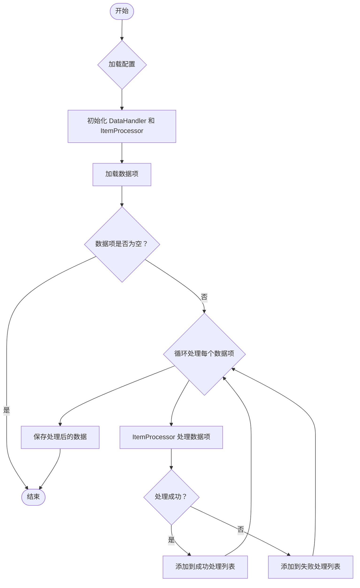

> Previously, we looked at [TypeScript 配置 (TypeScript Pèi Zhì)](01_typescript-配置-typescript-pèi-zhì.md).

# Chapter 6: 主程序 (Zhǔ Chéng Xù)
Let's begin exploring this concept. 本章的目标是理解主程序在 `20250704_1328_code-typescript-sample-project` 项目中的角色和功能。我们将了解它如何启动整个数据处理流程。
主程序就像一个交响乐团的指挥。它本身不演奏任何乐器，但它协调所有不同的乐器（在本例中是项目的各个组件，比如数据处理器、配置管理器等）来创造和谐的音乐（一个运行良好的应用程序）。 没有指挥，各个乐器可能各自为政，最终的结果会是一团糟。 同样，没有主程序，项目的各个组件也可能无法协同工作，从而导致应用程序无法正常运行。 主程序负责初始化配置，加载数据，并协调其他模块处理数据，最终将处理后的数据保存。 它的存在是为了提供一个清晰、统一的入口点，方便用户启动和管理整个应用程序。
主程序的核心概念包括：
*   **入口点 (Rù Kǒu Diǎn):** 这是应用程序开始执行的地方。 在 `main.ts` 文件中，你可以看到脚本从 `setupMainLogging()` 和 `runProcessingPipeline()` 开始。
*   **初始化 (Chū Shǐ Huà):** 主程序负责设置应用程序运行所需的初始状态，例如加载配置参数，设置日志级别等。
*   **协调 (Xié Tiáo):** 主程序协调各个组件之间的交互，确保它们按照正确的顺序执行。
*   **数据流程管理 (Shù Jù Liú Chéng Guǎn Lǐ):** 主程序定义了数据从加载到处理再到保存的整个流程。
*   **错误处理 (Cuò Wù Chǔ Lǐ):** 主程序负责捕获和处理应用程序运行时可能发生的错误，保证程序的健壮性。
现在让我们看看主程序是如何工作的。
主程序的主要功能是启动数据处理流程。 它首先加载配置，然后使用配置来初始化数据处理器和项目处理器。 接下来，它从数据源加载数据项，并将这些数据项传递给项目处理器进行处理。 最后，它将处理后的数据项保存回数据源。
以下是一些关键步骤的说明：
1.  **配置加载 (Pèi Zhì Jiā Zài):** 主程序首先从配置文件加载配置信息。 这包括数据源路径、阈值等参数。`config.ts` 模块负责管理配置，而主程序通过 `import * as config from './config';` 来访问这些配置。
2.  **组件初始化 (Zǔ Jiàn Chū Shǐ Huà):** 根据加载的配置信息，主程序创建并初始化 `DataHandler` 和 `ItemProcessor` 实例。 `DataHandler` 负责数据的加载和保存，而 `ItemProcessor` 负责处理单个数据项。
3.  **数据加载 (Shù Jù Jiā Zài):** 主程序使用 `DataHandler` 加载需要处理的数据项。 这些数据项通常存储在文件中或数据库中。
4.  **数据处理 (Shù Jù Chǔ Lǐ):** 主程序遍历加载的数据项，并将每个数据项传递给 `ItemProcessor` 进行处理。 `ItemProcessor` 根据预定义的规则对数据项进行转换、验证或其他操作。
5.  **数据保存 (Shù Jù Bǎo Cún):** 处理完成后，主程序使用 `DataHandler` 将处理后的数据项保存回数据源。
这是一个简化的流程图，展示了主程序的运作方式：

这个流程图展示了主程序如何从加载配置开始，到最终保存处理后的数据结束的整个过程。
以下是一个代码示例，展示了主程序的核心逻辑（精简版）：
```typescript
// Copyright (C) 2025 Jozef Darida (LinkedIn/Xing)
// ... (GPL License) ...
import * as config from './config'; // 导入所有来自 config.ts 的导出
import { DataHandler } from './dataHandler';
import { ItemProcessor } from './itemProcessor';
import { Item } from './item';
function runProcessingPipeline(): void {
    try {
        // 1. 初始化组件
        const dataPath: string = config.getDataPath();
        const threshold: number = config.getThreshold();
        const dataHandler = new DataHandler(dataPath);
        const itemProcessor = new ItemProcessor(threshold);
        // 2. 加载数据
        const itemsToProcess: Item[] = dataHandler.loadItems();
        // 3. 处理数据项
        for (const item of itemsToProcess) {
            itemProcessor.processItem(item);
        }
        // 4. 保存处理后的数据
        dataHandler.saveItems(itemsToProcess);
    } catch (e: any) {
        console.error("发生运行时错误:", e); // 发生运行时错误
    }
}
// --- 主程序执行 ---
runProcessingPipeline();
```
上面的代码片段展示了主程序如何协调 `DataHandler` 和 `ItemProcessor` 来完成数据处理任务。注释解释了每个步骤的作用。
你可以参考 [配置管理 (Pèi Zhì Guǎn Lǐ)](02_配置管理-pèi-zhì-guǎn-lǐ.md) 章节了解配置加载的更多细节， [数据处理器 (Shù Jù Chǔ Lǐ Qì)](04_数据处理器-shù-jù-chǔ-lǐ-qì.md) 章节了解 `DataHandler` 的功能， [项目处理器 (Xiàng Mù Chǔ Lǐ Qì)](05_项目处理器-xiàng-mù-chǔ-lǐ-qì.md) 章节了解 `ItemProcessor` 的功能，以及 [数据项模型 (Shù Jù Xiàng Mú Xíng)](03_数据项模型-shù-jù-xiàng-mú-xíng.md) 章节了解 `Item` 模型的定义。
总之，主程序是应用程序的核心，它负责协调各个组件，启动数据处理流程，并处理错误。理解主程序的工作原理对于理解整个应用程序的架构至关重要。
This concludes our look at this topic.

> Next, we will examine [数据处理器 (Shù Jù Chǔ Lǐ Qì)](03_数据处理器-shù-jù-chǔ-lǐ-qì.md).


---

*Generated by [SourceLens AI](https://github.com/openXFlow/sourceLensAI) using LLM: `gemini` (cloud) - model: `gemini-2.0-flash` | Language Profile: `Python`*