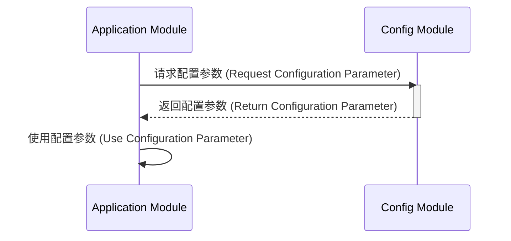

> Previously, we looked at [数据项模型 (Shù Jù Xiàng Mú Xíng)](04_数据项模型-shù-jù-xiàng-mú-xíng.md).

# Chapter 2: 配置管理 (Pèi Zhì Guǎn Lǐ)
Let's begin exploring this concept. 本章的目标是理解配置管理在项目中的作用以及如何在 `20250704_1328_code-typescript-sample-project` 项目中使用它。我们将学习为什么配置管理如此重要，以及如何通过它提高代码的灵活性和可维护性。
配置管理就像是软件的“控制面板”。想象一下，你有一个烤箱，你可以调整温度、时间和其他设置。配置管理就是允许我们调整应用程序的各种设置，而无需修改代码本身。这使得应用程序更加灵活，更容易适应不同的环境和需求。
如果没有配置管理，所有这些设置都将“硬编码”在代码中。如果我们需要更改文件路径或处理阈值，就必须修改代码、重新编译和重新部署应用程序。这既耗时又容易出错。配置管理通过将这些设置存储在外部，例如配置文件或环境变量中，解决了这个问题。
**关键概念分解:**
*   **配置参数 (Pèi Zhì Cān Shù):** 这些是实际的设置，例如文件路径、日志级别、数据库连接字符串等。
*   **配置存储 (Pèi Zhì Chǔ Cún):** 这是配置参数存储的地方。它可以是配置文件 (例如 JSON 或 YAML 文件)、环境变量、数据库或其他任何存储机制。
*   **配置访问 (Pèi Zhì Fǎng Wèn):** 这是应用程序访问配置参数的方式。通常，会有一个专门的模块或类来负责读取和提供配置参数。
**用法 / 工作原理:**
在这个项目中，配置管理主要通过 `config.ts` 文件实现。这个文件定义了一些常量和函数，用于存储和提供配置参数。其他模块可以通过调用这些函数来获取所需的配置参数。
例如，`getDataPath()` 函数返回数据文件的路径，`getThreshold()` 函数返回处理阈值。这些函数在内部使用常量 `DATA_FILE_PATH` 和 `PROCESSING_THRESHOLD` 来存储实际的配置值。
下面是一个简单的代码示例，展示了 `config.ts` 文件中的一些关键部分：
```typescript
--- File: config.ts ---
/**
 * Path to a data file (used by DataHandler).
 * 数据文件的路径 (由 DataHandler 使用).
 */
export const DATA_FILE_PATH: string = "data/items.json";
/**
 * A processing parameter (used by ItemProcessor).
 * 一个处理参数 (由 ItemProcessor 使用).
 */
export const PROCESSING_THRESHOLD: number = 100;
/**
 * Returns the configured path for the data file.
 * 返回数据文件的配置路径.
 * @returns {string} The path string for the data file.
 */
export function getDataPath(): string {
    // In a real app, this might involve more complex logic,
    // like checking environment variables first.
    // 在实际应用中，这可能涉及更复杂的逻辑，
    // 例如首先检查环境变量.
    console.log(`Config: Providing data file path: ${DATA_FILE_PATH}`);
    return DATA_FILE_PATH;
}
/**
 * Returns the configured processing threshold.
 * 返回配置的处理阈值.
 * @returns {number} The integer threshold value.
 */
export function getThreshold(): number {
    console.log(`Config: Providing processing threshold: ${PROCESSING_THRESHOLD}`);
    return PROCESSING_THRESHOLD;
}
--- End of File ---
```
在这个例子中，`DATA_FILE_PATH` 和 `PROCESSING_THRESHOLD` 是配置参数，它们被存储为常量。`getDataPath()` 和 `getThreshold()` 函数提供了一种访问这些参数的方式。注意，这些函数可以包含更复杂的逻辑，例如从环境变量中读取配置值。
以下是一个使用配置管理模块的例子：
```typescript
// 假设我们有一个需要使用数据文件路径的模块
import { getDataPath } from './config';
function processData() {
  const filePath = getDataPath(); // 从配置模块获取文件路径
  console.log(`Processing data from file: ${filePath}`);
  // ... 进一步处理数据
}
processData();
```
这个例子展示了如何从 `config.ts` 文件中导入 `getDataPath()` 函数，并使用它来获取数据文件的路径。这样做的好处是，如果数据文件的路径发生变化，我们只需要修改 `config.ts` 文件，而无需修改 `processData()` 函数。
配置管理还允许我们根据不同的环境使用不同的配置。例如，我们可以为开发环境、测试环境和生产环境使用不同的配置文件。
以下是一个简单的 `mermaid` 时序图，展示了模块如何访问配置信息：

这个图表展示了应用程序模块如何向配置模块请求配置参数，配置模块如何返回配置参数，以及应用程序模块如何使用配置参数。
总而言之，配置管理是一种重要的软件设计模式，它可以提高应用程序的灵活性和可维护性。通过将配置参数存储在外部，我们可以轻松地调整应用程序的各种设置，而无需修改代码本身。
在接下来的章节中，我们将看到配置管理如何在项目的其他模块中使用。例如，在[数据项模型 (Shù Jù Xiàng Mú Xíng)](03_数据项模型-shù-jù-xiàng-mú-xíng.md)和[数据处理器 (Shù Jù Chǔ Lǐ Qì)](04_数据处理器-shù-jù-xiàng-mú-xíng.md)章节中，我们将看到如何使用配置参数来指定数据文件的路径和处理阈值。
This concludes our look at this topic.

> Next, we will examine [项目处理器 (Xiàng Mù Chǔ Lǐ Qì)](06_项目处理器-xiàng-mù-chǔ-lǐ-qì.md).


---

*Generated by [SourceLens AI](https://github.com/openXFlow/sourceLensAI) using LLM: `gemini` (cloud) - model: `gemini-2.0-flash` | Language Profile: `Python`*