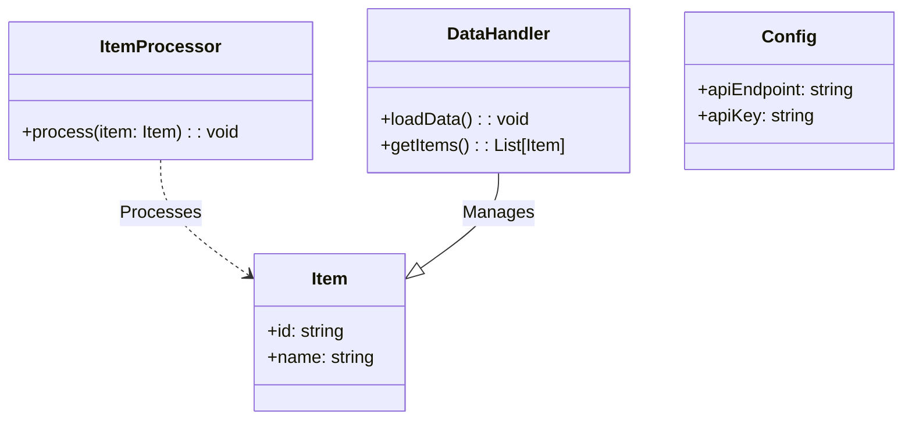
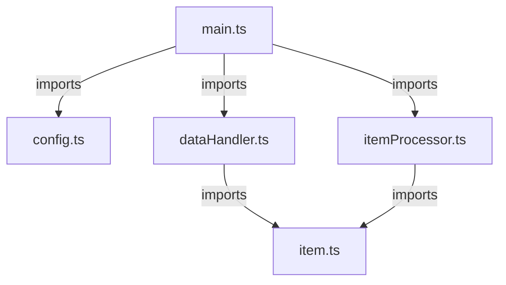
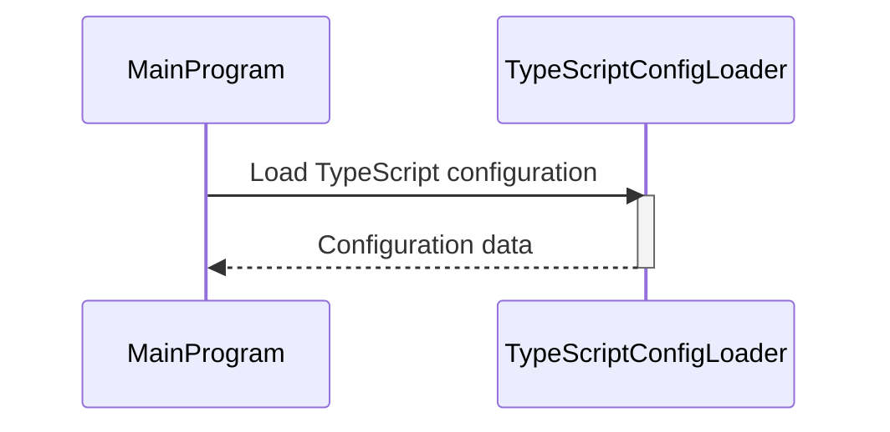
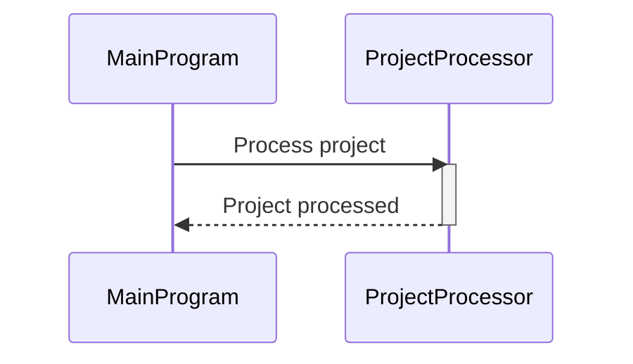
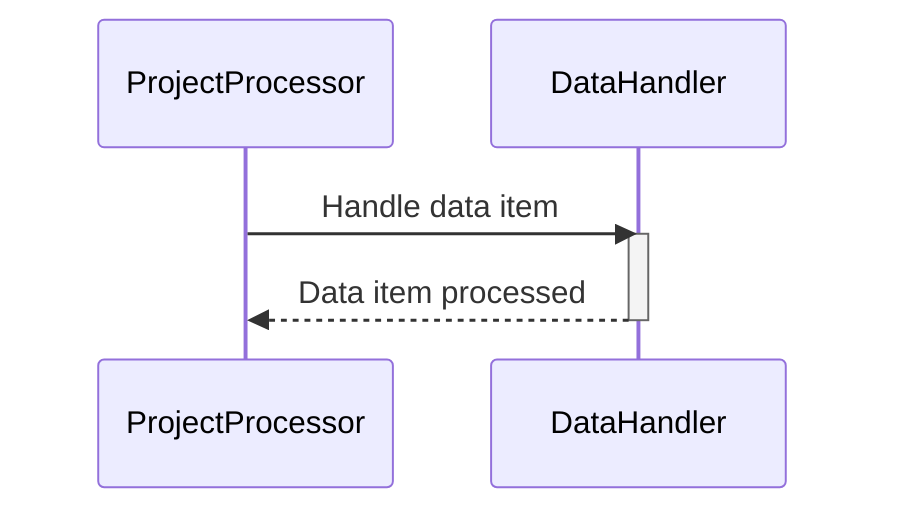
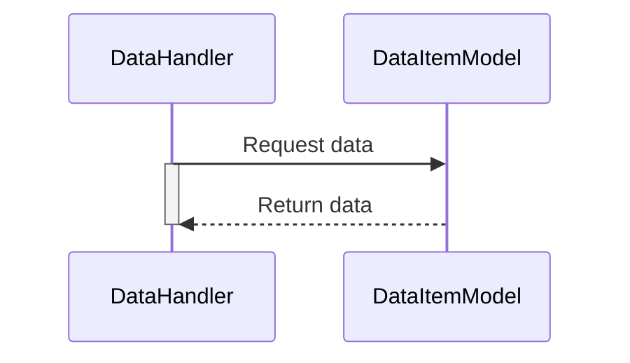
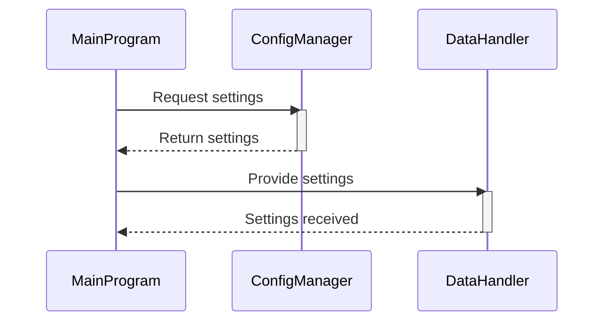

> Previously, we looked at [项目处理器 (Xiàng Mù Chǔ Lǐ Qì)](06_项目处理器-xiàng-mù-chǔ-lǐ-qì.md).

# Architecture Diagrams
## Class Diagram
Key classes and their relationships in **20250704_1328_code-typescript-sample-project**.

## Package Dependencies
High-level module and package structure of **20250704_1328_code-typescript-sample-project**.

## Sequence Diagrams
These diagrams illustrate various interaction scenarios, showcasing operations between components for specific use cases.
### The main program loads the TypeScript configuration.

### The main program processes a project using the project processor.

### The project processor handles a data item by using the data handler.

### The data handler interacts with a data item model.

### The configuration management provides settings to the main program and data handler.

> Next, we will examine [Code Inventory](08_code_inventory.md).

---

*Generated by [SourceLens AI](https://github.com/openXFlow/sourceLensAI) using LLM: `gemini` (cloud) - model: `gemini-2.0-flash` | Language Profile: `Python`*