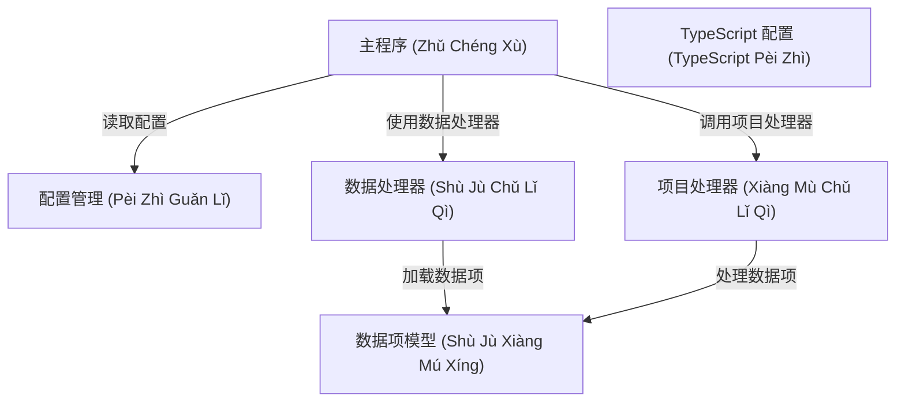

# Tutorial: 20250704_1328_code-typescript-sample-project

这个项目的主要目的是处理数据。**主程序**负责协调整个流程，它首先通过**配置管理**获取配置信息，然后使用**数据处理器**加载数据。加载的数据以**数据项模型**的形式存在，并由**项目处理器**进行处理。 (in Chinese)

**Source Directory:** `C:\_jd_programming\python\11_sourceLens_project\sourceLens\tests\typescript_sample_project`

## Abstraction Relationships

## Chapters

1. [TypeScript 配置 (TypeScript Pèi Zhì)](01_typescript-配置-typescript-pèi-zhì.md)
2. [主程序 (Zhǔ Chéng Xù)](02_主程序-zhǔ-chéng-xù.md)
3. [数据处理器 (Shù Jù Chǔ Lǐ Qì)](03_数据处理器-shù-jù-chǔ-lǐ-qì.md)
4. [数据项模型 (Shù Jù Xiàng Mú Xíng)](04_数据项模型-shù-jù-xiàng-mú-xíng.md)
5. [配置管理 (Pèi Zhì Guǎn Lǐ)](05_配置管理-pèi-zhì-guǎn-lǐ.md)
6. [项目处理器 (Xiàng Mù Chǔ Lǐ Qì)](06_项目处理器-xiàng-mù-chǔ-lǐ-qì.md)
7. [Architecture Diagrams](07_diagrams.md)
8. [Code Inventory](08_code_inventory.md)
9. [Project Review](09_project_review.md)

---

*Generated by [SourceLens AI](https://github.com/openXFlow/sourceLensAI) using LLM: `gemini` (cloud) - model: `gemini-2.0-flash` | Language Profile: `Python`*