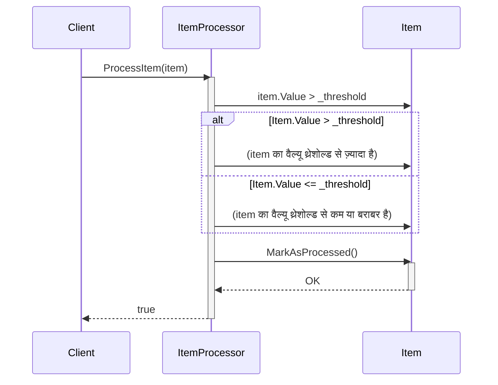

> Previously, we looked at the [Project Overview](index.md).

# Chapter 5: आइटम प्रोसेसर (Item Processor)
Let's begin exploring this concept. इस अध्याय में, हम `ItemProcessor` क्लास को समझेंगे, जो हमारे प्रोजेक्ट `20250704_1330_code-csharp-sample-project` में आइटम्स को प्रोसेस करने के लिए ज़िम्मेदार है। हमारा लक्ष्य यह समझना है कि `ItemProcessor` कैसे काम करता है, यह किस प्रकार कॉन्फ़िगर किया जाता है, और यह हमारे डेटा प्रोसेसिंग पाइपलाइन में कैसे फिट बैठता है।
आइटम प्रोसेसर क्यों? मान लीजिए आपके पास एक बड़ी लिस्ट है जिसमें अलग-अलग प्रकार की चीजें हैं - जैसे फल, सब्जियां, खिलौने आदि। अब आप कुछ नियम लागू करना चाहते हैं, जैसे कि केवल फलों को 'ताज़ा' के रूप में चिह्नित करना या सब्जियों को 'इन्वेंट्री' में जोड़ना। `ItemProcessor` बिलकुल यही करता है। यह एक आइटम लेता है, उस पर कुछ लॉजिक लागू करता है (जैसे कि यह एक फल है या सब्जी है), और फिर उसे प्रोसेस किया गया के रूप में चिह्नित करता है। एक वास्तविक दुनिया के उदाहरण में, आप इसका उपयोग ऑनलाइन ऑर्डर को प्रोसेस करने, लेनदेन को मान्य करने, या उपयोगकर्ता इनपुट को फ़िल्टर करने के लिए कर सकते हैं।
`ItemProcessor` हमारे प्रोजेक्ट में डेटा प्रोसेसिंग के लिए एक महत्वपूर्ण घटक है क्योंकि यह डेटा पर विशिष्ट लॉजिक लागू करने का एक केंद्रीकृत तरीका प्रदान करता है। यह डेटा को संसाधित करने के तरीके को मानकीकृत करने और यह सुनिश्चित करने में मदद करता है कि सभी आइटम समान नियमों के अनुसार संसाधित हों।
**मुख्य अवधारणाएं:**
`ItemProcessor` क्लास `ItemProcessor.cs` फ़ाइल में परिभाषित है। यह क्लास एक `_threshold` नामक प्राइवेट फ़ील्ड का उपयोग करता है, जो यह निर्धारित करता है कि किसी आइटम को कैसे प्रोसेस किया जाए।
*   **थ्रेशोल्ड (Threshold):** यह एक सीमा है। अगर किसी आइटम का `Value` इस सीमा से अधिक है, तो उसे एक तरीके से प्रोसेस किया जाएगा, और अगर कम है तो दूसरे तरीके से।
*   **ProcessItem मेथड:** यह मेथड एक `Item` ऑब्जेक्ट लेता है और उस पर प्रोसेसिंग लॉजिक लागू करता है। इस मेथड में, आइटम को प्रोसेस के रूप में चिह्नित किया जाता है।
**उपयोग / यह कैसे काम करता है:**
`ItemProcessor` का उपयोग करने के लिए, आपको पहले इसका एक इंस्टेंस बनाना होगा, `_threshold` मान प्रदान करके। फिर, आप `ProcessItem` मेथड को कॉल कर सकते हैं, जिसे प्रोसेस करने के लिए `Item` ऑब्जेक्ट पास किया जा सकता है।
यहां एक उदाहरण है कि `ItemProcessor` का उपयोग कैसे किया जाता है:
```csharp
// ItemProcessor का इंस्टेंस बनाएँ, थ्रेशोल्ड 100 के साथ
ItemProcessor processor = new ItemProcessor(100);
// एक आइटम बनाएँ
Item item = new Item { ItemId = 1, Name = "Example Item", Value = 150 };
// आइटम को प्रोसेस करें
bool result = processor.ProcessItem(item);
// परिणाम की जाँच करें
if (result)
{
    Console.WriteLine("Item processed successfully."); // आइटम सफलतापूर्वक प्रोसेस किया गया।
}
else
{
    Console.WriteLine("Item processing failed."); // आइटम प्रोसेसिंग विफल रही।
}
```
यहां `ItemProcessor.cs` फ़ाइल का कोड स्निपेट है:
```csharp
// tests/sample_project2/ItemProcessor.cs
namespace SampleProject2;
/// <summary>
/// Processes individual Item objects based on configured rules.
/// कॉन्फ़िगर किए गए नियमों के आधार पर व्यक्तिगत आइटम ऑब्जेक्ट्स को प्रोसेस करता है।
/// </summary>
public class ItemProcessor
{
    private readonly int _threshold;
    /// <summary>
    /// Initializes the ItemProcessor with a processing threshold.
    /// ItemProcessor को एक प्रोसेसिंग थ्रेशोल्ड के साथ इनिशियलाइज़ करता है।
    /// </summary>
    public ItemProcessor(int threshold)
    {
        _threshold = threshold;
        Console.WriteLine($"ItemProcessor initialized with threshold: {_threshold}"); // आइटमप्रोसेसर थ्रेशोल्ड के साथ इनिशियलाइज़ किया गया: {_threshold}
    }
    /// <summary>
    /// Processes a single item, marking it as processed and applying logic.
    /// एक सिंगल आइटम को प्रोसेस करता है, इसे प्रोसेस्ड के रूप में चिह्नित करता है और लॉजिक लागू करता है।
    /// </summary>
    /// <param name="item">The Item object to process.</param>
    /// <param name="item">प्रोसेस करने के लिए आइटम ऑब्जेक्ट।</param>
    /// <returns>True if processing was successful.</returns>
    /// <returns>सही अगर प्रोसेसिंग सफल रही।</returns>
    public bool ProcessItem(Item item)
    {
        Console.WriteLine($"Processing item ID: {item.ItemId}, Name: '{item.Name}', Value: {item.Value}"); // आइटम आईडी प्रोसेस किया जा रहा है: {item.ItemId}, नाम: '{item.Name}', मान: {item.Value}
        if (item.Value > _threshold)
        {
            Console.WriteLine($"Item '{item.Name}' (ID: {item.ItemId}) value {item.Value:F2} exceeds threshold {_threshold}."); // आइटम '{item.Name}' (आईडी: {item.ItemId}) का मान {item.Value:F2} थ्रेशोल्ड {_threshold} से अधिक है।
        }
        else
        {
            Console.WriteLine($"Item '{item.Name}' (ID: {item.ItemId}) value {item.Value:F2} is within threshold {_threshold}."); // आइटम '{item.Name}' (आईडी: {item.ItemId}) का मान {item.Value:F2} थ्रेशोल्ड {_threshold} के भीतर है।
        }
        item.MarkAsProcessed();
        return true;
    }
}
```
यहाँ `ProcessItem` मेथड के अंदर के लॉजिक को दर्शाने वाला एक क्रम डायग्राम है:

यह डायग्राम दिखाता है कि क्लाइंट `ItemProcessor` को एक आइटम प्रोसेस करने के लिए कहता है, `ItemProcessor` आइटम के वैल्यू की तुलना थ्रेशोल्ड से करता है, और फिर आइटम को `MarkAsProcessed()` मेथड के साथ प्रोसेस करता है। अंत में, `ItemProcessor` क्लाइंट को सही मान लौटाता है।
हमने पहले [कॉन्फ़िगरेशन (Config)](02_कॉन्फ़िगरेशन-config.md) और [आइटम मॉडल (Item Model)](03_आइटम-मॉडल-item-model.md) पर चर्चा की है। `ItemProcessor` को कॉन्फ़िगरेशन से थ्रेशोल्ड मान प्राप्त होता है और यह [आइटम मॉडल (Item Model)](03_आइटम-मॉडल-item-model.md) में परिभाषित `Item` क्लास का उपयोग करता है। यह `ItemProcessor` को कॉन्फ़िगरेशन और डेटा स्ट्रक्चर के साथ जोड़ता है, जिससे यह हमारे एप्लिकेशन का एक महत्वपूर्ण हिस्सा बन जाता है। इसी तरह, यह [डेटा हैंडलर (Data Handler)](04_डेटा-हैंडलर-data-handler.md) से डेटा लेता है, और [प्रोसेसिंग पाइपलाइन (Processing Pipeline)](06_प्रोसेसिंग-पाइपलाइन-processing-pipeline.md) में उपयोग किया जाता है।
यह निष्कर्ष हमारे इस विषय पर एक नज़र है।
This concludes our look at this topic.

> Next, we will examine [आइटम मॉडल (Item Model)](02_आइटम-मॉडल-item-model.md).


---

*Generated by [SourceLens AI](https://github.com/openXFlow/sourceLensAI) using LLM: `gemini` (cloud) - model: `gemini-2.0-flash` | Language Profile: `Python`*