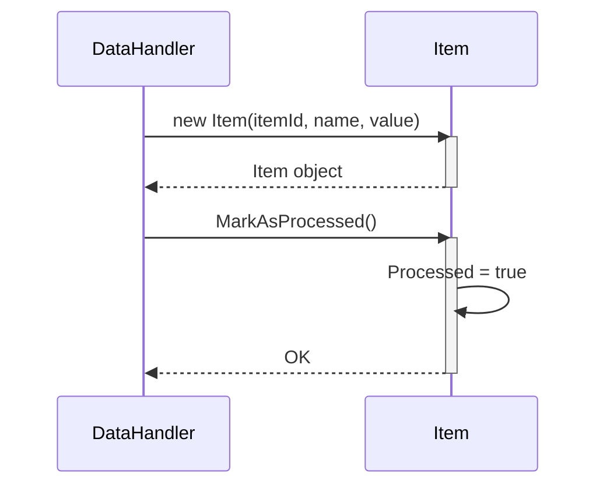

> Previously, we looked at [आइटम प्रोसेसर (Item Processor)](01_आइटम-प्रोसेसर-item-processor.md).

# Chapter 3: आइटम मॉडल (Item Model)
Let's begin exploring this concept. इस चैप्टर का लक्ष्य है `Item` मॉडल को समझना, जो हमारे `20250704_1330_code-csharp-sample-project` में डेटा को प्रोसेस करने के लिए उपयोग किया जाता है। हम देखेंगे कि यह मॉडल क्या है, यह कैसे काम करता है, और इसका उपयोग क्यों महत्वपूर्ण है।
आइटम मॉडल (Item Model) हमारे प्रोजेक्ट में एक बहुत ही महत्वपूर्ण भूमिका निभाता है। सोचिए कि आपके पास एक फैक्ट्री है जहाँ विभिन्न प्रकार के सामान प्रोसेस किए जाते हैं। हर एक सामान, चाहे वह छोटा हो या बड़ा, एक 'आइटम' है। आइटम मॉडल उसी तरह से काम करता है – यह प्रोसेसिंग के लिए एक डेटा आइटम को दर्शाता है। इसमें आइटम के बारे में सारी जानकारी होती है, जैसे कि उसका आईडी, नाम, वैल्यू, और प्रोसेसिंग की स्थिति। अगर हमारे पास आइटम मॉडल नहीं होता, तो हमें डेटा को ट्रैक करने और प्रबंधित करने में बहुत मुश्किल होती।
**आइटम मॉडल के मुख्य भाग:**
`Item` क्लास में निम्नलिखित मुख्य गुण होते हैं:
*   **ItemId:** यह आइटम का यूनिक आइडेंटिफायर है। यह एक संख्या होती है जो हर आइटम को अलग पहचान देती है।
*   **Name:** यह आइटम का नाम है, जैसे "उत्पाद A" या "सेवा B"।
*   **Value:** यह आइटम का वैल्यू है, जो कि एक संख्या हो सकती है, जैसे कि कीमत या मात्रा।
*   **Processed:** यह एक बूलियन वैल्यू है जो बताती है कि आइटम प्रोसेस हो चुका है या नहीं (`true` का मतलब है प्रोसेस हो गया है, `false` का मतलब है अभी प्रोसेस होना बाकी है)।
**आइटम मॉडल का उपयोग कैसे होता है:**
आइटम मॉडल का उपयोग डेटा को स्टोर करने और मैनेज करने के लिए किया जाता है। जब भी कोई नया आइटम प्रोसेस होने के लिए आता है, तो एक `Item` ऑब्जेक्ट बनाया जाता है। इस ऑब्जेक्ट में आइटम की सारी जानकारी स्टोर की जाती है। प्रोसेसिंग के दौरान, `Item` ऑब्जेक्ट को अपडेट किया जा सकता है। उदाहरण के लिए, जब आइटम प्रोसेस हो जाता है, तो `Processed` प्रॉपर्टी को `true` पर सेट किया जाता है।
यहाँ `Item.cs` फाइल से एक संक्षिप्त कोड उदाहरण दिया गया है:
```csharp
// tests/sample_project2/Item.cs
namespace SampleProject2;
/// <summary>
/// Represents a single data item to be processed.
/// // प्रोसेस किए जाने वाले सिंगल डेटा आइटम को दर्शाता है।
/// </summary>
public class Item
{
    public int ItemId { get; set; }
    public string Name { get; set; }
    public double Value { get; set; }
    public bool Processed { get; private set; }
    /// <summary>
    /// Initializes a new instance of the Item class.
    /// // आइटम क्लास का एक नया इंस्टेंस इनिशियलाइज़ करता है।
    /// </summary>
    public Item(int itemId, string name, double value)
    {
        ItemId = itemId;
        Name = name;
        Value = value;
        Processed = false; // Default value // डिफ़ॉल्ट वैल्यू
    }
    /// <summary>
    /// Sets the processed flag to true, updating the item's state.
    /// // प्रोसेस किए गए फ़्लैग को सही पर सेट करता है, आइटम की स्थिति को अपडेट करता है।
    /// </summary>
    public void MarkAsProcessed()
    {
        Console.WriteLine($"Model Item {ItemId}: Marking '{Name}' as processed.");
        this.Processed = true;
    }
    /// <summary>
    /// Returns a user-friendly string representation of the item.
    /// // आइटम का यूजर-फ्रेंडली स्ट्रिंग प्रतिनिधित्व देता है।
    /// </summary>
    public override string ToString()
    {
        string status = Processed ? "Processed" : "Pending";
        return $"Item(ID={ItemId}, Name='{Name}', Value={Value:F2}, Status={status})";
    }
}
```
यह कोड `Item` क्लास को परिभाषित करता है। इसमें आइटम की जानकारी को स्टोर करने के लिए प्रॉपर्टीज (properties) हैं और आइटम को प्रोसेस के रूप में चिह्नित करने के लिए एक मेथड (`MarkAsProcessed`) है। `ToString()` मेथड आइटम की जानकारी को एक स्ट्रिंग के रूप में प्रस्तुत करता है, जिससे इसे आसानी से लॉग किया जा सकता है या प्रदर्शित किया जा सकता है।
**आइटम मॉडल कैसे काम करता है:**
जब भी कोई नया आइटम प्रोसेस होने के लिए आता है, तो `Item` क्लास का एक नया ऑब्जेक्ट बनाया जाता है। कंस्ट्रक्टर (`Item(int itemId, string name, double value)`) आइटम की जानकारी लेता है और उसे ऑब्जेक्ट में स्टोर करता है। `Processed` प्रॉपर्टी को डिफ़ॉल्ट रूप से `false` पर सेट किया जाता है, क्योंकि आइटम अभी तक प्रोसेस नहीं हुआ है।
जब आइटम प्रोसेस हो जाता है, तो `MarkAsProcessed()` मेथड को कॉल किया जाता है। यह मेथड `Processed` प्रॉपर्टी को `true` पर सेट करता है और कंसोल पर एक मैसेज प्रिंट करता है।
`ToString()` मेथड का उपयोग आइटम की जानकारी को एक स्ट्रिंग के रूप में प्राप्त करने के लिए किया जाता है। यह मेथड आइटम आईडी, नाम, वैल्यू और प्रोसेसिंग स्टेटस को एक स्ट्रिंग में फॉर्मेट करता है।
नीचे एक सरल अनुक्रम डायग्राम (sequence diagram) है जो दिखाता है कि `Item` ऑब्जेक्ट कैसे बनाया और प्रोसेस किया जाता है:

यह डायग्राम दिखाता है कि `DataHandler` क्लास `Item` क्लास का एक नया ऑब्जेक्ट बनाता है। फिर, `DataHandler` क्लास `MarkAsProcessed()` मेथड को कॉल करता है, जो `Item` ऑब्जेक्ट के `Processed` प्रॉपर्टी को `true` पर सेट करता है।
यह समझने के लिए कि यह मॉडल हमारे प्रोजेक्ट के अन्य हिस्सों के साथ कैसे इंटरैक्ट करता है, आप [डेटा हैंडलर (Data Handler)](04_डेटा-हैंडलर-data-handler.md) और [प्रोसेसिंग पाइपलाइन (Processing Pipeline)](06_प्रोसेसिंग-पाइपलाइन-processing-pipeline.md) चैप्टर को देख सकते हैं।
यह निष्कर्ष है कि आइटम मॉडल डेटा को प्रोसेस करने के लिए एक महत्वपूर्ण बिल्डिंग ब्लॉक है। यह डेटा को स्टोर करने, मैनेज करने और ट्रैक करने का एक आसान और कुशल तरीका प्रदान करता है।
This concludes our look at this topic.

> Next, we will examine [कॉन्फ़िगरेशन (Config)](03_कॉन्फ़िगरेशन-config.md).


---

*Generated by [SourceLens AI](https://github.com/openXFlow/sourceLensAI) using LLM: `gemini` (cloud) - model: `gemini-2.0-flash` | Language Profile: `Python`*