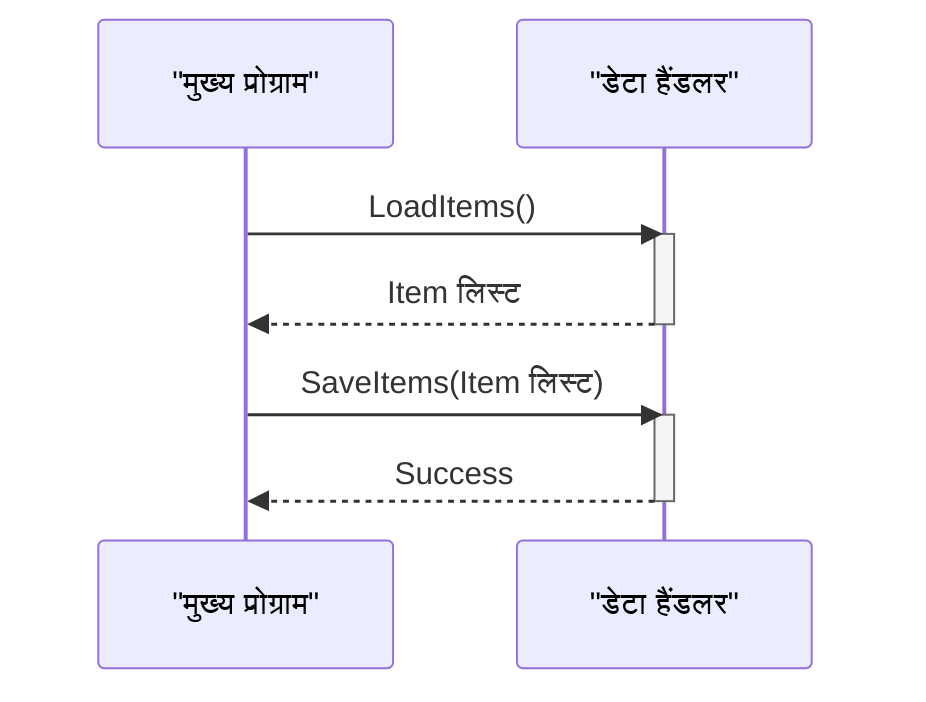

> Previously, we looked at [कॉन्फ़िगरेशन (Config)](03_कॉन्फ़िगरेशन-config.md).

# Chapter 4: डेटा हैंडलर (Data Handler)
Let's begin exploring this concept. इस अध्याय का लक्ष्य है डेटा हैंडलर के बारे में विस्तार से जानना, जो हमारे प्रोजेक्ट में डेटा को लोड और सेव करने का महत्वपूर्ण काम करता है।
डेटा हैंडलर क्यों? यह एक बहुत ही ज़रूरी सवाल है। कल्पना कीजिए कि आपके पास एक दुकान है। दुकान में सामान आता है (लोड होता है) और बिकता है (सेव होता है)। डेटा हैंडलर ठीक उसी तरह काम करता है, लेकिन डेटा के साथ। यह डेटा को पढ़ने और लिखने का काम करता है, जैसे कि एक फ़ाइल से या डेटाबेस से। डेटा हैंडलर का इस्तेमाल करने से हमारे कोड को डेटा के स्रोत (source) के बारे में ज़्यादा जानकारी रखने की ज़रूरत नहीं होती। इससे कोड सरल और रखरखाव में आसान हो जाता है।
डेटा हैंडलर (`DataHandler`) का मुख्य काम डेटा को लोड करना (Load) और सेव करना (Save) है। यह `Item` ऑब्जेक्ट्स की लिस्ट को मैनेज करता है।
यहां मुख्य बातें हैं:
*   **डेटा स्रोत पथ (Data Source Path):** यह बताता है कि डेटा कहाँ से लोड किया जाएगा और कहाँ सेव किया जाएगा। यह एक फ़ाइल का नाम हो सकता है, या किसी डेटाबेस का पता।
*   **लोड करना (Load):** डेटा स्रोत से आइटम (Item) डेटा को पढ़ना और उसे `Item` ऑब्जेक्ट्स की लिस्ट में बदलना।
*   **सेव करना (Save):** `Item` ऑब्जेक्ट्स की लिस्ट को डेटा स्रोत में लिखना।
डेटा हैंडलर कैसे काम करता है?
`DataHandler` क्लास में दो मुख्य मेथड हैं: `LoadItems()` और `SaveItems()`।
*   `LoadItems()`: यह मेथड डेटा स्रोत से आइटम (Item) डेटा को लोड करने का दिखावा करता है। अभी के लिए, यह हार्डकोड किए गए आइटम (Item) की एक लिस्ट बनाता है और उसे लौटा देता है। भविष्य में, इसे किसी फ़ाइल या डेटाबेस से डेटा पढ़ने के लिए बदला जा सकता है।
*   `SaveItems(List<Item> items)`: यह मेथड प्रोसेस किए गए आइटम (Item) को वापस डेटा स्रोत में सेव करने का दिखावा करता है। अभी के लिए, यह कंसोल पर आइटम (Item) को प्रिंट करता है। भविष्य में, इसे किसी फ़ाइल या डेटाबेस में डेटा लिखने के लिए बदला जा सकता है।
यहां `DataHandler.cs` फाइल का एक छोटा सा भाग है:
```csharp
// DataHandler.cs
namespace SampleProject2;
public class DataHandler
{
    private readonly string _dataSourcePath;
    public DataHandler(string dataSourcePath)
    {
        _dataSourcePath = dataSourcePath;
        Console.WriteLine($"DataHandler initialized for source: {_dataSourcePath}"); // डेटा हैंडलर {_dataSourcePath} के लिए शुरू किया गया
    }
    public List<Item> LoadItems()
    {
        Console.WriteLine($"Simulating loading items from {_dataSourcePath}..."); // {_dataSourcePath} से आइटम लोड करने का दिखावा किया जा रहा है...
        var items = new List<Item>
        {
            new Item(1, "Gadget Alpha", 150.75),
            new Item(2, "Widget Beta", 85.0),
        };
        Console.WriteLine($"Loaded {items.Count} items."); // {items.Count} आइटम लोड किए गए।
        return items;
    }
    public bool SaveItems(List<Item> items)
    {
        Console.WriteLine($"Simulating saving {items.Count} items to {_dataSourcePath}..."); // {_dataSourcePath} में {items.Count} आइटम सेव करने का दिखावा किया जा रहा है...
        foreach (var item in items)
        {
            Console.WriteLine($"Saving item: {item}"); // आइटम सेव किया जा रहा है: {item}
        }
        Console.WriteLine("Finished simulating save operation."); // सेव करने की प्रक्रिया का दिखावा खत्म हुआ।
        return true;
    }
}
```
यह कोड `DataHandler` क्लास को दर्शाता है। कंस्ट्रक्टर (`DataHandler`) `_dataSourcePath` को इनिशियलाइज़ (initialize) करता है, जो डेटा को लोड और सेव करने के लिए इस्तेमाल किया जाएगा। `LoadItems()` मेथड, वर्तमान में, हार्डकोडेड (hardcoded) डेटा लौटाता है। `SaveItems()` मेथड, वर्तमान में, कंसोल पर डेटा को प्रिंट करता है। भविष्य में, इन मेथड्स को असली डेटा स्टोरेज (data storage) के साथ इंटरैक्ट करने के लिए अपडेट किया जाएगा।
अब एक सीक्वेंस डायग्राम (sequence diagram) देखते हैं जो `LoadItems()` और `SaveItems()` के कॉल फ्लो (call flow) को दर्शाता है:

इस डायग्राम में, "मुख्य प्रोग्राम" पहले "डेटा हैंडलर" से `LoadItems()` को कॉल करता है, जिससे "डेटा हैंडलर" आइटम की लिस्ट लौटाता है। फिर, "मुख्य प्रोग्राम" "डेटा हैंडलर" को `SaveItems(Item लिस्ट)` को कॉल करता है, और "डेटा हैंडलर" ऑपरेशन के सफलतापूर्वक होने का संकेत देता है।
डेटा हैंडलर ([आइटम मॉडल (Item Model)](03_आइटम-मॉडल-item-model.md)) से `Item` ऑब्जेक्ट का इस्तेमाल करता है, और मुख्य प्रोग्राम ([मुख्य प्रोग्राम (Main Program)](07_मुख्य-प्रोग्राम-main-program.md)) इसका इस्तेमाल करता है। यह [प्रोसेसिंग पाइपलाइन (Processing Pipeline)](06_प्रोसेसिंग-पाइपलाइन-processing-pipeline.md) का एक हिस्सा है जहाँ डेटा लोड, प्रोसेस और सेव किया जाता है।
This concludes our look at this topic.

> Next, we will examine [प्रोसेसिंग पाइपलाइन (Processing Pipeline)](05_प्रोसेसिंग-पाइपलाइन-processing-pipeline.md).


---

*Generated by [SourceLens AI](https://github.com/openXFlow/sourceLensAI) using LLM: `gemini` (cloud) - model: `gemini-2.0-flash` | Language Profile: `Python`*