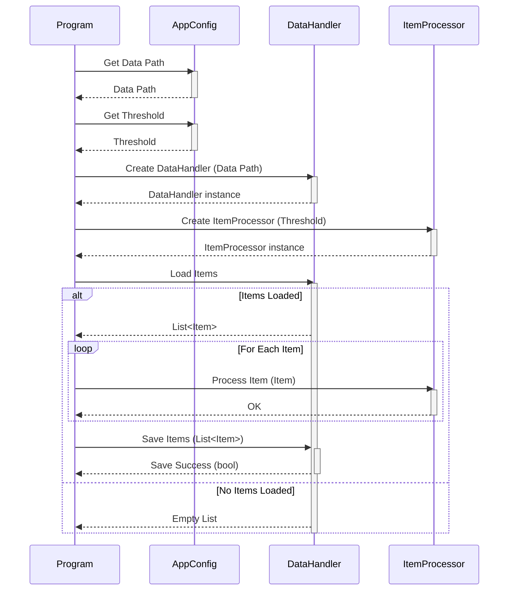

> Previously, we looked at [डेटा हैंडलर (Data Handler)](04_डेटा-हैंडलर-data-handler.md).

# Chapter 6: प्रोसेसिंग पाइपलाइन (Processing Pipeline)
Let's begin exploring this concept. इस चैप्टर का लक्ष्य है `20250704_1330_code-csharp-sample-project` में प्रोसेसिंग पाइपलाइन की अवधारणा को समझना। हम देखेंगे कि यह कैसे काम करता है, इसके मुख्य भाग क्या हैं, और इसे कैसे लागू किया जाता है।
**मोटिवेशन/परपस**
प्रोसेसिंग पाइपलाइन एक असेंबली लाइन की तरह है। कल्पना कीजिए कि आप एक खिलौना कार बना रहे हैं। प्रत्येक चरण - पहिये लगाना, रंग करना, विंडशील्ड लगाना - एक अलग स्टेशन पर होता है। प्रोसेसिंग पाइपलाइन भी इसी तरह काम करती है। यह डेटा को एक विशेष कार्य को पूरा करने के लिए डिज़ाइन किए गए चरणों की एक श्रृंखला के माध्यम से ले जाता है। इस तरह, हम जटिल कार्यों को छोटे, प्रबंधनीय भागों में विभाजित करते हैं, जिससे कोड को समझना, बनाए रखना और डीबग करना आसान हो जाता है। इस एप्लीकेशन में, प्रोसेसिंग पाइपलाइन का मुख्य उद्देश्य डेटा लोड करना, इसे प्रोसेस करना, और अंत में, प्रोसेस्ड डेटा को सेव करना है।
**मुख्य अवधारणाएं**
प्रोसेसिंग पाइपलाइन को समझने के लिए, हमें कुछ मुख्य अवधारणाओं को जानना होगा:
*   **डेटा इनपुट (Data Input):** यह पाइपलाइन का शुरुआती बिंदु है। इस चरण में, हम डेटा को लोड करते हैं, जैसे कि किसी फ़ाइल से या किसी API से।
*   **डेटा प्रोसेसिंग (Data Processing):** यह वह जगह है जहाँ डेटा को ट्रांसफॉर्म, फ़िल्टर, या बढ़ाया जाता है।
*   **डेटा आउटपुट (Data Output):** यह पाइपलाइन का अंतिम चरण है। इस चरण में, प्रोसेस्ड डेटा को सेव किया जाता है, जैसे कि किसी फ़ाइल में या किसी डेटाबेस में।
*   **चरण (Stages):** पाइपलाइन को बनाने वाले अलग-अलग कार्य। प्रत्येक चरण एक विशिष्ट कार्य करता है और अगले चरण को डेटा पास करता है।
**उपयोग / यह कैसे काम करता है**
`Program.cs` फ़ाइल में `RunProcessingPipeline()` मेथड मुख्य प्रोसेसिंग पाइपलाइन को लागू करता है। यह मेथड निम्नलिखित चरणों को पूरा करता है:
1.  **कॉन्फ़िगरेशन इनिशियलाइज़ेशन (Configuration Initialization):** कॉन्फ़िगरेशन से आवश्यक पैरामीटर लोड करता है, जैसे कि डेटा फ़ाइल पाथ और एक थ्रेशोल्ड वैल्यू।
2.  **डेटा लोड करना (Data Loading):** `DataHandler` क्लास का उपयोग करके डेटा लोड किया जाता है।
3.  **डेटा प्रोसेसिंग (Data Processing):** लोड किए गए प्रत्येक आइटम को `ItemProcessor` क्लास का उपयोग करके प्रोसेस किया जाता है।
4.  **प्रोसेस्ड डेटा सेव करना (Saving Processed Data):** प्रोसेस्ड आइटम को `DataHandler` क्लास का उपयोग करके वापस सेव किया जाता है।
5.  **एरर हैंडलिंग (Error Handling):** पूरे प्रोसेस को `try-catch` ब्लॉक में लपेटा गया है ताकि किसी भी त्रुटि को ठीक से हैंडल किया जा सके।
```python
--- File: Program.cs ---
// tests/sample_project2/Program.cs
namespace SampleProject2;
/// <summary>
/// Main execution class for Sample Project 2.
/// </summary>
public class Program
{
    /// <summary>
    /// Main entry point for the application.
    /// </summary>
    public static void Main(string[] args)
    {
        RunProcessingPipeline();
    }
    /// <summary>
    /// Executes the main data processing pipeline.
    /// </summary>
    public static void RunProcessingPipeline()
    {
        Console.WriteLine("Starting Sample Project 2 processing pipeline...");
        // Console में एक संदेश प्रिंट करता है कि प्रोसेसिंग पाइपलाइन शुरू हो रही है।
        try
        {
            // 1. Initialize components using configuration
            // कॉन्फ़िगरेशन का उपयोग करके घटकों को इनिशियलाइज़ करें
            string dataPath = AppConfig.GetDataPath();
            int threshold = AppConfig.GetThreshold();
            var dataHandler = new DataHandler(dataPath);
            var itemProcessor = new ItemProcessor(threshold);
            // 2. Load data
            // डेटा लोड करें
            List<Item> itemsToProcess = dataHandler.LoadItems();
            if (itemsToProcess.Count == 0)
            {
                Console.WriteLine("No items loaded. Exiting pipeline.");
                // यदि कोई आइटम लोड नहीं होता है तो एक संदेश प्रिंट करता है और पाइपलाइन से बाहर निकलता है।
                return;
            }
            Console.WriteLine($"Successfully loaded {itemsToProcess.Count} items.");
            // सफलतापूर्वक लोड किए गए आइटम की संख्या को console में प्रिंट करता है।
            // 3. Process data items
            // डेटा आइटम प्रोसेस करें
            foreach (var item in itemsToProcess)
            {
                Console.WriteLine($"Passing item to processor: {item}");
                // प्रत्येक आइटम को प्रोसेसर को पास करते समय console में प्रिंट करता है।
                itemProcessor.ProcessItem(item);
            }
            // 4. Save processed data
            // प्रोसेस्ड डेटा को सेव करें
            bool saveSuccess = dataHandler.SaveItems(itemsToProcess);
            if(saveSuccess)
            {
                Console.WriteLine("Processed items saved successfully.");
                // यदि प्रोसेस्ड आइटम सफलतापूर्वक सेव हो जाते हैं तो console में प्रिंट करता है।
            }
            else
            {
                Console.WriteLine("Failed to save processed items.");
                // यदि प्रोसेस्ड आइटम सेव करने में विफल हो जाते हैं तो console में प्रिंट करता है।
            }
        }
        catch (Exception ex)
        {
            Console.WriteLine($"A critical error occurred: {ex.Message}");
            // एक गंभीर त्रुटि होने पर console में एक संदेश प्रिंट करता है।
            // In a real app, log the full exception: Console.WriteLine(ex.ToString());
        }
        finally
        {
            Console.WriteLine("Sample Project 2 processing pipeline finished.");
            // अंत में console में एक संदेश प्रिंट करता है कि सैंपल प्रोजेक्ट 2 प्रोसेसिंग पाइपलाइन समाप्त हो गई है।
        }
    }
}
```
इस कोड स्निपेट में, हम `RunProcessingPipeline()` मेथड को देख सकते हैं। यह मेथड `AppConfig` क्लास से कॉन्फ़िगरेशन डिटेल्स प्राप्त करता है, `DataHandler` और `ItemProcessor` के इंस्टेंस बनाता है, डेटा लोड करता है, प्रत्येक आइटम को प्रोसेस करता है, और अंत में प्रोसेस्ड डेटा को सेव करता है। `try-catch-finally` ब्लॉक त्रुटियों को संभालने और यह सुनिश्चित करने के लिए उपयोग किया जाता है कि पाइपलाइन हमेशा एक निष्कर्ष पर पहुंचे, भले ही कुछ गलत हो जाए।
यहां एक सरलीकृत क्रम आरेख (sequence diagram) है जो प्रोसेसिंग पाइपलाइन में शामिल मुख्य चरणों को दर्शाता है:

यह आरेख `Program` क्लास और अन्य कंपोनेंट्स के बीच इंटरेक्शन को दर्शाता है, जैसे `AppConfig`, `DataHandler`, और `ItemProcessor`। यह डेटा को लोड करने, आइटम को प्रोसेस करने और प्रोसेस्ड डेटा को सेव करने के चरणों को दर्शाता है।
**रिलेशनशिप और क्रॉस-लिंकिंग**
यह चैप्टर [कॉन्फ़िगरेशन (Config)](02_कॉन्फ़िगरेशन-config.md), [आइटम मॉडल (Item Model)](03_आइटम-मॉडल-item-model.md), [डेटा हैंडलर (Data Handler)](04_डेटा-हैंडलर-data-handler.md), और [आइटम प्रोसेसर (Item Processor)](05_आइटम-प्रोसेसर-item-processor.md) चैप्टर से संबंधित है, क्योंकि प्रोसेसिंग पाइपलाइन इन सभी कंपोनेंट्स का उपयोग करती है। यह [मुख्य प्रोग्राम (Main Program)](07_मुख्य-प्रोग्राम-main-program.md) चैप्टर से भी संबंधित है, क्योंकि `RunProcessingPipeline` मेथड `Main` मेथड से कॉल किया जाता है।
**निष्कर्ष**
प्रोसेसिंग पाइपलाइन एक शक्तिशाली अवधारणा है जो हमें जटिल कार्यों को सरल, प्रबंधनीय चरणों में विभाजित करने की अनुमति देती है। यह हमारे कोड को अधिक पठनीय, रखरखाव योग्य और डीबग करने में आसान बनाता है। इस चैप्टर में, हमने देखा कि `20250704_1330_code-csharp-sample-project` में प्रोसेसिंग पाइपलाइन कैसे काम करती है और इसके मुख्य भाग क्या हैं।
This concludes our look at this topic.

> Next, we will examine [मुख्य प्रोग्राम (Main Program)](06_मुख्य-प्रोग्राम-main-program.md).


---

*Generated by [SourceLens AI](https://github.com/openXFlow/sourceLensAI) using LLM: `gemini` (cloud) - model: `gemini-2.0-flash` | Language Profile: `Python`*