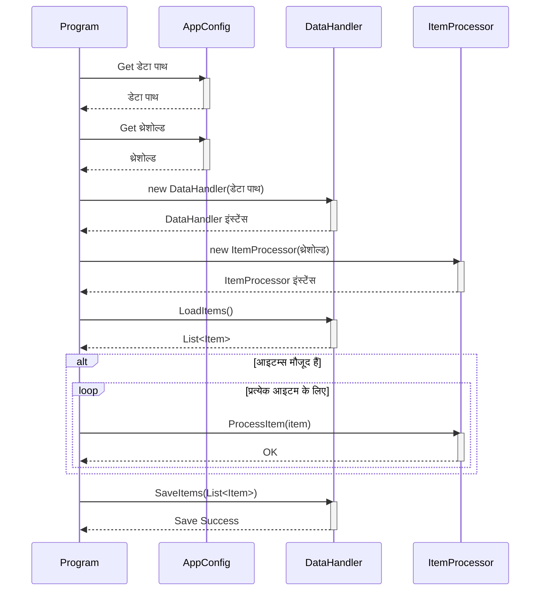

> Previously, we looked at [प्रोसेसिंग पाइपलाइन (Processing Pipeline)](05_प्रोसेसिंग-पाइपलाइन-processing-pipeline.md).

# Chapter 7: मुख्य प्रोग्राम (Main Program)
Let's begin exploring this concept. इस चैप्टर का उद्देश्य है `Program.cs` फाइल को समझना, जो हमारे एप्लीकेशन का मुख्य एंट्री पॉइंट है। हम देखेंगे कि यह कैसे डेटा प्रोसेसिंग पाइपलाइन को चलाता है।
**Motivation/Purpose**
मुख्य प्रोग्राम, या `Main Program`, किसी भी एप्लीकेशन का दिल होता है। यह वह जगह है जहाँ सब कुछ शुरू होता है। इसे एक ऑर्केस्ट्रा कंडक्टर के रूप में सोचें। कंडक्टर संगीत नहीं बजाता, लेकिन वह यह सुनिश्चित करता है कि सभी संगीतकार सही समय पर सही नोट बजाएं, और पूरा ऑर्केस्ट्रा मिलकर एक सुंदर संगीत तैयार करे। उसी तरह, `Program.cs` खुद डेटा प्रोसेस नहीं करता, लेकिन यह `Data Handler`, `Item Processor`, और `Processing Pipeline` जैसे अन्य घटकों को सही क्रम में चलाता है ताकि हमारा एप्लीकेशन ठीक से काम करे। इसके बिना, एप्लीकेशन को पता नहीं चलेगा कि क्या करना है।
**Key Concepts Breakdown**
`Program.cs` मुख्य रूप से दो महत्वपूर्ण कार्य करता है:
1.  **एप्लीकेशन को शुरू करना (Application Initialization):** यह एप्लीकेशन के लिए आवश्यक कॉन्फ़िगरेशन को पढ़ता है, और आवश्यक कंपोनेंट्स जैसे कि `DataHandler` और `ItemProcessor` को इनिशियलाइज़ करता है।
2.  **प्रोसेसिंग पाइपलाइन चलाना (Processing Pipeline Execution):** यह डेटा को लोड करने, प्रोसेस करने और सेव करने की प्रक्रिया को क्रमबद्ध तरीके से चलाता है। इसमें `DataHandler` का उपयोग करके डेटा लोड करना, प्रत्येक `Item` को `ItemProcessor` के माध्यम से प्रोसेस करना, और फिर प्रोसेस किए गए डेटा को वापस `DataHandler` का उपयोग करके सेव करना शामिल है।
**Usage / How it Works**
`Program.cs` में `Main` मेथड एप्लीकेशन का एंट्री पॉइंट है। जब आप एप्लीकेशन चलाते हैं, तो `Main` मेथड सबसे पहले रन होता है। यहां, हम `RunProcessingPipeline()` मेथड को कॉल करते हैं, जो डेटा प्रोसेसिंग पाइपलाइन को एक्सेक्यूट करता है। `RunProcessingPipeline()` मेथड निम्नलिखित स्टेप्स को फॉलो करता है:
1.  **कॉन्फ़िगरेशन लोड करना (Loading Configuration):** `AppConfig` से डेटा पाथ और थ्रेशोल्ड जैसे महत्वपूर्ण कॉन्फ़िगरेशन वैल्यू प्राप्त करता है।
2.  **कंपोनेंट्स को इनिशियलाइज़ करना (Initializing Components):** `DataHandler` और `ItemProcessor` के नए इंस्टेंस बनाता है, जो कॉन्फ़िगरेशन वैल्यू का उपयोग करते हैं।
3.  **डेटा लोड करना (Loading Data):** `DataHandler` का उपयोग करके डेटा लोड करता है। यदि कोई डेटा लोड नहीं होता है, तो पाइपलाइन एग्जिट हो जाती है।
4.  **डेटा प्रोसेस करना (Processing Data):** लोडेड डेटा में प्रत्येक `Item` के लिए, `ItemProcessor` का उपयोग करके `ProcessItem` मेथड को कॉल करता है।
5.  **प्रोसेस्ड डेटा सेव करना (Saving Processed Data):** `DataHandler` का उपयोग करके प्रोसेस्ड डेटा को सेव करता है।
6.  **एरर हैंडलिंग (Error Handling):** पूरे प्रोसेस को `try-catch-finally` ब्लॉक में रैप किया गया है ताकि किसी भी एरर को हैंडल किया जा सके और यह सुनिश्चित किया जा सके कि एप्लीकेशन ग्रेसफुली एग्जिट हो।
**Code Examples**
यहाँ `Program.cs` का एक छोटा सा उदाहरण दिया गया है:
```csharp
// tests/sample_project2/Program.cs
namespace SampleProject2;
/// <summary>
/// Main execution class for Sample Project 2.
/// </summary>
public class Program
{
    /// <summary>
    /// Main entry point for the application.
    /// </summary>
    public static void Main(string[] args)
    {
        RunProcessingPipeline();
    }
    /// <summary>
    /// Executes the main data processing pipeline.
    /// </summary>
    public static void RunProcessingPipeline()
    {
        Console.WriteLine("Starting Sample Project 2 processing pipeline...");
        try
        {
            // 1. Initialize components using configuration
            // 1. कॉन्फ़िगरेशन का उपयोग करके कंपोनेंट्स को इनिशियलाइज़ करें
            string dataPath = AppConfig.GetDataPath();
            int threshold = AppConfig.GetThreshold();
            var dataHandler = new DataHandler(dataPath);
            var itemProcessor = new ItemProcessor(threshold);
            // 2. Load data
            // 2. डेटा लोड करें
            List<Item> itemsToProcess = dataHandler.LoadItems();
            if (itemsToProcess.Count == 0)
            {
                Console.WriteLine("No items loaded. Exiting pipeline.");
                return;
            }
            Console.WriteLine($"Successfully loaded {itemsToProcess.Count} items.");
            // 3. Process data items
            // 3. डेटा आइटम प्रोसेस करें
            foreach (var item in itemsToProcess)
            {
                Console.WriteLine($"Passing item to processor: {item}");
                itemProcessor.ProcessItem(item);
            }
            // 4. Save processed data
            // 4. प्रोसेस्ड डेटा सेव करें
            bool saveSuccess = dataHandler.SaveItems(itemsToProcess);
            if(saveSuccess)
            {
                Console.WriteLine("Processed items saved successfully.");
            }
            else
            {
                Console.WriteLine("Failed to save processed items.");
            }
        }
        catch (Exception ex)
        {
            Console.WriteLine($"A critical error occurred: {ex.Message}");
            // In a real app, log the full exception: Console.WriteLine(ex.ToString());
        }
        finally
        {
            Console.WriteLine("Sample Project 2 processing pipeline finished.");
        }
    }
}
```
नीचे एक सरल क्रम डायग्राम दिया गया है जो मुख्य प्रोग्राम के फ्लो को दर्शाता है:

यह डायग्राम दिखाता है कि `Program` क्लास कैसे `AppConfig`, `DataHandler`, और `ItemProcessor` क्लास के साथ इंटरैक्ट करता है ताकि प्रोसेसिंग पाइपलाइन को चलाया जा सके।
**Relationships & Cross-Linking**
यह चैप्टर `Processing Pipeline` के ऊपर बनाता है। आप [प्रोसेसिंग पाइपलाइन (Processing Pipeline)](06_प्रोसेसिंग-पाइपलाइन-processing-pipeline.md) चैप्टर में प्रोसेसिंग पाइपलाइन के बारे में अधिक जान सकते हैं। इसके अलावा, कॉन्फ़िगरेशन के बारे में अधिक जानकारी के लिए [कॉन्फ़िगरेशन (Config)](02_कॉन्फ़िगरेशन-config.md) देखें, और डेटा हैंडलिंग के बारे में अधिक जानकारी के लिए [डेटा हैंडलर (Data Handler)](04_डेटा-हैंडलर-data-handler.md) देखें।
**Conclusion**
इस चैप्टर में, हमने `Program.cs` फाइल और एप्लीकेशन के मुख्य एंट्री पॉइंट के रूप में इसकी भूमिका का पता लगाया। हमने देखा कि यह कैसे कॉन्फ़िगरेशन लोड करता है, कंपोनेंट्स को इनिशियलाइज़ करता है, डेटा को प्रोसेस करता है और प्रोसेस्ड डेटा को सेव करता है।
This concludes our look at this topic.

> Next, we will examine [सी# प्रोजेक्ट फाइल (.csproj)](07_सी-प्रोजेक्ट-फाइल-.csproj.md).


---

*Generated by [SourceLens AI](https://github.com/openXFlow/sourceLensAI) using LLM: `gemini` (cloud) - model: `gemini-2.0-flash` | Language Profile: `Python`*