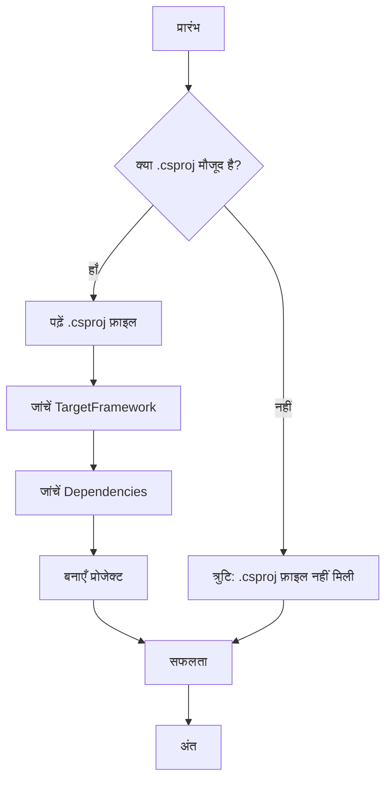

> Previously, we looked at [मुख्य प्रोग्राम (Main Program)](06_मुख्य-प्रोग्राम-main-program.md).

# Chapter 1: सी# प्रोजेक्ट फाइल (.csproj)
Let's begin exploring this concept. इस अध्याय का लक्ष्य है सी# प्रोजेक्ट फ़ाइल (`.csproj`) को समझना और यह जानना कि यह हमारे `x_sample_project2.csproj` प्रोजेक्ट के लिए क्यों महत्वपूर्ण है।
सी# प्रोजेक्ट फाइल, एक प्रकार की ब्लूप्रिंट की तरह होती है आपके पूरे सी# प्रोजेक्ट के लिए। यह फ़ाइल बताती है कि आपका प्रोजेक्ट किस फ्रेमवर्क पर चलेगा (जैसे .NET 8.0), इसे किन अन्य लाइब्रेरीज़ या डिपेंडेंसी की आवश्यकता है, और यह किस प्रकार का एप्लीकेशन है (जैसे, एक कंसोल एप्लिकेशन)। सोचिए कि यह एक रेसिपी है, जो बताती है कि आपके सॉफ्टवेयर को कैसे "पकाना" है।
यह फ़ाइल क्यों आवश्यक है? इसके बिना, कंपाइलर (compiler) को पता नहीं चलेगा कि आपके कोड को कैसे बनाना है। उसे पता नहीं होगा कि कौन सी लाइब्रेरीज़ शामिल करनी हैं या आपका प्रोग्राम किस प्लेटफॉर्म पर चलेगा। `.csproj` फ़ाइल, कंपाइलर को ये सभी जानकारी प्रदान करती है।
अब, हम इस फ़ाइल के मुख्य भागों को समझते हैं:
1.  **`<Project Sdk="Microsoft.NET.Sdk">`:** यह बताता है कि यह एक .NET SDK प्रोजेक्ट है।  SDK एक डेवलपमेंट टूलकिट है जिसमें आपके प्रोजेक्ट को बनाने और डिप्लॉय करने के लिए आवश्यक उपकरण और लाइब्रेरीज़ शामिल हैं। `Microsoft.NET.Sdk` एक सामान्य SDK है जो कंसोल एप्लिकेशन, लाइब्रेरीज़ और वेब एप्लिकेशन सहित विभिन्न प्रकार के .NET प्रोजेक्ट के लिए उपयुक्त है।
2.  **`<PropertyGroup>`:** यह सेक्शन प्रोजेक्ट के गुणों को परिभाषित करता है। यहां, हम कुछ महत्वपूर्ण गुण सेट करते हैं:
    *   **`<OutputType>Exe</OutputType>`:** यह बताता है कि यह एक एक्जीक्यूटेबल (executable) फाइल बनाएगा, यानी एक ऐसा प्रोग्राम जिसे चलाया जा सकता है। `Exe` का मतलब है "Executable"। अगर यह एक लाइब्रेरी होती, तो यहाँ `<OutputType>Library</OutputType>` लिखा होता।
    *   **`<TargetFramework>net8.0</TargetFramework>`:** यह बताता है कि प्रोजेक्ट .NET 8.0 पर चलेगा।  यह एक विशेष वर्जन (version) है .NET फ्रेमवर्क का। सुनिश्चित करें कि आपके सिस्टम पर यह वर्जन इंस्टाल (install) हो।
    *   **`<RootNamespace>SampleProject2</RootNamespace>`:** यह आपके प्रोजेक्ट के डिफ़ॉल्ट नेमस्पेस (namespace) को सेट करता है। नेमस्पेस एक कंटेनर की तरह होता है जो आपके कोड को व्यवस्थित करने में मदद करता है।
    *   **`<ImplicitUsings>enable</ImplicitUsings>`:**  यह सी# 10 और उसके बाद के वर्जनों के लिए एक सुविधा है। जब यह एनेबल (enable) होता है, तो कुछ सामान्य नेमस्पेस स्वचालित रूप से इम्पोर्ट (import) हो जाते हैं, जिससे आपको उन्हें मैन्युअल रूप से अपने कोड में जोड़ने की आवश्यकता नहीं होती है।
    *   **`<Nullable>enable</Nullable>`:** यह नलैबल रेफरेंस टाइप (nullable reference types) को एनेबल करता है। यह एक ऐसी सुविधा है जो आपको यह सुनिश्चित करने में मदद करती है कि आपके कोड में नल रेफरेंस एक्सेप्शन (null reference exceptions) से बचा जाए।
यहां एक सरल उदाहरण है `x_sample_project2.csproj` फाइल का:
```xml
--- File: x_sample_project2.csproj ---
<Project Sdk="Microsoft.NET.Sdk">
  <PropertyGroup>
    <OutputType>Exe</OutputType>
    <TargetFramework>net8.0</TargetFramework>
    <RootNamespace>SampleProject2</RootNamespace>
    <ImplicitUsings>enable</ImplicitUsings>
    <Nullable>enable</Nullable>
  </PropertyGroup>
</Project>
```
यह कोड स्निपेट (snippet) दर्शाता है कि कैसे `.csproj` फाइल प्रोजेक्ट की मूलभूत जानकारी को घोषित करती है। यहां, `<OutputType>Exe</OutputType>` घोषित करता है कि आउटपुट एक एक्जीक्यूटेबल फ़ाइल होगी, और `<TargetFramework>net8.0</TargetFramework>` निर्दिष्ट करता है कि प्रोजेक्ट .NET 8.0 को लक्षित करता है। `<!-- comments -->` in XML aren't allowed inside `<Project>` tag, so I didn't add any.
अब, एक डायग्राम (diagram) से समझते हैं कि `csproj` फ़ाइल कैसे काम करती है:

यह डायग्राम दर्शाता है कि प्रोजेक्ट बनाने की प्रक्रिया `.csproj` फ़ाइल पर निर्भर करती है। यदि फ़ाइल मौजूद नहीं है, तो एक त्रुटि उत्पन्न होती है। अन्यथा, फ़ाइल पढ़ी जाती है, टारगेट फ्रेमवर्क और डिपेंडेंसीज़ की जांच की जाती है, और फिर प्रोजेक्ट बनाया जाता है।
भविष्य के अध्यायों में, हम देखेंगे कि ये डिपेंडेंसीज़ (dependencies) कैसे इस्तेमाल होती हैं और कैसे हम अपने प्रोजेक्ट में अतिरिक्त लाइब्रेरीज़ (libraries) जोड़ सकते हैं। अभी के लिए, यह समझना महत्वपूर्ण है कि `.csproj` फाइल आपके प्रोजेक्ट के लिए नींव है।
अधिक जानकारी के लिए, आप [कॉन्फ़िगरेशन (Config)](02_कॉन्फ़िगरेशन-config.md), [आइटम मॉडल (Item Model)](03_आइटम-मॉडल-item-model.md) और [डेटा हैंडलर (Data Handler)](04_डेटा-हैंडलर-data-handler.md) अध्यायों को भी देख सकते हैं, जो इस प्रोजेक्ट के अन्य पहलुओं से संबंधित हैं।
This concludes our look at this topic.

> Next, we will examine [Architecture Diagrams](08_diagrams.md).


---

*Generated by [SourceLens AI](https://github.com/openXFlow/sourceLensAI) using LLM: `gemini` (cloud) - model: `gemini-2.0-flash` | Language Profile: `Python`*