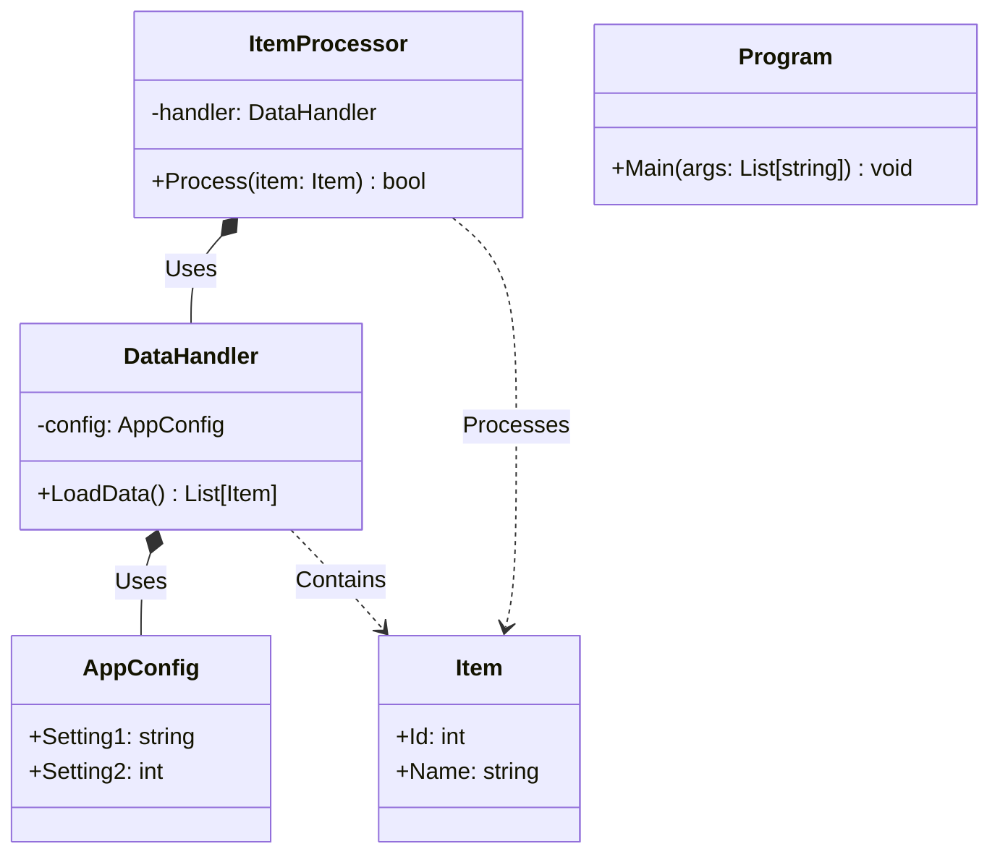
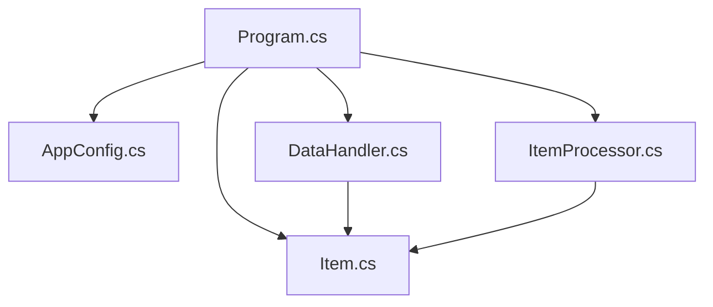
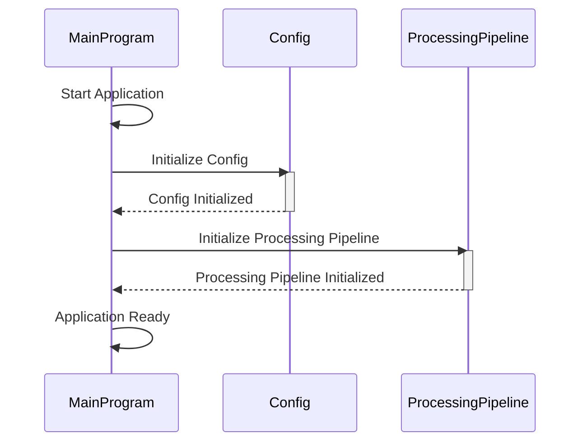
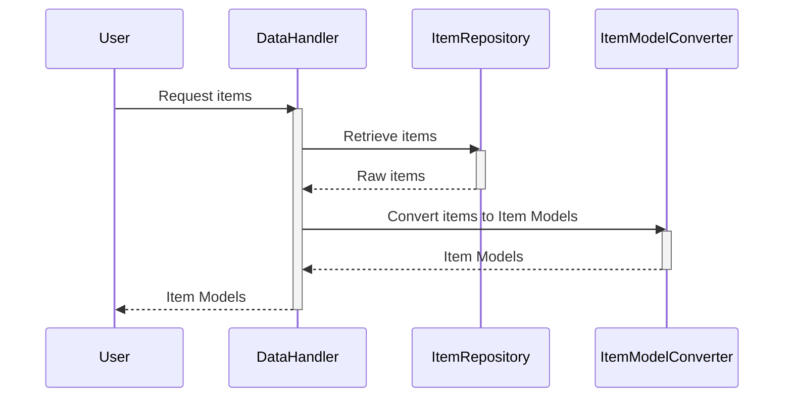
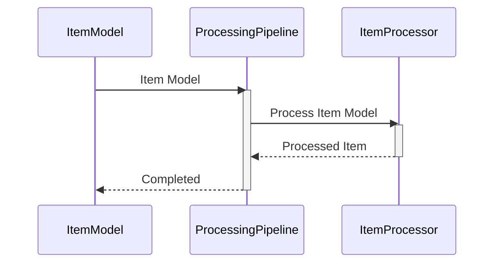
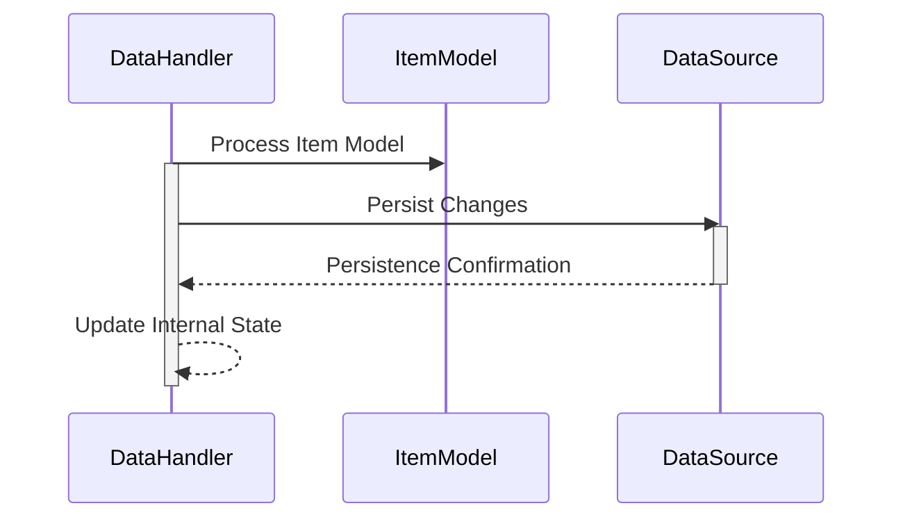

> Previously, we looked at [सी# प्रोजेक्ट फाइल (.csproj)](07_सी-प्रोजेक्ट-फाइल-.csproj.md).

# Architecture Diagrams
## Class Diagram
Key classes and their relationships in **20250704_1330_code-csharp-sample-project**.

## Package Dependencies
High-level module and package structure of **20250704_1330_code-csharp-sample-project**.

## Sequence Diagrams
These diagrams illustrate various interaction scenarios, showcasing operations between components for specific use cases.
### The Main Program initializes the Config and Processing Pipeline.

### A Data Handler retrieves items, converting them into Item Models.

### The Processing Pipeline processes an Item Model through the Item Processor.

### The Main Program handles an exception during data processing and logs the error.
```mermaid
sequenceDiagram
    participant MainProgram
    participant DataProcessor
    participant Logger
    MainProgram->>DataProcessor: Process data
    activate DataProcessor
    alt Exception occurs
        DataProcessor-->>MainProgram: Exception
        deactivate DataProcessor
        MainProgram->>Logger: Log error
        activate Logger
        Logger-->>MainProgram: Logged
        deactivate Logger
    else No exception
        DataProcessor-->>MainProgram: Data processed
        deactivate DataProcessor
    end
```
### The Data Handler persists changes to the data source based on processed Item Models.


> Next, we will examine [Code Inventory](09_code_inventory.md).


---

*Generated by [SourceLens AI](https://github.com/openXFlow/sourceLensAI) using LLM: `gemini` (cloud) - model: `gemini-2.0-flash` | Language Profile: `Python`*