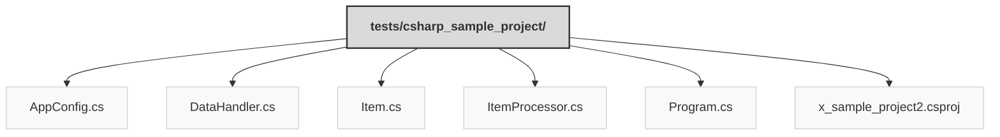

> Previously, we looked at [Architecture Diagrams](08_diagrams.md).

# Code Inventory: 20250704_1330_code-csharp-sample-project
## File Structure

## File Descriptions Summary
*   **`AppConfig.cs`**: // tests/sample_project2/AppConfig.cs
*   **`DataHandler.cs`**: // tests/sample_project2/DataHandler.cs
*   **`Item.cs`**: // tests/sample_project2/Item.cs
*   **`ItemProcessor.cs`**: // tests/sample_project2/ItemProcessor.cs
*   **`Program.cs`**: // tests/sample_project2/Program.cs
*   **`x_sample_project2.csproj`**: <Project Sdk="Microsoft.NET.Sdk">
---
## Detailed File Content
No detailed structural information could be generated for the files based on the selected parser.

> Next, we will examine [Project Review](10_project_review.md).

---

*Generated by [SourceLens AI](https://github.com/openXFlow/sourceLensAI) using LLM: `gemini` (cloud) - model: `gemini-2.0-flash` | Language Profile: `Python`*