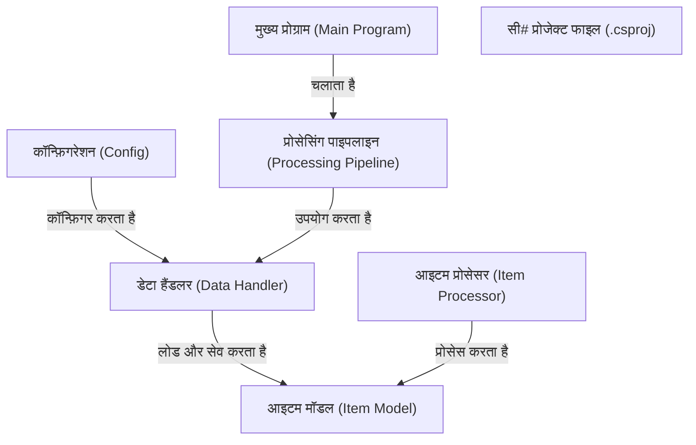

# Tutorial: 20250704_1330_code-csharp-sample-project

यह प्रोजेक्ट **मुख्य प्रोग्राम (Main Program)** के ज़रिए एक प्रोसेसिंग पाइपलाइन चलाता है। **कॉन्फ़िगरेशन (Config)** एप्लीकेशन सेटिंग्स प्रदान करता है जिसका उपयोग **डेटा हैंडलर (Data Handler)** डेटा लोड और सेव करने के लिए करता है। **आइटम प्रोसेसर (Item Processor)** डेटा आइटम्स को प्रोसेस करता है, और सभी आइटम **आइटम मॉडल (Item Model)** का उपयोग करते हैं।

**Source Directory:** `C:\_jd_programming\python\11_sourceLens_project\sourceLens\tests\csharp_sample_project`

## Abstraction Relationships

## Chapters

1. [आइटम प्रोसेसर (Item Processor)](01_आइटम-प्रोसेसर-item-processor.md)
2. [आइटम मॉडल (Item Model)](02_आइटम-मॉडल-item-model.md)
3. [कॉन्फ़िगरेशन (Config)](03_कॉन्फ़िगरेशन-config.md)
4. [डेटा हैंडलर (Data Handler)](04_डेटा-हैंडलर-data-handler.md)
5. [प्रोसेसिंग पाइपलाइन (Processing Pipeline)](05_प्रोसेसिंग-पाइपलाइन-processing-pipeline.md)
6. [मुख्य प्रोग्राम (Main Program)](06_मुख्य-प्रोग्राम-main-program.md)
7. [सी# प्रोजेक्ट फाइल (.csproj)](07_सी-प्रोजेक्ट-फाइल-.csproj.md)
8. [Architecture Diagrams](08_diagrams.md)
9. [Code Inventory](09_code_inventory.md)
10. [Project Review](10_project_review.md)

---

*Generated by [SourceLens AI](https://github.com/openXFlow/sourceLensAI) using LLM: `gemini` (cloud) - model: `gemini-2.0-flash` | Language Profile: `Python`*