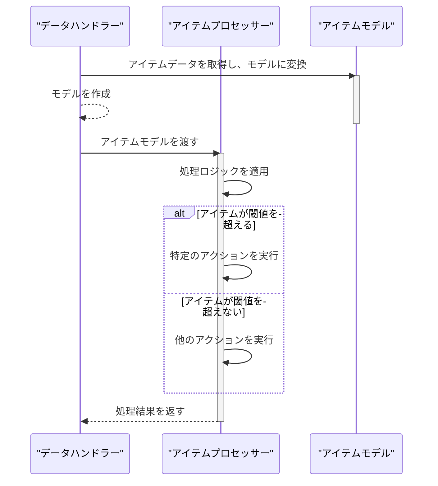

> Previously, we looked at the [Project Overview](index.md).

# Chapter 5: アイテムプロセッサー (アイテム処理担当)
Let's begin exploring this concept. この章では、アイテムプロセッサー（アイテム処理担当）の役割と機能について学びます。アイテムプロセッサーは、個々のアイテムに対して特定の処理を行い、ビジネスロジックを適用する重要なコンポーネントです。
アイテムプロセッサーの存在意義を考えてみましょう。たとえば、工場でベルトコンベアに乗って流れてくる製品を想像してください。それぞれの製品に対して、品質検査やラベル貼り付けなどの処理を行う担当者がいます。この担当者がアイテムプロセッサーに相当します。すべての製品に対して一律の処理を行うのではなく、製品の状態や種類に応じて異なる処理を適用する必要があるため、アイテムプロセッサーは非常に重要な役割を担います。
**アイテムプロセッサー (アイテム処理担当)**
アイテムプロセッサーは、アプリケーション内の個々のアイテム（データ）を処理するために設計されたコンポーネントです。主な目的は以下のとおりです。
*   **アイテムの検証:** アイテムのデータが特定の条件を満たしているかを確認します。
*   **ビジネスロジックの適用:** 設定されたルールに基づいてアイテムを処理します。例えば、閾値を超えているかどうかを判断し、適切なアクションを実行します。
*   **アイテムの状態変更:** 処理の結果に基づいてアイテムの状態を更新します。
**主要な概念の分解**
アイテムプロセッサーは通常、以下の要素で構成されます。
*   **入力:** 処理対象のアイテム（通常は[アイテムモデル (アイテムの型)](03_アイテムモデル-アイテムの型.md)で定義されたオブジェクト）。
*   **設定:** 処理のルールや閾値などの設定情報。
*   **処理ロジック:** アイテムに対して実行される具体的な処理。
*   **出力:** 処理後のアイテム（状態が更新されている場合がある）。
**使い方 / 仕組み**
アイテムプロセッサーは、通常、データハンドラーまたはメイン処理から呼び出されます。データハンドラーがデータを取得し、アイテムモデルに変換した後、アイテムプロセッサーはそのアイテムモデルを受け取り、定義された処理ロジックを適用します。
以下は、アイテムプロセッサーの基本的な流れを示す図です。

この図は、[データハンドラー (データ処理担当)](04_データハンドラー-データ処理担当.md)がアイテムデータを取得し、アイテムモデルに変換した後、アイテムプロセッサーに渡し、アイテムプロセッサーが処理を行い、結果をデータハンドラーに返す様子を示しています。
**コード例**
以下は、`ItemProcessor.php` ファイルの簡単な例です。
```php
<?php
// tests/sample_project2/ItemProcessor.php
namespace SampleProject2;
use SampleProject2\Item;
/**
 * Processes individual Item objects based on configured rules.
 */
class ItemProcessor
{
    private int $threshold;
    /**
     * Initialize the ItemProcessor with a processing threshold.
     * @param int $threshold The numerical threshold for processing logic.
     */
    public function __construct(int $threshold)
    {
        $this->threshold = $threshold;
        echo "ItemProcessor initialized with threshold: {$this->threshold}\n";
    }
    /**
     * Process a single item.
     * Marks the item as processed and applies logic based on the threshold.
     * @param Item $item The Item object to process.
     * @return bool True if processing was successful.
     */
    public function processItem(Item $item): bool
    {
        echo "Processing item ID: {$item->itemId}, Name: '{$item->name}', Value: {$item->value}\n";
        if ($item->value > $this->threshold) {
            echo "Item '{$item->name}' (ID: {$item->itemId}) value {$item->value} exceeds threshold {$this->threshold}.\n";
        } else {
            echo "Item '{$item->name}' (ID: {$item->itemId}) value {$item->value} is within threshold {$this->threshold}.\n";
        }
        $item->markAsProcessed();
        return true;
    }
}
```
上記のコードは、`ItemProcessor`クラスが、コンストラクターで閾値を受け取り、`processItem`メソッドで個々の`Item`オブジェクトを処理する様子を示しています。処理の際には、アイテムの値が閾値を超えているかどうかを判断し、適切なメッセージを出力します。
```php
<?php
// ItemProcessor クラスのインスタンスを作成
$processor = new ItemProcessor(100); // 閾値を100に設定
// Item オブジェクトを作成 (Itemクラスは03章で定義されているものとします)
$item = new Item(1, "Sample Item", 120);
// アイテムを処理
$processor->processItem($item); // アイテムを処理する
?>
```
上記のコードは、`ItemProcessor`クラスのインスタンスを作成し、`Item`オブジェクトを処理する例を示しています。
**関連する章**
*   [オートローダー (自動読み込み)](01_オートローダー-自動読み込み.md)
*   [設定 (せってい)](02_設定-せってい.md)
*   [アイテムモデル (アイテムの型)](03_アイテムモデル-アイテムの型.md)
*   [データハンドラー (データ処理担当)](04_データハンドラー-データ処理担当.md)
*   [メイン処理 (メインの処理)](06_メイン処理-メインの処理.md)
この章では、アイテムプロセッサーの概念、目的、および基本的な使い方について学びました。アイテムプロセッサーは、個々のアイテムに対してビジネスロジックを適用し、アプリケーションの機能を拡張するために不可欠なコンポーネントです。
This concludes our look at this topic.

> Next, we will examine [アイテムモデル (アイテムの型)](02_アイテムモデル-アイテムの型.md).


---

*Generated by [SourceLens AI](https://github.com/openXFlow/sourceLensAI) using LLM: `gemini` (cloud) - model: `gemini-2.0-flash` | Language Profile: `Python`*