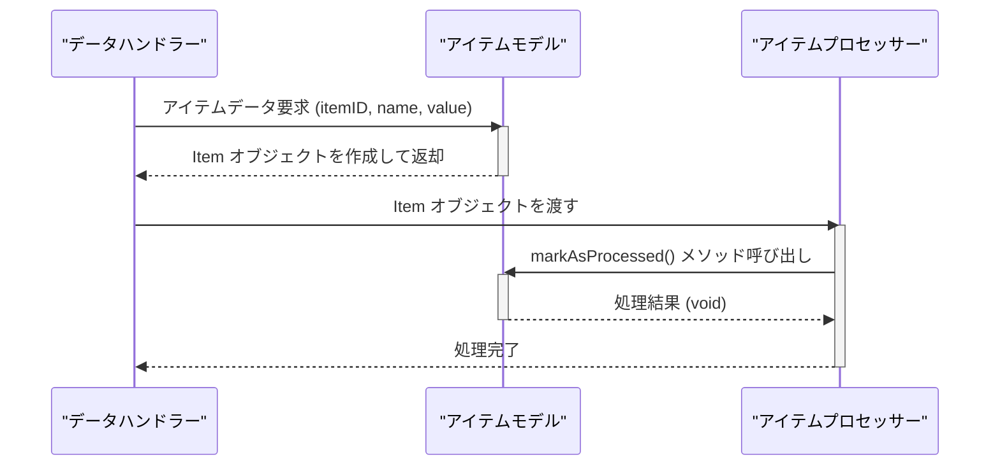

> Previously, we looked at [アイテムプロセッサー (アイテム処理担当)](01_アイテムプロセッサー-アイテム処理担当.md).

# Chapter 3: アイテムモデル (アイテムの型)
Let's begin exploring this concept. この章では、`Item`クラス、つまりアイテムモデルについて学びます。このモデルは、処理対象となるデータを抽象化し、プログラム内で扱いやすくするための重要な要素です。この章を終える頃には、アイテムモデルの役割と使い方を理解し、プロジェクト内でどのように活用できるかを把握できるようになるでしょう。
アイテムモデルは、現実世界のオブジェクトや概念をソフトウェア内で表現するための設計パターンの一つです。例えば、オンラインストアの商品、顧客情報、タスクリストのタスクなど、さまざまなものがアイテムモデルとして表現できます。
この`20250704_1343_code-php-sample-project`プロジェクトでは、アイテムモデル(`Item`クラス)は、処理する個々のデータアイテムを表現します。アイテムは、ID、名前、値、そして処理済みかどうかを示すフラグを持ちます。
アイテムモデルが存在する理由は、主に以下の通りです。
*   **データの構造化:** アイテムに関する情報を一つの場所にまとめ、関連するデータを整理します。
*   **コードの可読性と保守性の向上:** アイテムに関連するロジックをカプセル化し、コードをより理解しやすく、変更しやすくします。
*   **抽象化:** 具体的なデータソース（データベース、ファイルなど）からアイテムの表現を分離します。これにより、データソースを変更しても、アイテムモデルを使用するコードは変更する必要がなくなる可能性があります。
では、`Item`クラスの主要な要素を見ていきましょう。
1.  **属性 (Attributes):**
    *   `$itemId` (int): アイテムの一意なID (整数)。
    *   `$name` (string): アイテムの名前 (文字列)。
    *   `$value` (float): アイテムに関連付けられた数値 (浮動小数点数)。
    *   `$processed` (bool): アイテムが処理済みかどうかを示すフラグ (真偽値)。初期値は `false` (未処理) です。
2.  **コンストラクタ (Constructor):**
    *   `__construct(int $itemId, string $name, float $value, bool $processed = false)`: `Item`オブジェクトを初期化するために使用されます。`$itemId`、`$name`、`$value`は必須の引数であり、`$processed`はオプションの引数です。
3.  **メソッド (Methods):**
    *   `markAsProcessed(): void`: アイテムの`$processed`フラグを`true`に設定します。これは、アイテムが処理されたことを示すために使用されます。
    *   `__toString(): string`: アイテムの文字列表現を返します。これは、アイテムの情報を人間が読みやすい形式で表示するために使用されます。
次に、`Item`クラスのコードを見てみましょう。
```php
<?php
namespace SampleProject2;
/**
 * Represents a single data item to be processed.
 * 処理対象となる単一のデータアイテムを表します。
 */
class Item
{
    /**
     * @param int $itemId A unique integer identifier for the item.
     * @param string $name The name of the item.
     * @param float $value A numerical value associated with the item.
     * @param bool $processed A flag indicating if the item has been processed.
     * @param int $itemId アイテムの一意な整数識別子。
     * @param string $name アイテムの名前。
     * @param float $value アイテムに関連付けられた数値。
     * @param bool $processed アイテムが処理されたかどうかを示すフラグ。
     */
    public function __construct(
        public int $itemId,
        public string $name,
        public float $value,
        public bool $processed = false
    ) {
    }
    /**
     * Set the processed flag to True.
     * This method updates the item's state.
     * 処理済みフラグをTrueに設定します。
     * このメソッドはアイテムの状態を更新します。
     */
    public function markAsProcessed(): void
    {
        echo "Model Item {$this->itemId}: Marking '{$this->name}' as processed.\n";
        $this->processed = true;
    }
    /**
     * Return a user-friendly string representation of the item.
     *
     * @return string A string detailing the item's properties.
     * アイテムのユーザーフレンドリーな文字列表現を返します。
     *
     * @return string アイテムのプロパティを詳述する文字列。
     */
    public function __toString(): string
    {
        $status = $this->processed ? "Processed" : "Pending";
        return sprintf(
            "Item(ID=%d, Name='%s', Value=%.2f, Status=%s)",
            $this->itemId,
            $this->name,
            $this->value,
            $status
        );
    }
}
```
このコードは、`Item`クラスの定義を示しています。コンストラクタは、アイテムの初期値を設定し、`markAsProcessed()`メソッドは、アイテムを処理済みとしてマークします。`__toString()`メソッドは、アイテムの文字列表現を提供します。
アイテムモデルの使用例を考えてみましょう。まず、新しい`Item`オブジェクトを作成します。
```php
<?php
require_once 'Item.php';
use SampleProject2\Item;
$item = new Item(123, "Product A", 19.99);
echo $item . "\n"; // Output: Item(ID=123, Name='Product A', Value=19.99, Status=Pending)
$item->markAsProcessed(); // Output: Model Item 123: Marking 'Product A' as processed.
echo $item . "\n"; // Output: Item(ID=123, Name='Product A', Value=19.99, Status=Processed)
```
この例では、IDが123、名前が"Product A"、値が19.99の新しい`Item`オブジェクトを作成しました。最初は処理待ちの状態であり、`markAsProcessed()`メソッドを呼び出すと、処理済みの状態に変わります。
アイテムモデルは、[データハンドラー (データ処理担当)](04_データハンドラー-データ処理担当.md)や[アイテムプロセッサー (アイテム処理担当)](05_アイテムプロセッサー-アイテム処理担当.md)などの他のコンポーネントで使用されます。データハンドラーは、データソースからアイテムを読み込み、アイテムプロセッサーは、アイテムに対して何らかの処理を実行します。

上のシーケンス図は、データハンドラー(DH)、アイテムモデル(IM)、アイテムプロセッサー(IP)間のやり取りを示しています。DHがIMにアイテムデータを要求し、IMはItemオブジェクトを作成して返却します。次にDHはItemオブジェクトをIPに渡し、IPはアイテムを処理し、`markAsProcessed()`メソッドを呼び出してアイテムの状態を更新します。
`Item`クラスは、データの表現方法を定義する重要な要素であり、プロジェクト全体の構造を理解する上で不可欠です。このクラスを理解することで、データの流れや処理方法をより深く理解することができます。
このチュートリアルの[オートローダー (自動読み込み)](01_オートローダー-自動読み込み.md)と[設定 (せってい)](02_設定-せってい.md)の章で説明されている概念も、このアイテムモデルの動作を支える基盤となっています。
This concludes our look at this topic.

> Next, we will examine [オートローダー (自動読み込み)](03_オートローダー-自動読み込み.md).


---

*Generated by [SourceLens AI](https://github.com/openXFlow/sourceLensAI) using LLM: `gemini` (cloud) - model: `gemini-2.0-flash` | Language Profile: `Python`*