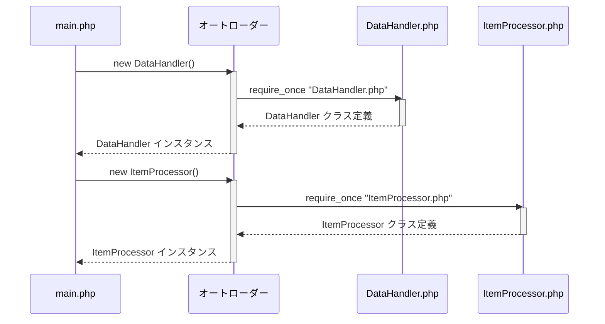

> Previously, we looked at [アイテムモデル (アイテムの型)](02_アイテムモデル-アイテムの型.md).

# Chapter 1: オートローダー (自動読み込み)
Let's begin exploring this concept. この章では、`20250704_1343_code-php-sample-project` プロジェクトにおけるオートローダーの役割と仕組みについて学びます。目標は、オートローダーが何をするもので、なぜ重要なのかを理解し、プロジェクト内でどのように機能するかを把握することです。
オートローダー（自動読み込み）は、PHPにおいて非常に重要な概念です。なぜなら、クラスやインターフェースを使用する際に、必要なファイルをいちいち `require` や `include` で読み込む手間を省いてくれるからです。手動でファイルの読み込みを行うと、コードが煩雑になり、保守が難しくなる可能性があります。オートローダーは、必要なクラスが使用されるタイミングで自動的にファイルを読み込むため、コードをより整理し、保守しやすくします。
例えるなら、オートローダーは図書館の司書のようなものです。あなたが本（クラス）を読みたいと思ったとき、司書（オートローダー）は自動的にその本がある場所を探し出し、あなたの手元に届けてくれます。あなたは、本棚を自分で探す必要はありません。
このプロジェクトでは、ComposerというPHPの依存性管理ツールを利用してオートローダーを実装しています。Composerは、プロジェクトに必要なライブラリを管理し、オートローダーの設定も簡単に行うことができます。
**Key Concepts Breakdown (主要な概念):**
*   **名前空間 (Namespace):** PHPでは、クラスの名前空間を使ってクラス名を整理します。名前空間は、ディレクトリ構造と対応していることが一般的です。たとえば、`SampleProject2\DataHandler` という名前空間を持つクラスは、`DataHandler.php` というファイルに格納され、`SampleProject2` というディレクトリの下に配置されることが多いです。
*   **PSR-4:** PSR-4は、PHP Standards Recommendationsの4番目の規格であり、オートローダーの実装に関する推奨事項を定めています。PSR-4に準拠することで、異なるプロジェクト間でも一貫性のあるオートローディングが可能になります。
*   **composer.json:** このファイルは、プロジェクトの依存関係やオートローダーの設定を記述するJSONファイルです。Composerはこのファイルに基づいて、必要なライブラリをインストールし、オートローダーを設定します。
**Usage / How it Works (使い方と仕組み):**
オートローダーは、クラスが初めて使用されるときに自動的に動作します。PHPインタプリタがクラスを見つけられない場合、登録されたオートローダー関数が呼び出されます。この関数は、クラス名に基づいて対応するファイルを探し、`require` または `include` でファイルを読み込みます。
`composer.json` ファイルの設定を見てみましょう。
```json
{
    "name": "sourcelens/sample-project-2",
    "description": "A sample PHP project with a clear separation of concerns, equivalent to the Python sample project.",
    "type": "project",
    "authors": [
        {
            "name": "SourceLens AI",
            "email": "assistant@example.com"
        }
    ],
    "require": {},
    "autoload": {
        "psr-4": {
            "SampleProject2\\": "./"
        }
    }
}
```
`autoload` セクションの `psr-4` は、PSR-4規格に従ってオートローダーを設定することを示しています。`"SampleProject2\\": "./"` は、`SampleProject2` 名前空間で始まるクラスは、プロジェクトのルートディレクトリ（`./`）から相対的にファイルを検索することを意味します。
つまり、`SampleProject2\DataHandler` というクラスを使用する場合、オートローダーは `./DataHandler.php` というファイルを読み込もうとします。
`main.php` ファイルでは、以下の行でオートローダーを有効にしています。
```php
<?php
// tests/sample_project2/main.php
/**
 * Main execution script for Sample Project 2.
 * Orchestrates the loading, processing, and saving of data items.
 */
// This is crucial for autoloading all our classes
require 'vendor/autoload.php';
use SampleProject2\DataHandler;
use SampleProject2\ItemProcessor;
/**
 * Executes the main data processing pipeline.
 */
function runProcessingPipeline(): void
{
    echo "Starting Sample Project 2 processing pipeline...\n";
    try {
        // 1. Load configuration
        $config = require 'config.php';
        // 2. Initialize components
        $dataHandler = new DataHandler($config['DATA_FILE_PATH']);
        $itemProcessor = new ItemProcessor($config['PROCESSING_THRESHOLD']);
        // 3. Load data
        $itemsToProcess = $dataHandler->loadItems();
        if (empty($itemsToProcess)) {
            echo "No items loaded. Exiting pipeline.\n";
            return;
        }
        // 4. Process data items
        foreach ($itemsToProcess as $item) {
            $itemProcessor->processItem($item);
        }
        // 5. Save processed data
        $dataHandler->saveItems($itemsToProcess);
    } catch (Throwable $e) {
        // Catch any error or exception for graceful exit
        echo "A critical error occurred: " . $e->getMessage() . "\n";
    } finally {
        echo "Sample Project 2 processing pipeline finished.\n";
    }
}
// Run the main function
runProcessingPipeline();
```
```php
require 'vendor/autoload.php'; // クラスの自動読み込みに必須
```
この行は、Composerによって生成されたオートローダーのスクリプトを読み込んでいます。これにより、プロジェクト内のすべてのクラスが自動的に読み込まれるようになります。
オートローダーの処理の流れをシーケンス図で見てみましょう。

上の図は、`main.php` が `DataHandler` と `ItemProcessor` のインスタンスを作成する際に、オートローダーがどのように動作するかを示しています。`main.php` がこれらのクラスを使用しようとすると、オートローダーが対応するファイルを自動的に読み込みます。
オートローダーの設定と利用は、プロジェクト全体で一貫したクラスの読み込みを保証し、開発効率を向上させるために不可欠です。オートローダーがあることで、開発者はクラスの場所を気にする必要がなくなり、ビジネスロジックの実装に集中できます。
この章では、オートローダーがどのように機能するかを学びました。次の章では、プロジェクトの設定ファイルについて詳しく見ていきましょう。[設定 (せってい)](02_設定-せってい.md)
This concludes our look at this topic.

> Next, we will examine [データハンドラー (データ処理担当)](04_データハンドラー-データ処理担当.md).


---

*Generated by [SourceLens AI](https://github.com/openXFlow/sourceLensAI) using LLM: `gemini` (cloud) - model: `gemini-2.0-flash` | Language Profile: `Python`*