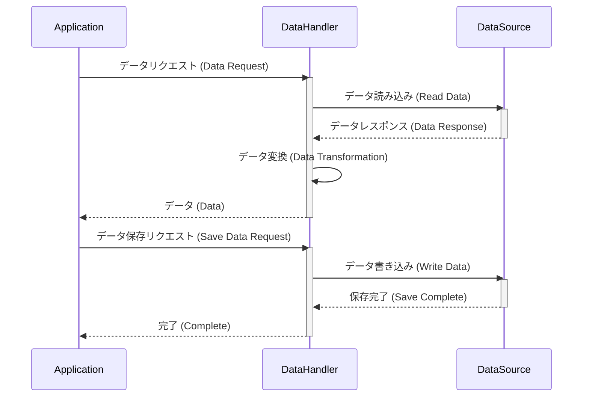

> Previously, we looked at [オートローダー (自動読み込み)](03_オートローダー-自動読み込み.md).

# Chapter 4: データハンドラー (データ処理担当)
Let's begin exploring this concept. この章では、データハンドラーの役割と、それがどのようにデータを読み込み、保存するかを学びます。このコンポーネントを理解することで、アプリケーションのデータ管理がどのように行われるかを知ることができます。
データハンドラーは、アプリケーションにおけるデータの読み込みと保存という重要な役割を担っています。なぜデータハンドラーが必要なのでしょうか？ それを理解するために、レストランのキッチンを想像してみてください。
*   **レストランの厨房の例:** レストランでは、食材の調達（データの読み込み）と料理の提供（データの保存）が必要です。 データハンドラーは、この厨房のシェフのようなものです。食材の倉庫（データベースやファイル）から必要な材料（データ）を取り出し、それを調理（加工）して、最終的に料理（アプリケーション）で使えるようにします。また、食べ残しや新しいレシピ（更新されたデータ）を倉庫に戻す（保存する）役割も担います。
このように、データハンドラーは、アプリケーションがデータを必要とするときに、必要なデータを適切な形式で提供し、変更されたデータを安全に保存するための橋渡し役なのです。これによって、アプリケーションの他の部分は、データの保存場所や形式を気にすることなく、データの処理に集中できます。
データハンドラーの主な構成要素は以下の通りです。
*   **データソースの抽象化:** データハンドラーは、データがどこに保存されているか（ファイル、データベース、APIなど）を隠蔽します。アプリケーションは、データハンドラーが提供するインターフェースを通じてデータにアクセスします。
*   **データの読み込み:** データソースからデータを読み込み、アプリケーションが使用できる形式に変換します。
*   **データの保存:** アプリケーションによって変更されたデータをデータソースに保存します。
*   **エラー処理:** データの読み込みや保存中に発生する可能性のあるエラーを処理します。
それでは、データハンドラーがどのように動作するかを見ていきましょう。`DataHandler.php` のコード例を使って説明します。
```php
<?php
// tests/sample_project2/DataHandler.php
namespace SampleProject2;
use SampleProject2\Item;
/**
 * Manages loading and saving Item data.
 * Simulates interaction with a data source like a file or database.
 */
class DataHandler
{
    private string $dataSourcePath;
    /**
     * Initialize the DataHandler with the path to the data source.
     * @param string $dataSourcePath The configured path to the data source.
     */
    public function __construct(string $dataSourcePath)
    {
        $this->dataSourcePath = $dataSourcePath;
        echo "DataHandler initialized for source: {$this->dataSourcePath}\n";
    }
    /**
     * Simulate loading items from the data source.
     * In a real app, this would read from a file or database.
     * @return Item[] A list of Item objects.
     */
    public function loadItems(): array
    {
        echo "Simulating loading items from {$this->dataSourcePath}...\n";
        $simulatedData = [
            ['item_id' => 1, 'name' => 'Gadget Alpha', 'value' => 150.75],
            ['item_id' => 2, 'name' => 'Widget Beta', 'value' => 85.0],
            ['item_id' => 3, 'name' => 'Thingamajig Gamma', 'value' => 210.5],
            ['item_id' => 4, 'name' => 'Doohickey Delta', 'value' => 55.2],
        ];
        $items = [];
        foreach ($simulatedData as $data) {
            $items[] = new Item(
                $data['item_id'],
                $data['name'],
                $data['value']
            );
        }
        echo "Loaded " . count($items) . " items.\n";
        return $items;
    }
    /**
     * Simulate saving processed items back to the data source.
     * @param Item[] $items A list of Item objects to save.
     * @return bool True if saving was simulated successfully.
     */
    public function saveItems(array $items): bool
    {
        echo "Simulating saving " . count($items) . " items to {$this->dataSourcePath}...\n";
        foreach ($items as $item) {
            echo "Saving item: " . $item . "\n";
        }
        echo "Finished simulating save operation.\n";
        return true;
    }
}
```
この `DataHandler` クラスは、データの読み込みと保存をシミュレートしています。
*   **`__construct(string $dataSourcePath)`:** コンストラクタは、データソースのパスを受け取ります。これは、データが保存されている場所（例：ファイルパス、データベース接続文字列）を示します。
*   **`loadItems(): array`:** この関数は、データソースからアイテムを読み込み、`Item` オブジェクトの配列として返します。ここでは、ハードコードされたデータを使用していますが、実際のアプリケーションでは、ファイルやデータベースからデータを読み込むことになります。
*   **`saveItems(array $items): bool`:** この関数は、アイテムの配列を受け取り、それをデータソースに保存します。ここでも、保存処理はシミュレートされていますが、実際のアプリケーションでは、ファイルやデータベースにデータを書き込むことになります。
データハンドラーの動作の流れをシーケンス図で見てみましょう。

上のシーケンス図は、アプリケーションがデータハンドラーにデータを要求し、データハンドラーがデータソースからデータを取得して、アプリケーションに返す流れを示しています。また、アプリケーションがデータを保存するときも同様に、データハンドラーがデータソースとのやり取りを仲介します。
データハンドラーは、[アイテムモデル (アイテムの型)](03_アイテムモデル-アイテムの型.md)で定義された `Item` オブジェクトを操作します。そして、[アイテムプロセッサー (アイテム処理担当)](05_アイテムプロセッサー-アイテム処理担当.md)で加工されたデータを永続化するために利用されます。
この章では、データハンドラーがデータの読み込みと保存をどのように行うかを学びました。データハンドラーは、アプリケーションのデータ管理を簡素化し、データの整合性を保つために不可欠なコンポーネントです。
This concludes our look at this topic.

> Next, we will examine [メイン処理 (メインの処理)](05_メイン処理-メインの処理.md).


---

*Generated by [SourceLens AI](https://github.com/openXFlow/sourceLensAI) using LLM: `gemini` (cloud) - model: `gemini-2.0-flash` | Language Profile: `Python`*