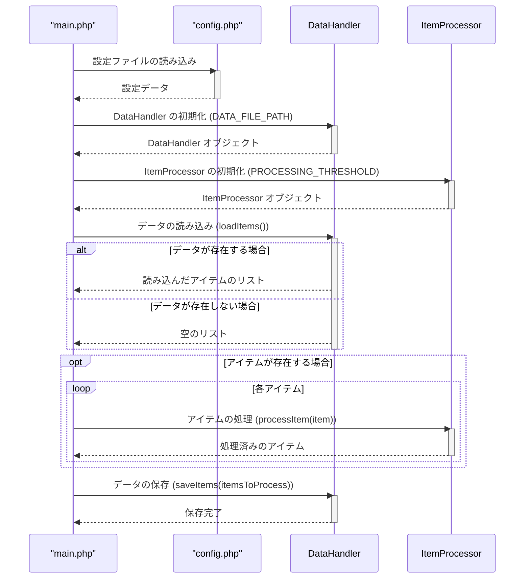

> Previously, we looked at [データハンドラー (データ処理担当)](04_データハンドラー-データ処理担当.md).

# Chapter 6: メイン処理 (メインの処理)
Let's begin exploring this concept. この章では、アプリケーションの中核となるメイン処理について学びます。メイン処理は、アプリケーション全体の動作を制御し、各コンポーネントを連携させる重要な役割を担っています。
メイン処理は、オーケストラの指揮者に例えることができます。個々の楽器（コンポーネント）が素晴らしい演奏能力を持っていても、指揮者がいなければ、音楽はまとまりのないものになってしまいます。同様に、アプリケーション内の個々のコンポーネントが正常に動作しても、メイン処理がなければ、アプリケーション全体として意味のある処理を行うことはできません。メイン処理は、設定の読み込み、データのロード、データの処理、結果の保存など、アプリケーションに必要なすべての手順を調整します。
アプリケーションが複雑になるほど、メイン処理の重要性は増します。適切に設計されたメイン処理は、アプリケーションの保守性、拡張性、信頼性を高めることができます。
この章では、`20250704_1343_code-php-sample-project` におけるメイン処理がどのように実装されているかを具体的に見ていきましょう。
## メイン処理の構成要素
メイン処理は、通常、以下の要素で構成されます。
1. **設定の読み込み (設定の読み込み)**: アプリケーションの動作に必要な設定情報を読み込みます。設定ファイルは、アプリケーションの動作環境や動作パラメータを定義するために使用されます。
2. **コンポーネントの初期化 (コンポーネントのしょきか)**: アプリケーションで使用するコンポーネント（データハンドラー、アイテムプロセッサーなど）を初期化します。初期化処理では、コンポーネントに必要なリソースの割り当てや、初期状態の設定などを行います。
3. **データの読み込み (データのよみこみ)**: 処理対象のデータを外部ソース（ファイル、データベース、APIなど）から読み込みます。
4. **データの処理 (データのしょり)**: 読み込んだデータに対して、必要な処理を行います。データの変換、加工、検証などが含まれます。
5. **結果の保存 (けっかのほぞん)**: 処理結果を外部ストレージ（ファイル、データベースなど）に保存します。
6. **エラー処理 (エラーしょり)**: 処理中に発生したエラーを適切に処理します。エラーログの記録や、エラーからの回復処理などを行います。
## `main.php` の動作
`main.php` ファイルは、上記の構成要素を実際にどのように実装しているかを見てみましょう。
```php
<?php
// tests/sample_project2/main.php
/**
 * Main execution script for Sample Project 2.
 * Orchestrates the loading, processing, and saving of data items.
 */
// This is crucial for autoloading all our classes
require 'vendor/autoload.php';
use SampleProject2\DataHandler;
use SampleProject2\ItemProcessor;
/**
 * Executes the main data processing pipeline.
 */
function runProcessingPipeline(): void
{
    echo "Starting Sample Project 2 processing pipeline...\n";
    try {
        // 1. Load configuration
        $config = require 'config.php';
        // 2. Initialize components
        $dataHandler = new DataHandler($config['DATA_FILE_PATH']);
        $itemProcessor = new ItemProcessor($config['PROCESSING_THRESHOLD']);
        // 3. Load data
        $itemsToProcess = $dataHandler->loadItems();
        if (empty($itemsToProcess)) {
            echo "No items loaded. Exiting pipeline.\n";
            return;
        }
        // 4. Process data items
        foreach ($itemsToProcess as $item) {
            $itemProcessor->processItem($item);
        }
        // 5. Save processed data
        $dataHandler->saveItems($itemsToProcess);
    } catch (Throwable $e) {
        // Catch any error or exception for graceful exit
        echo "A critical error occurred: " . $e->getMessage() . "\n";
    } finally {
        echo "Sample Project 2 processing pipeline finished.\n";
    }
}
// Run the main function
runProcessingPipeline();
```
上記のコードは、`runProcessingPipeline` 関数でメイン処理を定義しています。
1.  **設定の読み込み (設定の読み込み)**: `require 'config.php';` で設定ファイルを読み込んでいます。
2.  **コンポーネントの初期化 (コンポーネントのしょきか)**: `DataHandler` と `ItemProcessor` を初期化しています。`config.php` から読み込んだ設定に基づいて、これらのコンポーネントの動作をカスタマイズしています。
3.  **データの読み込み (データのよみこみ)**: `$dataHandler->loadItems();` でデータを読み込んでいます。
4.  **データの処理 (データのしょり)**: `foreach` ループで各アイテムを `$itemProcessor->processItem($item);` で処理しています。
5.  **結果の保存 (けっかのほぞん)**: `$dataHandler->saveItems($itemsToProcess);` で処理結果を保存しています。
6.  **エラー処理 (エラーしょり)**: `try...catch...finally` ブロックを使用して、エラーが発生した場合でもプログラムがクラッシュしないようにしています。
## 処理の流れ (しょりのながれ)
メイン処理の流れをシーケンス図で見てみましょう。

このシーケンス図は、`main.php` がどのように `config.php`, `DataHandler`, `ItemProcessor` と連携して、データの読み込み、処理、保存を行うかを示しています。
## 他の章との関連 (たのしょうとのかんれん)
この章で説明したメイン処理は、他の章で説明したコンポーネントと密接に関連しています。
*   [オートローダー (自動読み込み)](01_オートローダー-自動読み込み.md): クラスを自動的にロードするために使用されます。
*   [設定 (せってい)](02_設定-せってい.md): アプリケーションの動作に必要な設定情報を提供します。
*   [データハンドラー (データ処理担当)](04_データハンドラー-データ処理担当.md): データの読み込みと保存を処理します。
*   [アイテムプロセッサー (アイテム処理担当)](05_アイテムプロセッサー-アイテム処理担当.md): 個々のアイテムの処理を担当します。
これらのコンポーネントが連携することで、アプリケーション全体として意味のある処理が実現されます。
This concludes our look at this topic.

> Next, we will examine [設定 (せってい)](06_設定-せってい.md).


---

*Generated by [SourceLens AI](https://github.com/openXFlow/sourceLensAI) using LLM: `gemini` (cloud) - model: `gemini-2.0-flash` | Language Profile: `Python`*