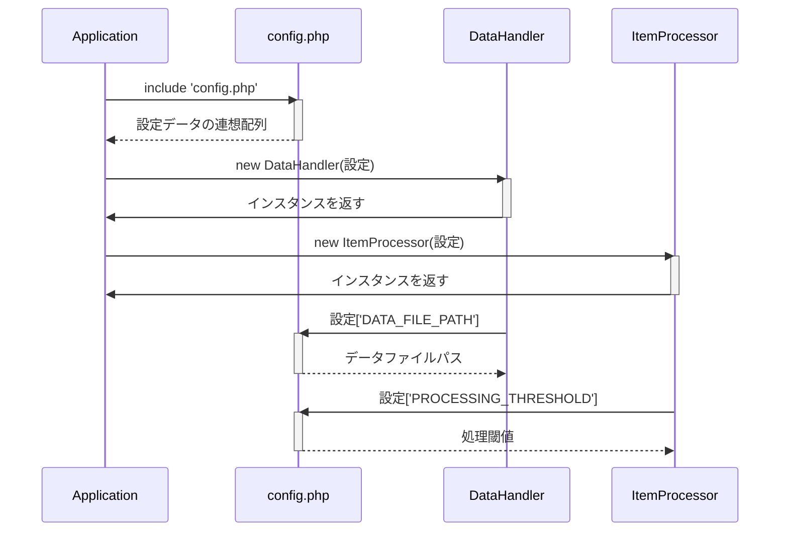

> Previously, we looked at [メイン処理 (メインの処理)](05_メイン処理-メインの処理.md).

# Chapter 2: 設定 (せってい)
Let's begin exploring this concept. この章では、アプリケーションの設定について学びます。設定ファイルは、アプリケーションの動作をカスタマイズするための重要な情報源です。この章の目標は、設定ファイルがどのように構成され、アプリケーション内でどのように使用されるかを理解することです。
設定 (せってい) は、アプリケーションが正しく動作するために必要なすべての情報を管理する中心的な場所です。これは、データベース接続の詳細、APIキー、ファイルパス、およびアプリケーションのさまざまな部分で使用されるその他の重要な値を含む場合があります。
設定を管理する理由は、コード全体に値をハードコーディングすることを避けるためです。想像してみてください。家の設計図を書いていて、すべての部屋の壁の色を直接書き込んでしまったとします。もし、後で壁の色を変更したくなった場合、すべての設計図を修正する必要があります。設定ファイルを使用すると、この問題を解決できます。設定ファイルを家の色のパレットとして考えれば、色を変更したい場合は、パレットの色を変更するだけで、設計図全体を変更する必要はありません。
**Key Concepts Breakdown**
このプロジェクトの設定は、連想配列 (associative array) を返す PHP ファイル (`config.php`) として実装されています。連想配列は、キーと値のペアのコレクションです。
*   **キー (Key):** 設定項目の名前 (例: `'DATA_FILE_PATH'`)。
*   **値 (Value):** 設定項目の値 (例: `'data/items.json'`)。
`config.php` ファイルは、アプリケーションの他の部分によって読み込まれ、これらの値はアプリケーションの動作を制御するために使用されます。
**Usage / How it Works**
設定は、アプリケーション全体でグローバルにアクセスできる定数を定義するために使用されます。アプリケーションのさまざまな部分がこれらの設定値を使用して、たとえば、読み込むデータの場所、特定の操作を実行するための閾値、またはログの記録レベルを決定できます。
`config.php` ファイルは、必要な設定をキーと値のペアとして定義する PHP スクリプトです。
**Code Examples**
以下に、`config.php` ファイルの例を示します。
```php
<?php
// tests/sample_project2/config.php
/**
 * Sample Project 2 の設定。
 *
 * ファイルパスや処理パラメータなど、アプリケーションの他の部分で使用される
 * 設定値の配列を返します。
 */
return [
    // --- 設定のための定数 ---
    // データファイルへのパス (DataHandler で使用)
    'DATA_FILE_PATH' => 'data/items.json',
    // 処理パラメータ (ItemProcessor で使用)
    'PROCESSING_THRESHOLD' => 100,
    // ログレベルの例 (メイン処理で使用可能)
    'LOG_LEVEL' => 'INFO',
];
```
この例では、`DATA_FILE_PATH`、`PROCESSING_THRESHOLD`、および `LOG_LEVEL` の 3 つの設定が定義されています。`DATA_FILE_PATH` は、データファイルへのパスを定義し、`PROCESSING_THRESHOLD` は処理に使用される閾値を定義し、`LOG_LEVEL` はログの記録レベルを定義します。
これらの値は、他の PHP ファイルで以下のようにアクセスできます (ただし、実際には直接アクセスするのではなく、`DataHandler`や`ItemProcessor`などのクラスを通じて間接的にアクセスすることが多いです)。
```php
<?php
$config = include 'config.php';
// データファイルのパスを取得
$dataFilePath = $config['DATA_FILE_PATH'];
// 処理閾値を取得
$processingThreshold = $config['PROCESSING_THRESHOLD'];
// ログレベルを取得
$logLevel = $config['LOG_LEVEL'];
echo "データファイルのパス: " . $dataFilePath . "\n";
echo "処理閾値: " . $processingThreshold . "\n";
echo "ログレベル: " . $logLevel . "\n";
```
**Inline Diagrams**
以下は、設定ファイルの読み込みと使用方法を示すシーケンス図です。

この図は、アプリケーションが `config.php` ファイルを含めて設定データを取得し、その設定データを `DataHandler` と `ItemProcessor` に渡す方法を示しています。`DataHandler`と`ItemProcessor`は、それぞれ設定ファイルから必要な特定の構成設定 (データファイルパスと処理閾値) を取得します。
**Relationships & Cross-Linking**
設定は、アプリケーションの多くの部分で使用されます。特に、[データハンドラー (データ処理担当)](04_データハンドラー-データ処理担当.md) と [アイテムプロセッサー (アイテム処理担当)](05_アイテムプロセッサー-アイテム処理担当.md) が設定を使用してその動作をカスタマイズします。
This concludes our look at this topic.

> Next, we will examine [Architecture Diagrams](07_diagrams.md).


---

*Generated by [SourceLens AI](https://github.com/openXFlow/sourceLensAI) using LLM: `gemini` (cloud) - model: `gemini-2.0-flash` | Language Profile: `Python`*