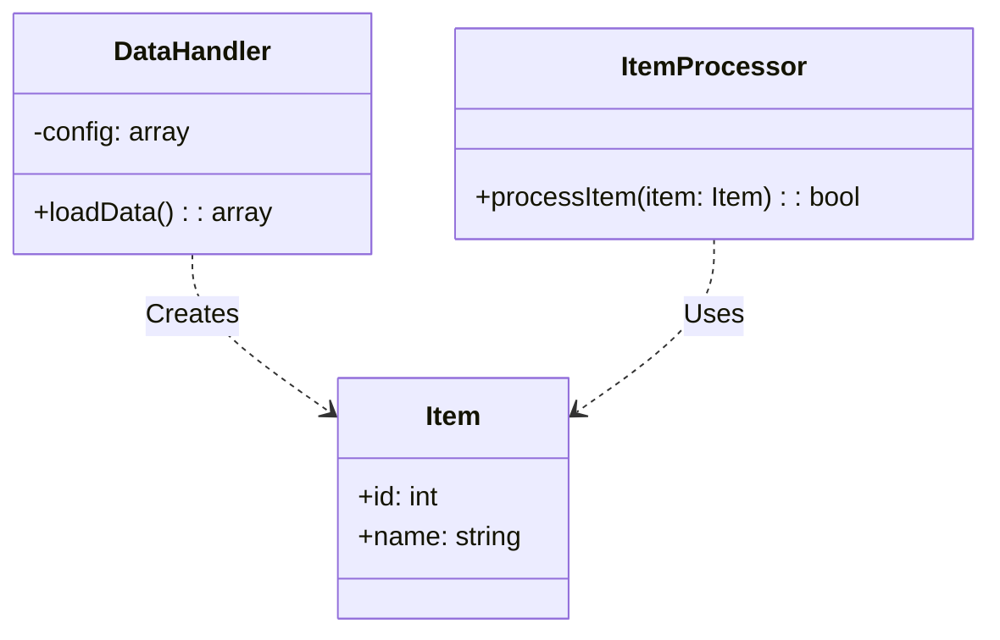
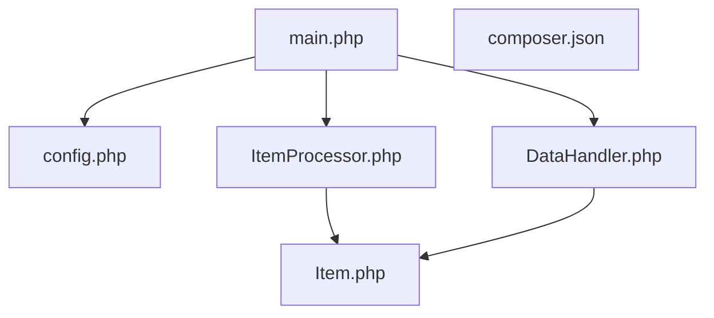
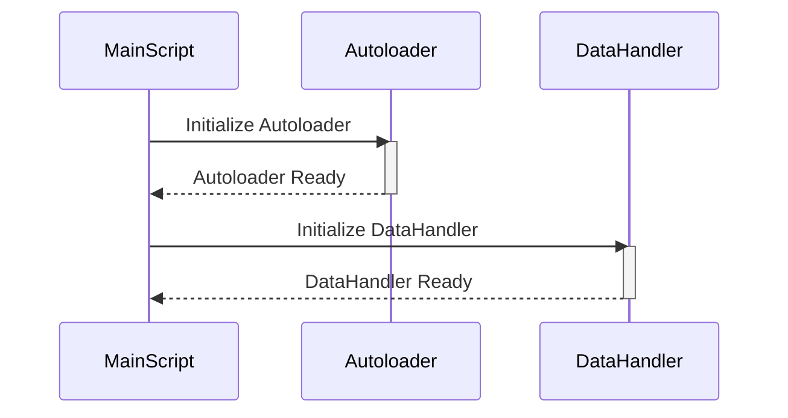
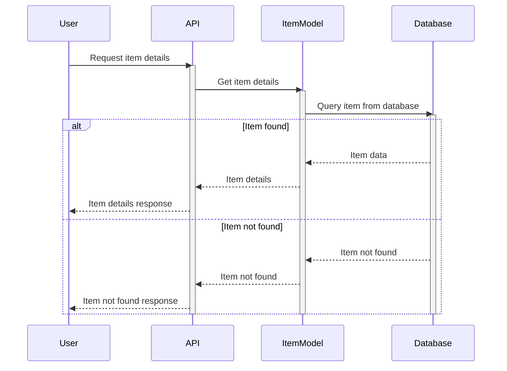
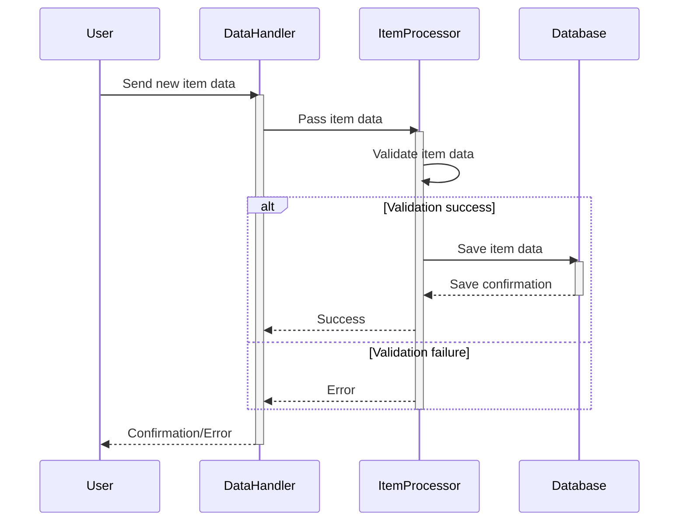
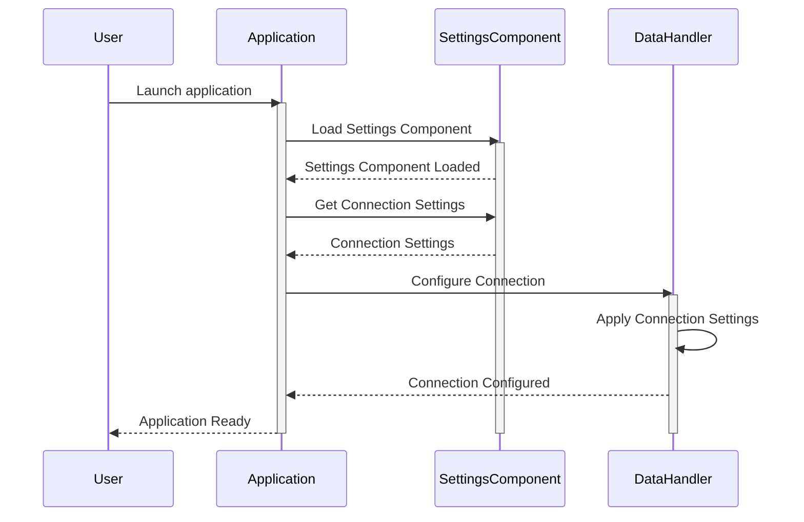
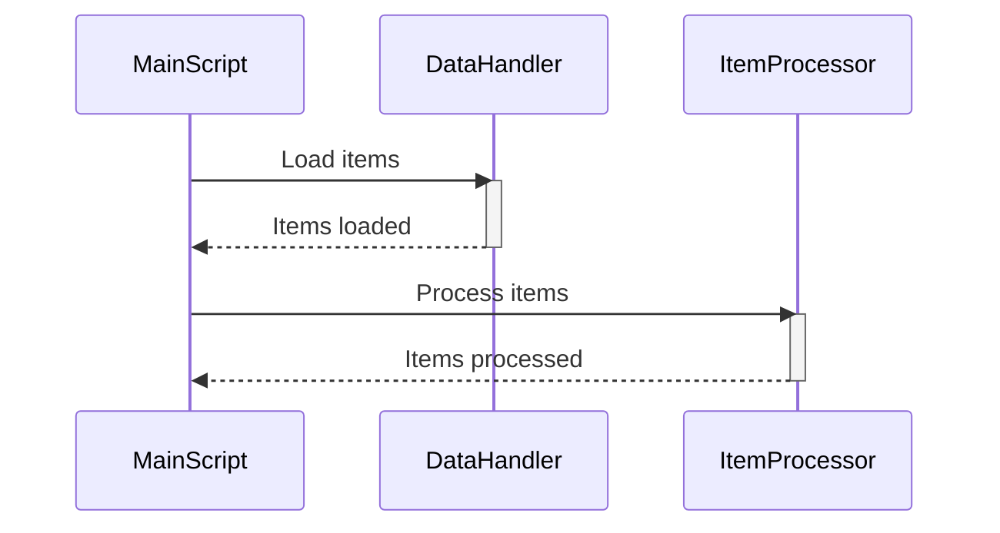

> Previously, we looked at [設定 (せってい)](06_設定-せってい.md).

# Architecture Diagrams
## Class Diagram
Key classes and their relationships in **20250704_1343_code-php-sample-project**.

## Package Dependencies
High-level module and package structure of **20250704_1343_code-php-sample-project**.

## Sequence Diagrams
These diagrams illustrate various interaction scenarios, showcasing operations between components for specific use cases.
### The main processing script initializes the autoloader and data handler.

### A user requests to view a specific item's details, retrieved and displayed using the item model.

### The item processor validates and saves a new item's data provided through the data handler.

### The settings component is loaded and used to configure the data handler's connection.

### The main processing script calls the item processor to process a batch of items loaded by the data handler.

> Next, we will examine [Code Inventory](08_code_inventory.md).

---

*Generated by [SourceLens AI](https://github.com/openXFlow/sourceLensAI) using LLM: `gemini` (cloud) - model: `gemini-2.0-flash` | Language Profile: `Python`*