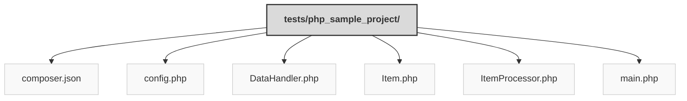

> Previously, we looked at [Architecture Diagrams](07_diagrams.md).

# Code Inventory: 20250704_1343_code-php-sample-project
## File Structure

## File Descriptions Summary
*   **`composer.json`**: {
*   **`config.php`**: <?php
*   **`DataHandler.php`**: <?php
*   **`Item.php`**: <?php
*   **`ItemProcessor.php`**: <?php
*   **`main.php`**: <?php
---
## Detailed File Content
No detailed structural information could be generated for the files based on the selected parser.

> Next, we will examine [Project Review](09_project_review.md).

---

*Generated by [SourceLens AI](https://github.com/openXFlow/sourceLensAI) using LLM: `gemini` (cloud) - model: `gemini-2.0-flash` | Language Profile: `Python`*