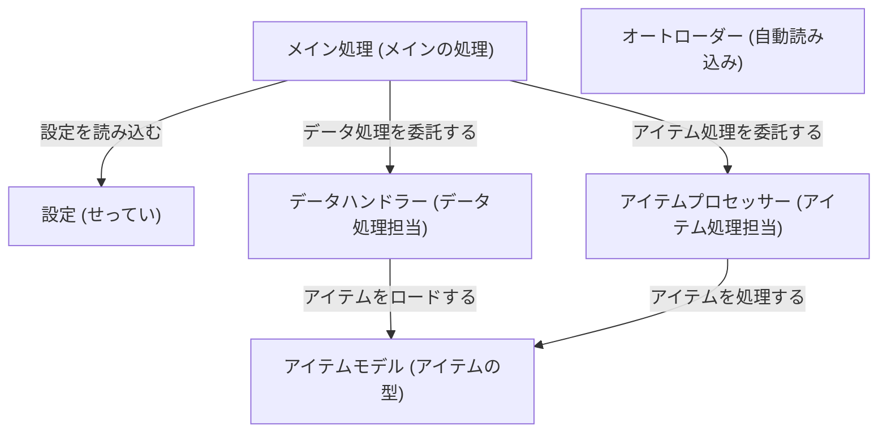

# Tutorial: 20250704_1343_code-php-sample-project

このプロジェクトは、**設定**を読み込み、*データハンドラー*を使ってアイテムデータをロードし、ロードされたアイテムを*アイテムプロセッサー*で処理します。最後に、処理されたアイテムは再び*データハンドラー*によって保存されます。*メイン処理*がこれらのステップ全体を管理します。

**Source Directory:** `C:\_jd_programming\python\11_sourceLens_project\sourceLens\tests\php_sample_project`

## Abstraction Relationships

## Chapters

1. [アイテムプロセッサー (アイテム処理担当)](01_アイテムプロセッサー-アイテム処理担当.md)
2. [アイテムモデル (アイテムの型)](02_アイテムモデル-アイテムの型.md)
3. [オートローダー (自動読み込み)](03_オートローダー-自動読み込み.md)
4. [データハンドラー (データ処理担当)](04_データハンドラー-データ処理担当.md)
5. [メイン処理 (メインの処理)](05_メイン処理-メインの処理.md)
6. [設定 (せってい)](06_設定-せってい.md)
7. [Architecture Diagrams](07_diagrams.md)
8. [Code Inventory](08_code_inventory.md)
9. [Project Review](09_project_review.md)

---

*Generated by [SourceLens AI](https://github.com/openXFlow/sourceLensAI) using LLM: `gemini` (cloud) - model: `gemini-2.0-flash` | Language Profile: `Python`*