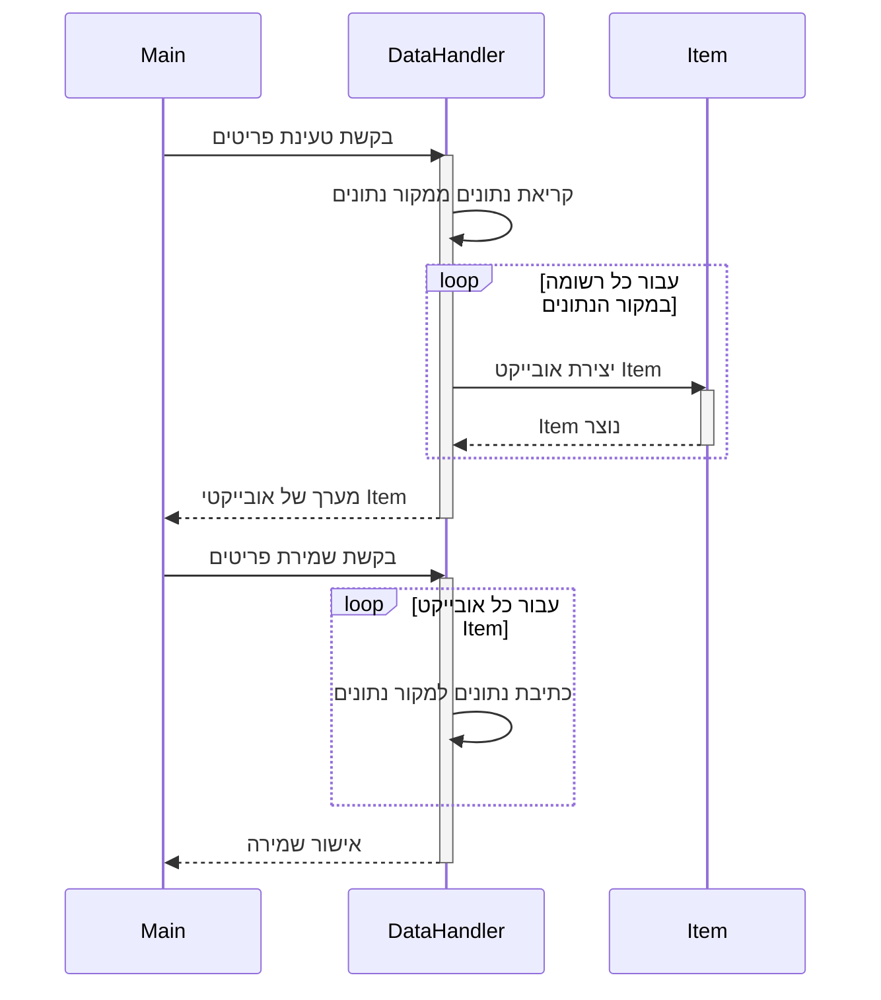

> Previously, we looked at the [Project Overview](index.md).

# Chapter 3: מטפל נתונים (Data Handler)
Let's begin exploring this concept. במדריך זה, נלמד על ה"מטפל נתונים" (Data Handler), מודול מרכזי באפליקציה שלנו. המטרה שלנו היא להבין את תפקידו, איך הוא עובד, ואיך הוא משתלב עם שאר חלקי הפרויקט.
ה"מטפל נתונים" (Data Handler) קיים כדי להפריד את הלוגיקה של טעינה ושמירה של נתונים משאר חלקי האפליקציה. תחשבו על זה כמו על ספרן בספרייה. הספרן (המטפל נתונים) אחראי על אחזור ספרים (נתונים) מהמדפים (מקור הנתונים) ומאפשר לקוראים (מעבדי הנתונים) לעבוד איתם. לאחר העיבוד, הספרן מחזיר את הספרים למדפים. בלי ספרן, כל קורא היה צריך לדעת איפה כל ספר נמצא ואיך להחזיר אותו, מה שהיה יוצר בלאגן גדול.
הנה פירוט של מושגי מפתח:
*   **מקור נתונים (Data Source):** המקום שבו הנתונים מאוחסנים. זה יכול להיות קובץ, מסד נתונים, או אפילו API חיצוני.
*   **טעינה (Loading):** תהליך קריאת הנתונים ממקור הנתונים והפיכתם לאובייקטים שניתן לעבוד איתם.
*   **שמירה (Saving):** תהליך כתיבת הנתונים המעובדים חזרה למקור הנתונים.
*   **אובייקט פריט (Item Object):** ייצוג של פריט נתונים בודד בתוך האפליקציה. דיברנו על זה ב-[פריט (Item)](02_פריט-item.md).
איך ה"מטפל נתונים" (Data Handler) עובד בפועל?
1.  **אתחול:** כאשר האפליקציה מתחילה, נוצר מופע של ה"מטפל נתונים" (Data Handler) ומצוין לו נתיב למקור הנתונים (data source path). הנתיב הזה יכול להיות נתיב לקובץ JSON, כתובת URL של API, או כל מקום אחר שבו הנתונים מאוחסנים.
2.  **טעינת פריטים (Loading Items):** כאשר האפליקציה צריכה את הנתונים, היא קוראת למתודה `load_items` של ה"מטפל נתונים" (Data Handler). המתודה הזו קוראת את הנתונים ממקור הנתונים, יוצרת אובייקטים של `Item` עבור כל פריט, ומחזירה מערך של אובייקטים אלו.
3.  **שמירת פריטים (Saving Items):** לאחר שהפריטים עובדו על ידי ה-[מעבד פריטים (Item Processor)](04_מעבד-פריטים-item-processor.md), האפליקציה קוראת למתודה `save_items` של ה"מטפל נתונים" (Data Handler), ומעבירה לה את מערך הפריטים המעובדים. המתודה הזו כותבת את הנתונים המעודכנים חזרה למקור הנתונים.
הנה דוגמה לקוד של ה"מטפל נתונים" (Data Handler) שלנו:
```ruby
# data_handler.rb
require_relative 'item'
#
# אחראי על טעינה ושמירה של נתוני פריטים.
# מדמה אינטראקציה עם מקור נתונים כמו קובץ או מסד נתונים.
#
class DataHandler
  # מאתחל את ה-DataHandler עם הנתיב למקור הנתונים.
  # @param data_source_path [String] הנתיב המוגדר למקור הנתונים.
  def initialize(data_source_path)
    @data_source_path = data_source_path
    puts "DataHandler initialized for source: #{@data_source_path}"
  end
  # מדמה טעינת פריטים ממקור הנתונים.
  # @return [Array<Item>] מערך של אובייקטי Item.
  def load_items
    puts "Simulating loading items from #{@data_source_path}..."
    simulated_data = [
      { item_id: 1, name: 'Gadget Alpha', value: 150.75 },
      { item_id: 2, name: 'Widget Beta', value: 85.0 },
      { item_id: 3, name: 'Thingamajig Gamma', value: 210.5 },
      { item_id: 4, name: 'Doohickey Delta', value: 55.2 }
    ]
    items = simulated_data.map do |data|
      Item.new(data[:item_id], data[:name], data[:value])
    end
    puts "Loaded #{items.length} items."
    items
  end
  # מדמה שמירת פריטים מעובדים חזרה למקור הנתונים.
  # @param items [Array<Item>] מערך של אובייקטי Item לשמירה.
  # @return [Boolean] True אם השמירה דומתה בהצלחה.
  def save_items(items)
    puts "Simulating saving #{items.length} items to #{@data_source_path}..."
    items.each do |item|
      puts "Saving item: #{item}"
    end
    puts 'Finished simulating save operation.'
    true
  end
end
```
הקוד הזה מדמה אינטראקציה עם מקור נתונים אמיתי. בפועל, הייתם משתמשים בספרייה כמו `JSON` או בספריית מסד נתונים כדי לקרוא ולכתוב נתונים.
הנה דיאגרמת רצף (Sequence Diagram) שממחישה את תהליך הטעינה והשמירה:

הדיאגרמה הזו מראה איך ה-`Main` יוצר אינטראקציה עם ה-`DataHandler` כדי לטעון ולשמור פריטים, ואיך ה-`DataHandler` יוצר אובייקטים של `Item`.
ה"מטפל נתונים" (Data Handler) מופעל בסקריפט הראשי, כפי שניתן לראות בקוד ה-`main.rb` שהוצג בפתיחה:
```ruby
# main.rb
require_relative 'config'
require_relative 'data_handler'
require_relative 'item_processor'
def run_processing_pipeline
  puts 'Starting Sample Project 2 processing pipeline...'
  begin
    # 1. אתחול רכיבים באמצעות תצורה
    data_path = AppConfig.get_data_path
    threshold = AppConfig.get_threshold
    data_handler = DataHandler.new(data_path) # יוצר מופע של מטפל הנתונים
    item_processor = ItemProcessor.new(threshold)
    # 2. טעינת נתונים
    items_to_process = data_handler.load_items # טוען את הפריטים
    # ... המשך הקוד
```
הבנו איך ה"מטפל נתונים" (Data Handler) טוען ושומר נתונים. למדנו על חשיבותו בהפרדת אחריות ושיפור תחזוקת הקוד. ראינו גם דוגמת קוד פשוטה ודיאגרמה שממחישה את התהליך. כעת, אנו יכולים להעריך את תפקידו במערכת הכללית. למדנו גם על ה-[תצורה (Configuration)](01_תצורה-configuration.md) ועל ה-[פריט (Item)](02_פריט-item.md) שחשובים כאן.
This concludes our look at this topic.

> Next, we will examine [מעבד פריטים (Item Processor)](02_מעבד-פריטים-item-processor.md).


---

*Generated by [SourceLens AI](https://github.com/openXFlow/sourceLensAI) using LLM: `gemini` (cloud) - model: `gemini-2.0-flash` | Language Profile: `Python`*