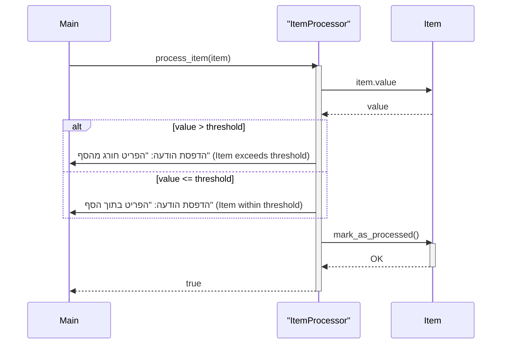

> Previously, we looked at [מטפל נתונים (Data Handler)](01_מטפל-נתונים-data-handler.md).

# Chapter 4: מעבד פריטים (Item Processor)
Let's begin exploring this concept. במדריך הזה, נתמקד במודול המכונה "מעבד פריטים" (Item Processor). המטרה שלנו היא להבין את תפקידו, את אופן פעולתו, ואת האופן שבו הוא משתלב בתהליך העיבוד הכללי של הנתונים בפרויקט.
**Motivation/Purpose (הנעה/מטרה)**
הסיבה לקיומו של "מעבד פריטים" היא ליצור הפרדה ברורה בין טעינת נתונים, טיפול בנתונים באופן גורף, לבין הטיפול הספציפי בכל פריט נתונים בודד. תארו לעצמכם מפעל לייצור צעצועים. "מעבד הפריטים" הוא כמו עובד פס ייצור אשר בודק כל צעצוע בנפרד, מוודא שהוא עומד בתקנים, ואולי אפילו מוסיף לו מדבקה מיוחדת. בלי העובד הזה, כל הצעצועים היו פשוט עוברים הלאה בלי בדיקה אישית. באופן דומה, "מעבד הפריטים" מבטיח שכל פריט נתונים מקבל את תשומת הלב הראויה לו, בהתאם לכללים שהוגדרו.
**Key Concepts Breakdown (פירוק מושגי מפתח)**
המושגים העיקריים ב"מעבד פריטים" הם:
1.  **סף עיבוד (Processing Threshold):** ערך מספרי המשמש לקביעת אופן הטיפול בפריט. אם ערך הפריט גדול מהסף, יתבצע עיבוד מיוחד.
2.  **עיבוד פריט (Item Processing):** הפעולה של טיפול בפריט בודד בהתאם לערכו ולסף העיבוד.
3.  **סימון כמעובד (Mark as Processed):** לאחר העיבוד, הפריט מסומן ככזה, כדי למנוע עיבוד חוזר שלו.
**Usage / How it Works (שימוש / איך זה עובד)**
ה"מעבד פריטים" מקבל כקלט אובייקט `Item` (כפי שראינו ב-[פריט (Item)](02_פריט-item.md)) ובודק את ערכו מול סף העיבוד. בהתאם לתוצאה, הוא מבצע פעולות מסוימות (למשל, הדפסת הודעה מיוחדת) ומסמן את הפריט כ"מעובד". פעולות אלה מוגדרות בתוך הפונקציה `process_item`. לאחר מכן, הפונקציה מחזירה `true` כדי לציין שהעיבוד הצליח.
**Code Examples (דוגמאות קוד)**
הנה קטע קוד מתוך `item_processor.rb` שממחיש את הפעולה:
```ruby
# item_processor.rb
class ItemProcessor
  def initialize(threshold)
    @threshold = threshold
    puts "ItemProcessor הופעל עם סף: #{@threshold}" # ItemProcessor initialized with threshold
  end
  def process_item(item)
    puts "מעבד פריט ID: #{item.item_id}, שם: '#{item.name}', ערך: #{item.value}" # Processing item ID, Name, Value
    if item.value > @threshold
      puts "הפריט '#{item.name}' (ID: #{item.item_id}) ערך #{item.value} חורג מהסף #{@threshold}." # Item value exceeds threshold
    else
      puts "הפריט '#{item.name}' (ID: #{item.item_id}) ערך #{item.value} בתוך הסף #{@threshold}." # Item value is within threshold
    end
    item.mark_as_processed
    true
  end
end
```
הנה דיאגרמת רצף פשוטה שממחישה את זרימת העבודה של `process_item`:

הדיאגרמה מראה כיצד ה-`Main` קורא לפונקציה `process_item` ב-`ItemProcessor`. ה-`ItemProcessor` מקבל את ה`value` מה-`Item`, מבצע השוואה מול ה`threshold` ומדפיס הודעה. בסוף התהליך, ה-`Item` מסומן כמעובד.
**Relationships & Cross-Linking (יחסים וקישורים)**
ה"מעבד פריטים" תלוי ב-[פריט (Item)](02_פריט-item.md) כסוג הנתונים שהוא מעבד. הוא מקבל את סף העיבוד מ-[תצורה (Configuration)](01_תצורה-configuration.md) ומנוהל על ידי [צינור עיבוד ראשי (Main Processing Pipeline)](05_צינור-עיבוד-ראשי-main-processing-pipeline.md).
**Conclusion**
בפרק זה, למדנו על תפקידו של ה"מעבד פריטים" בעיבוד נתוני פרויקט. ראינו כיצד הוא משתמש בסף עיבוד כדי לקבוע את אופן הטיפול בפריטים בודדים, וכיצד הוא מסמן פריטים כמעובדים לאחר סיום התהליך. This concludes our look at this topic.

> Next, we will examine [פריט (Item)](03_פריט-item.md).


---

*Generated by [SourceLens AI](https://github.com/openXFlow/sourceLensAI) using LLM: `gemini` (cloud) - model: `gemini-2.0-flash` | Language Profile: `Python`*