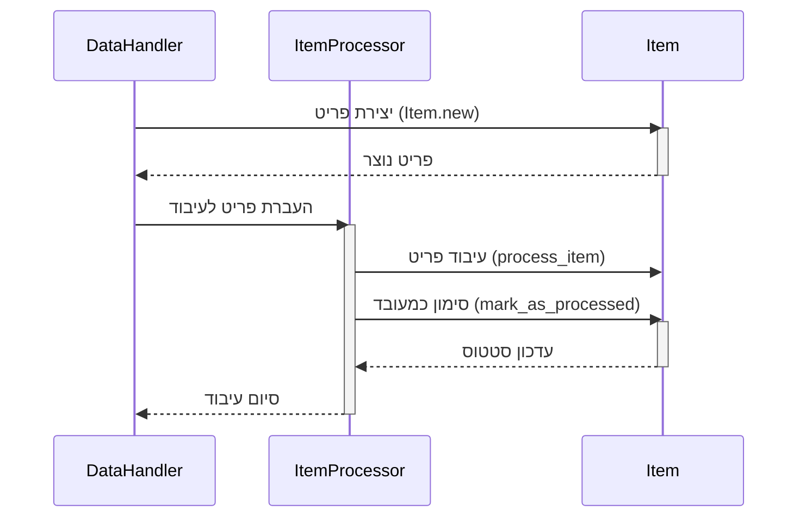

> Previously, we looked at [מעבד פריטים (Item Processor)](02_מעבד-פריטים-item-processor.md).

# Chapter 2: פריט (Item)
Let's begin exploring this concept. במדריך זה, נתמקד בהבנת מהו "פריט" (Item) בקוד שלנו, מה תפקידו וכיצד הוא משמש. המטרה שלנו היא להבין את הייצוג של נתון בודד במערכת שלנו.
הפריט (Item) הוא מרכיב מרכזי בפרויקט. הוא מייצג את יחידת המידע הבסיסית ביותר שאנו מעבדים. אפשר לחשוב עליו כמו רשומה בודדת במסד נתונים, או שורה בקובץ CSV. ללא פריט, לא יהיה לנו מה לעבד! מטרתו היא לאגד מידע רלוונטי ליחידה אחת, כך שנוכל לטפל בה בצורה יעילה.
הפריט (Item) מאפשר לנו להפריד את הלוגיקה של עיבוד הנתונים מהייצוג שלהם. זה אומר שאנו יכולים לשנות את אופן העיבוד של הנתונים בלי לשנות את מבנה הנתונים עצמו, ולהיפך. זהו עיקרון חשוב בתכנות מונחה עצמים, המאפשר לנו ליצור קוד גמיש וקל לתחזוקה.
בואו נפרק את המושג "פריט" (Item) למרכיביו העיקריים:
*   **מזהה פריט (item_id):** מספר ייחודי המזהה את הפריט. זה יכול להיות מספר סידורי, או מזהה אחר שמאפשר לנו להבדיל בין פריטים שונים.
*   **שם (name):** שם הפריט, המשמש לתיאור קצר שלו.
*   **ערך (value):** ערך מספרי המשויך לפריט. זה יכול להיות מחיר, כמות, או כל ערך אחר שאנו צריכים לעבד.
*   **עובד (processed):** דגל בוליאני (true/false) המציין האם הפריט כבר עובד או לא.
השימוש בפריט (Item) הוא פשוט יחסית. אנו יוצרים מופע של מחלקת ה-`Item` עם הנתונים המתאימים, ולאחר מכן משתמשים בו בפונקציות עיבוד הנתונים שלנו. המחלקה `Item` מכילה גם שיטות (methods) לעדכון מצב הפריט, למשל סימון כ"עובד".
הנה דוגמה קצרה של קוד הממחישה כיצד יוצרים פריט (Item) חדש:
```ruby
# יצירת פריט חדש
item = Item.new(1, "מוצר אלפא", 100.50)
puts item # הדפסת הפריט
```
התוצאה של הקוד הזה תהיה:
```
Item(ID=1, Name='מוצר אלפא', Value=100.50, Status=Pending)
```
שימו לב שהסטטוס (Status) הוא "Pending" (ממתין), מכיוון שעדיין לא עיבדנו את הפריט.
הנה עוד דוגמה שמראה איך לסמן פריט (Item) כ"עובד":
```ruby
# יצירת פריט חדש
item = Item.new(1, "מוצר אלפא", 100.50)
# סימון הפריט כ"עובד"
item.mark_as_processed
# הדפסת הפריט לאחר העיבוד
puts item
```
התוצאה של הקוד הזה תהיה:
```
Model Item 1: Marking 'מוצר אלפא' as processed.
Item(ID=1, Name='מוצר אלפא', Value=100.50, Status=Processed)
```
כעת הסטטוס (Status) הוא "Processed" (עובד).
אפשר להמחיש את זרימת העבודה של הפריט (Item) באמצעות דיאגרמת רצף:

הדיאגרמה הזו מציגה כיצד ה-`DataHandler` יוצר את ה-`Item`, מעביר אותו ל-`ItemProcessor` לצורך עיבוד, וה-`ItemProcessor` מעדכן את הסטטוס של ה-`Item`.
הפריט (Item) משמש כמרכיב בסיסי ב[מטפל נתונים (Data Handler)](03_מטפל-נתונים-data-handler.md) וב[מעבד פריטים (Item Processor)](04_מעבד-פריטים-item-processor.md). ה[מטפל נתונים (Data Handler)](03_מטפל-נתונים-data-handler.md) אחראי על טעינת ושמירת פריטים, ואילו ה[מעבד פריטים (Item Processor)](04_מעבד-פריטים-item-processor.md) אחראי על עיבוד הפריטים עצמם. כל הפעולות הללו מתרחשות בתוך [צינור עיבוד ראשי (Main Processing Pipeline)](05_צינור-עיבוד-ראשי-main-processing-pipeline.md).
This concludes our look at this topic.

> Next, we will examine [צינור עיבוד ראשי (Main Processing Pipeline)](04_צינור-עיבוד-ראשי-main-processing-pipeline.md).


---

*Generated by [SourceLens AI](https://github.com/openXFlow/sourceLensAI) using LLM: `gemini` (cloud) - model: `gemini-2.0-flash` | Language Profile: `Python`*