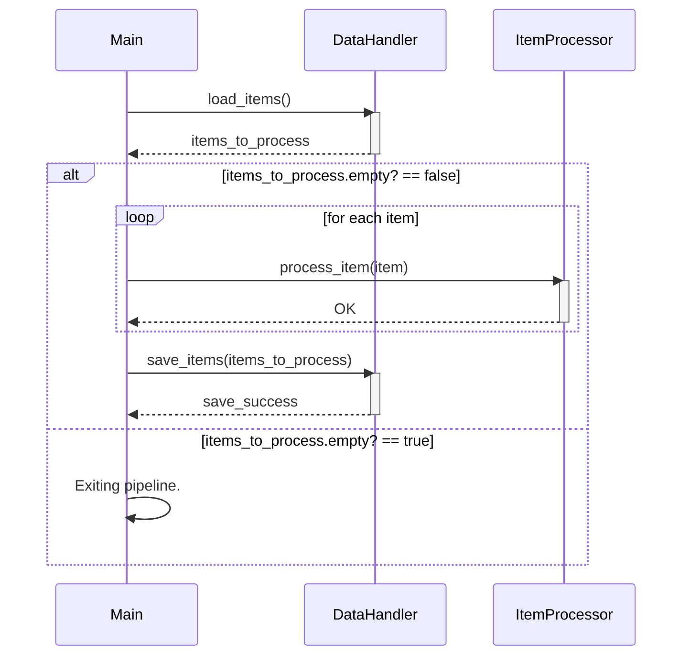

> Previously, we looked at [פריט (Item)](03_פריט-item.md).

# Chapter 5: צינור עיבוד ראשי (Main Processing Pipeline)
Let's begin exploring this concept. פרק זה מוקדש לצינור העיבוד הראשי, הרכיב המרכזי באפליקציה שלנו. מטרתנו היא להבין את תפקידו, כיצד הוא פועל, וכיצד הוא משלב את כל החלקים האחרים של הפרויקט.
The purpose of the "צינור עיבוד ראשי" is to orchestrate the entire data processing workflow. תחשבו על זה כמו על פס ייצור במפעל: חומרי הגלם (הנתונים) מגיעים, עוברים סדרה של פעולות עיבוד (עיבוד נתונים), ובסוף יוצא מוצר מוגמר (נתונים מעובדים ושמורים). צינור העיבוד הראשי דואג שכל שלב יתבצע בסדר הנכון ובאופן תקין. בלעדיו, לא היינו מצליחים לעבד את הנתונים שלנו באופן יעיל ואמין.
The "צינור עיבוד ראשי" connects the data loading, processing, and saving steps.
Here's a breakdown of the key concepts:
*   **טעינת נתונים (Loading Data):** קריאת הנתונים ממקור חיצוני (למשל, קובץ JSON) והכנתם לעיבוד. המודול `DataHandler` אחראי על כך, כפי שראינו בפרק [מטפל נתונים (Data Handler)](03_מטפל-נתונים-data-handler.md).
*   **עיבוד נתונים (Processing Data):** ביצוע פעולות שונות על הנתונים, כגון סינון, שינוי או חישובים. המודול `ItemProcessor` מטפל בשלב זה, כפי שלמדנו בפרק [מעבד פריטים (Item Processor)](04_מעבד-פריטים-item-processor.md).
*   **שמירת נתונים (Saving Data):** כתיבת הנתונים המעובדים בחזרה למקור חיצוני (למשל, קובץ JSON). שוב, `DataHandler` אחראי על כך.
*   **טיפול בשגיאות (Error Handling):** טיפול בכל השגיאות שעלולות להתרחש במהלך העיבוד, כגון קבצים חסרים, נתונים לא תקינים או בעיות בחיבור.
*   **סיום חכם (Graceful Shutdown):** סיום תקין של התהליך, גם אם התרחשה שגיאה. זה כולל סגירת קבצים, שחרור משאבים והודעות למשתמש.
The "צינור עיבוד ראשי" pulls everything together. בואו נראה כיצד זה עובד:
1.  **אתחול (Initialization):** הצינור מתחיל באתחול כל הרכיבים הנדרשים, כגון `DataHandler` ו-`ItemProcessor`. הוא משתמש בתצורה (Configuration), כפי שלמדנו בפרק [תצורה (Configuration)](01_תצורה-configuration.md), כדי להגדיר את הנתיב לנתונים ואת סף העיבוד.
2.  **טעינה (Loading):** הצינור טוען את הנתונים באמצעות `DataHandler`.
3.  **עיבוד (Processing):** הצינור מעביר כל פריט נתונים ל-`ItemProcessor` לעיבוד.
4.  **שמירה (Saving):** הצינור שומר את הנתונים המעובדים באמצעות `DataHandler`.
5.  **טיפול בשגיאות (Error Handling):** אם מתרחשת שגיאה בשלב כלשהו, הצינור תופס אותה ומציג הודעה מתאימה.
6.  **סיום (Shutdown):** הצינור מסיים את התהליך ומציג הודעה למשתמש.
Here's a snippet of the main processing function:
```ruby
--- File: main.rb ---
# Executes the main data processing pipeline.
def run_processing_pipeline
  puts 'Starting Sample Project 2 processing pipeline...'
  begin
    # 1. Initialize components using configuration
    data_path = AppConfig.get_data_path
    threshold = AppConfig.get_threshold
    data_handler = DataHandler.new(data_path)
    item_processor = ItemProcessor.new(threshold)
    # 2. Load data
    items_to_process = data_handler.load_items
    if items_to_process.empty?
      puts 'No items loaded. Exiting pipeline.'
      return
    end
    puts "Successfully loaded #{items_to_process.length} items."
    # 3. Process data items
    items_to_process.each do |item|
      puts "Passing item to processor: #{item}"
      item_processor.process_item(item)
    end
    # 4. Save processed data
    save_success = data_handler.save_items(items_to_process)
    if save_success
      puts 'Processed items saved successfully.'
    else
      puts 'Failed to save processed items.'
    end
  rescue StandardError => e
    # Catch any standard error for a graceful exit
    puts "A critical error occurred: #{e.message}"
    puts e.backtrace.join("\n")
  ensure
    puts 'Sample Project 2 processing pipeline finished.'
  end
end
```
הנה דיאגרמת רצף שממחישה את זרימת העבודה של צינור העיבוד הראשי:

הדיאגרמה מראה את האינטראקציה בין הרכיבים השונים במהלך העיבוד. תחילה, `Main` טוען את הפריטים באמצעות `DataHandler`. לאחר מכן, עבור כל פריט, הוא מעביר אותו ל-`ItemProcessor` לעיבוד. לבסוף, הוא שומר את הפריטים המעובדים באמצעות `DataHandler`.
This concludes our look at this topic.

> Next, we will examine [תצורה (Configuration)](05_תצורה-configuration.md).


---

*Generated by [SourceLens AI](https://github.com/openXFlow/sourceLensAI) using LLM: `gemini` (cloud) - model: `gemini-2.0-flash` | Language Profile: `Python`*