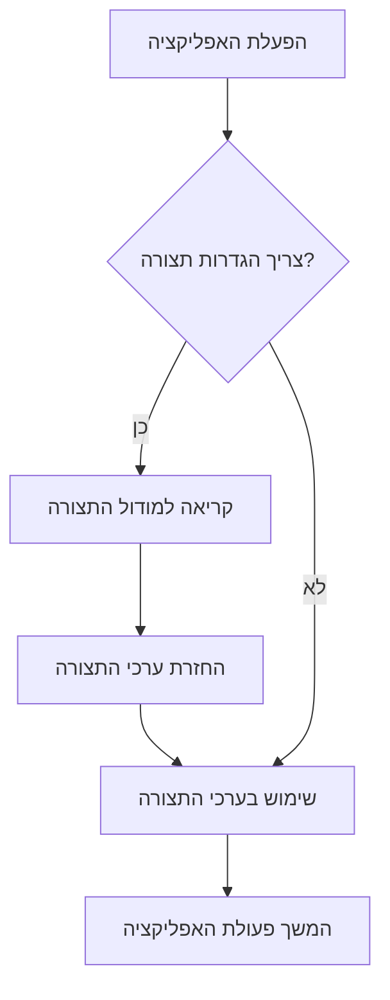

> Previously, we looked at [צינור עיבוד ראשי (Main Processing Pipeline)](04_צינור-עיבוד-ראשי-main-processing-pipeline.md).

# Chapter 1: תצורה (Configuration)
Let's begin exploring this concept. פרק זה נועד להסביר כיצד מודול התצורה (`config.rb`) עובד בפרויקט `20250704_1345_code-ruby-sample-project`. המטרה שלנו היא להבין איך הוא מאחסן, מנהל ומספק הגדרות שונות המשמשות את שאר האפליקציה.
**למה אנחנו צריכים תצורה?**
תארו לעצמכם מתכון לעוגה. המתכון מציין את כל המרכיבים והכמויות הדרושות. מודול התצורה הוא כמו המתכון של האפליקציה שלנו. הוא אומר לאפליקציה איפה למצוא את הנתונים שלה, כמה עיבוד לבצע, ואיזה מידע לתעד. במקום לכתוב את כל ההגדרות האלה ישירות בקוד, אנחנו שומרים אותן במקום אחד מרכזי. זה מקל עלינו לשנות אותן בעתיד בלי צורך לחפש ולעדכן קוד בכל מיני מקומות.
**מה מרכיב את מודול התצורה?**
מודול התצורה שלנו (`AppConfig`) מורכב בעיקר מקבועים (Constants) ופונקציות שמספקות גישה לקבועים האלה.
*   **קבועים (Constants):** אלו הם ערכים שלא משתנים במהלך פעולת האפליקציה. בדוגמה שלנו, יש לנו:
    *   `DATA_FILE_PATH`: הנתיב לקובץ הנתונים (בפורמט JSON).
    *   `PROCESSING_THRESHOLD`: סף העיבוד, כלומר ערך מספרי שקובע כמה עיבוד יתבצע על הנתונים.
    *   `LOG_LEVEL`: רמת התיעוד (למשל, 'INFO', 'DEBUG', 'ERROR'), הקובעת איזה מידע יירשם.
*   **פונקציות (Functions):** אלו הן פונקציות שמאפשרות לנו לקבל את הערכים של הקבועים. לדוגמה:
    *   `get_data_path`: מחזירה את הנתיב לקובץ הנתונים.
    *   `get_threshold`: מחזירה את סף העיבוד.
**איך זה עובד?**
הנה תרשים זרימה פשוט שממחיש איך מודול התצורה משמש את שאר האפליקציה:

בתרשים הזה, האפליקציה מתחילה (A) ואז בודקת אם היא צריכה הגדרות תצורה (B). אם כן, היא קוראת למודול התצורה (C), שמחזיר את הערכים (D). האפליקציה משתמשת בערכים האלה (E) וממשיכה לפעול (F). אם לא צריכה תצורה, מדלגת על שלבים C ו D.
**דוגמת קוד:**
הנה איך מודול התצורה נראה בקוד:
```ruby
# config.rb
module AppConfig
  DATA_FILE_PATH = 'data/items.json'.freeze # נתיב לקובץ הנתונים
  PROCESSING_THRESHOLD = 100 # סף עיבוד
  LOG_LEVEL = 'INFO'.freeze # רמת תיעוד
  def self.get_data_path
    puts "Config: Providing data file path: #{DATA_FILE_PATH}" # הדפסת מידע לקונסולה
    DATA_FILE_PATH
  end
  def self.get_threshold
    puts "Config: Providing processing threshold: #{PROCESSING_THRESHOLD}" # הדפסת מידע לקונסולה
    PROCESSING_THRESHOLD
  end
end
```
בדוגמה הזאת, אנחנו רואים את הקבועים ואת הפונקציות שמחזירות את הערכים שלהם. הפונקציות גם מדפיסות מידע לקונסולה, כדי שנדע מתי הן נקראות.
הנה דוגמה איך משתמשים במודול התצורה בקוד אחר:
```ruby
# main.rb
require_relative 'config'
data_path = AppConfig.get_data_path # קבלת נתיב הקובץ
threshold = AppConfig.get_threshold # קבלת סף העיבוד
puts "Data path: #{data_path}" # הדפסת הנתיב
puts "Processing threshold: #{threshold}" # הדפסת הסף
```
כאן, אנחנו טוענים את מודול התצורה וקוראים לפונקציות `get_data_path` ו-`get_threshold` כדי לקבל את הערכים.
**יחסים וקישורים לפרקים אחרים**
מודול זה משמש מודולים אחרים כמו [מטפל נתונים (Data Handler)](03_מטפל-נתונים-data-handler.md) ו [מעבד פריטים (Item Processor)](04_מעבד-פריטים-item-processor.md). הוא מספק להם את ההגדרות הדרושות להם כדי לבצע את העבודה שלהם.
This concludes our look at this topic.

> Next, we will examine [Architecture Diagrams](06_diagrams.md).


---

*Generated by [SourceLens AI](https://github.com/openXFlow/sourceLensAI) using LLM: `gemini` (cloud) - model: `gemini-2.0-flash` | Language Profile: `Python`*