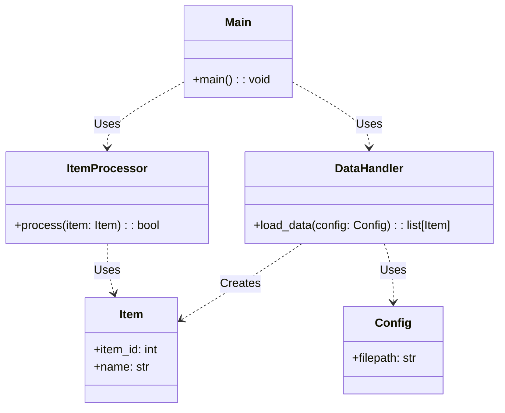
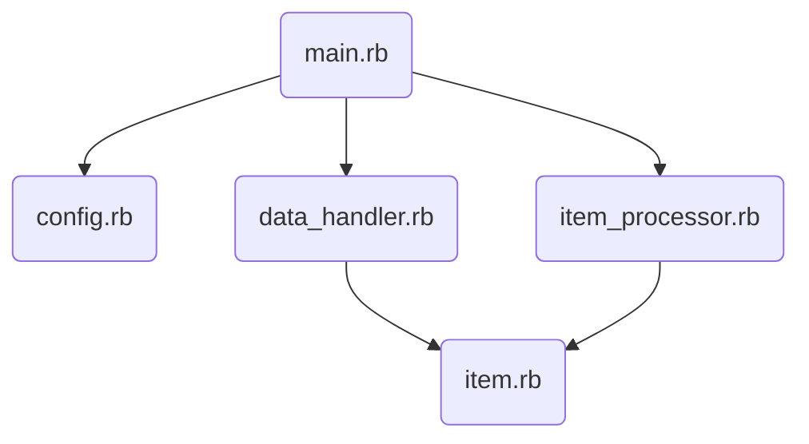
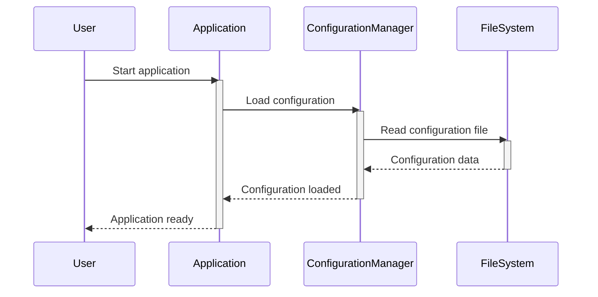
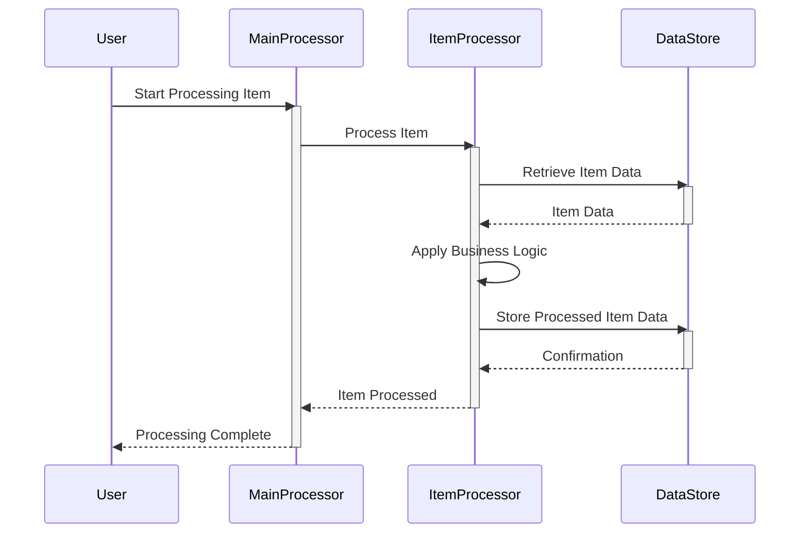
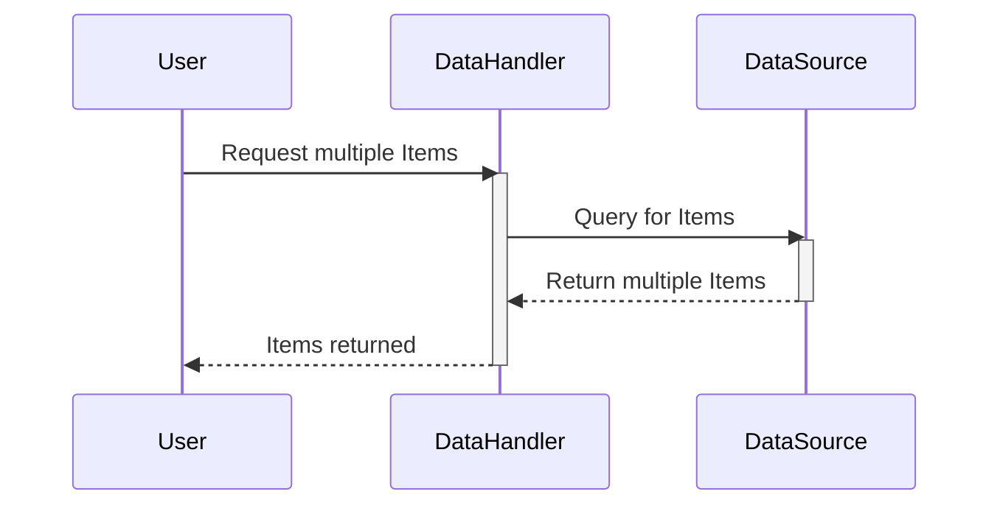
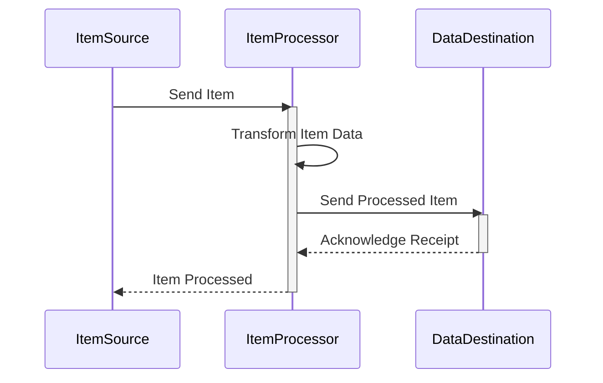
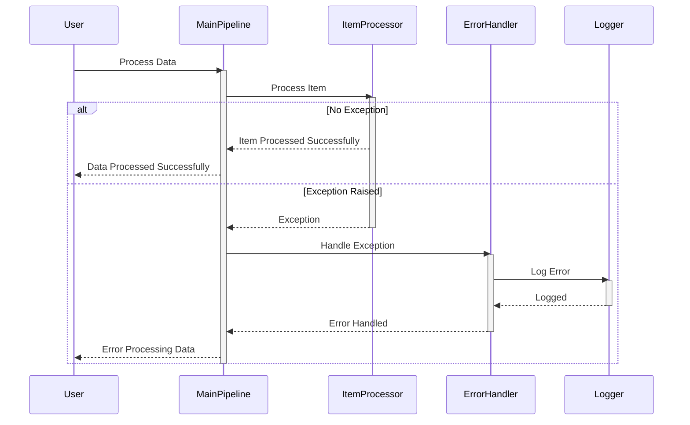

> Previously, we looked at [תצורה (Configuration)](05_תצורה-configuration.md).

# Architecture Diagrams
## Class Diagram
Key classes and their relationships in **20250704_1345_code-ruby-sample-project**.

## Package Dependencies
High-level module and package structure of **20250704_1345_code-ruby-sample-project**.

## Sequence Diagrams
These diagrams illustrate various interaction scenarios, showcasing operations between components for specific use cases.
### Loading the application configuration at startup.

### Processing a single Item through the Main Processing Pipeline.

### The Data Handler retrieving multiple Items.

### The Item Processor transforming an Item's data.

### The Main Processing Pipeline handling an exception raised by the Item Processor.

> Next, we will examine [Code Inventory](07_code_inventory.md).

---

*Generated by [SourceLens AI](https://github.com/openXFlow/sourceLensAI) using LLM: `gemini` (cloud) - model: `gemini-2.0-flash` | Language Profile: `Python`*