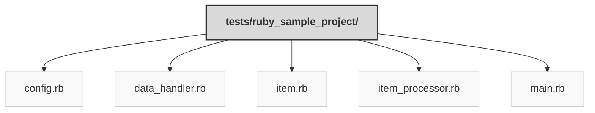

> Previously, we looked at [Architecture Diagrams](06_diagrams.md).

# Code Inventory: 20250704_1345_code-ruby-sample-project
## File Structure

## File Descriptions Summary
*   **`config.rb`**: tests/sample_project2/config.rb
*   **`data_handler.rb`**: tests/sample_project2/data_handler.rb
*   **`item.rb`**: tests/sample_project2/item.rb
*   **`item_processor.rb`**: tests/sample_project2/item_processor.rb
*   **`main.rb`**: tests/sample_project2/main.rb
---
## Detailed File Content
No detailed structural information could be generated for the files based on the selected parser.

> Next, we will examine [Project Review](08_project_review.md).

---

*Generated by [SourceLens AI](https://github.com/openXFlow/sourceLensAI) using LLM: `gemini` (cloud) - model: `gemini-2.0-flash` | Language Profile: `Python`*