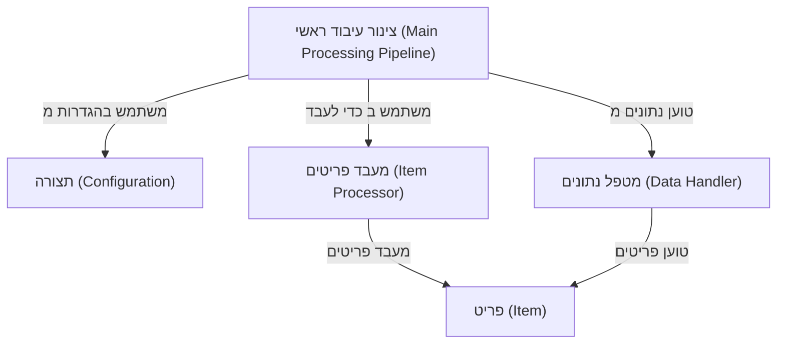

# Tutorial: 20250704_1345_code-ruby-sample-project

הפרויקט הזה **טוען נתוני פריטים**, מעבד אותם לפי תצורה מוגדרת, ושומר אותם בחזרה.
*צינור העיבוד הראשי* הוא המרכיב המרכזי שמארגן את כל הפעולות הללו. הוא משתמש במטפל נתונים לטעינה ושמירה, ומשתמש במעבד פריטים לעיבוד בפועל. התצורה מספקת את ההגדרות הנדרשות.

**Source Directory:** `C:\_jd_programming\python\11_sourceLens_project\sourceLens\tests\ruby_sample_project`

## Abstraction Relationships

## Chapters

1. [מטפל נתונים (Data Handler)](01_מטפל-נתונים-data-handler.md)
2. [מעבד פריטים (Item Processor)](02_מעבד-פריטים-item-processor.md)
3. [פריט (Item)](03_פריט-item.md)
4. [צינור עיבוד ראשי (Main Processing Pipeline)](04_צינור-עיבוד-ראשי-main-processing-pipeline.md)
5. [תצורה (Configuration)](05_תצורה-configuration.md)
6. [Architecture Diagrams](06_diagrams.md)
7. [Code Inventory](07_code_inventory.md)
8. [Project Review](08_project_review.md)

---

*Generated by [SourceLens AI](https://github.com/openXFlow/sourceLensAI) using LLM: `gemini` (cloud) - model: `gemini-2.0-flash` | Language Profile: `Python`*