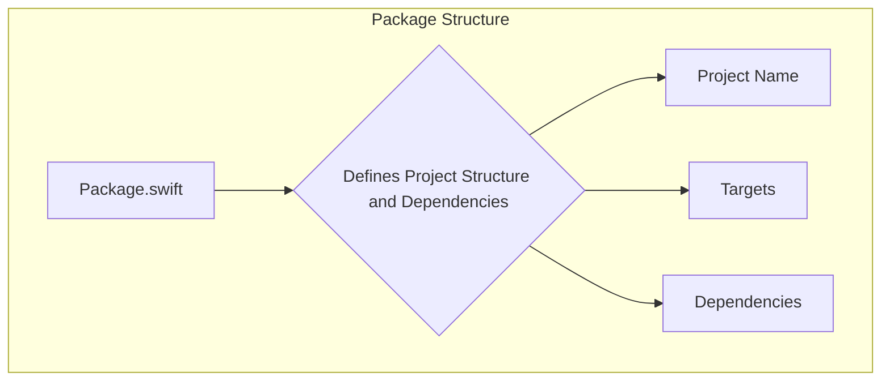

> Previously, we looked at [إعدادات التطبيق](01_إعدادات-التطبيق.md).

# Chapter 1: حزمة سويفت
Let's begin exploring this concept. الهدف من هذا الفصل هو فهم هيكل حزمة سويفت في مشروعنا، وكيف تحدد التبعيات والإعدادات.
### ما هي حزمة سويفت؟ (Motivation/Purpose)
تخيل أنك تبني منزلًا. حزمة سويفت هي مثل المخطط الرئيسي للمنزل. يحدد هذا المخطط عدد الغرف وأبعادها، وأنواع المواد المستخدمة، وكيفية توصيل الكهرباء والسباكة. في عالم تطوير البرمجيات باستخدام سويفت، تقوم حزمة سويفت بنفس الشيء: تحدد اسم المشروع، وتحدد الوحدات الأساسية (الأهداف - targets) التي يتكون منها المشروع، وتحدد المكتبات الخارجية (التبعيات - dependencies) التي يعتمد عليها المشروع. بدون هذا المخطط، سيكون بناء المشروع مهمة فوضوية وغير منظمة.
### المفاهيم الأساسية (Key Concepts Breakdown)
*   **اسم الحزمة (Package Name):** الاسم الذي يميز مشروعك بشكل فريد. في مثالنا، الاسم هو `"SampleProject2"`.
*   **الأهداف (Targets):** الوحدات الأساسية القابلة للتنفيذ أو المكتبات التي تشكل المشروع. يمكن أن يكون لديك هدف واحد (كما في مثالنا) أو عدة أهداف.
*   **التبعيات (Dependencies):** المكتبات أو الحزم الخارجية التي يحتاجها مشروعك ليعمل. على سبيل المثال، إذا كنت تستخدم مكتبة للتعامل مع JSON، فسوف يتم تعريفها هنا كاعتمادية.
*   **إصدار أدوات سويفت (Swift Tools Version):** يحدد الحد الأدنى من إصدار سويفت المطلوب لبناء الحزمة. في مثالنا، الإصدار هو `5.9`.
### كيف تعمل حزمة سويفت؟ (Usage / How it Works)
عندما تقوم ببناء مشروع سويفت، يقوم مترجم سويفت (Swift compiler) أولاً بتحليل ملف `Package.swift`. يقرأ المترجم هذا الملف لتحديد كيفية تنظيم المشروع، وما هي التبعيات التي يجب تنزيلها وتضمينها في المشروع. ثم يقوم المترجم ببناء الأهداف المحددة في الملف، مع التأكد من تضمين جميع التبعيات اللازمة.
### مثال على حزمة سويفت (Code Examples)
إليك مثال على ملف `Package.swift` بسيط:
```swift
--- File: Package.swift ---
// swift-tools-version: 5.9
// يحدد إصدار أدوات سويفت الحد الأدنى من إصدار سويفت المطلوب لبناء هذه الحزمة.
import PackageDescription
let package = Package(
    name: "SampleProject2",
    targets: [
        // الأهداف هي اللبنات الأساسية للحزمة، وتحدد وحدة نمطية أو مجموعة اختبار.
        // يمكن أن يعتمد الهدف على أهداف أخرى في هذه الحزمة ومنتجات من التبعيات.
        .executableTarget(
            name: "SampleProject2"
        ),
    ]
)
```
في هذا المثال:
*   `swift-tools-version: 5.9` يحدد أن الحد الأدنى من إصدار سويفت المطلوب هو 5.9.
*   `name: "SampleProject2"` يحدد اسم المشروع.
*   `.executableTarget(name: "SampleProject2")` يحدد هدفًا قابلاً للتنفيذ اسمه `"SampleProject2"`.
### مخطط مبسط لهيكل الحزمة (Inline Diagrams)

يوضح هذا المخطط البسيط كيف يحدد ملف `Package.swift` جوانب مختلفة من هيكل الحزمة، مثل اسم المشروع والأهداف والتبعيات.
### العلاقات والترابط (Relationships & Cross-Linking)
ملف `Package.swift` هو نقطة البداية لتحديد إعدادات التطبيق، والتي سيتم تناولها في [إعدادات التطبيق](02_إعدادات-التطبيق.md). كما أنه يؤثر على كيفية معالجة البيانات والعناصر، كما هو موضح في [معالج البيانات](04_معالج-البيانات.md) و [معالج العناصر](05_معالج-العناصر.md).
### الخلاصة (Conclusion)
باختصار، حزمة سويفت هي أساس مشروع سويفت الخاص بك. تحدد هيكل المشروع والتبعيات والإعدادات. فهم هذا الملف أمر ضروري لبناء تطبيقات سويفت ناجحة.
This concludes our look at this topic.

> Next, we will examine [خط أنابيب المعالجة الرئيسي](03_خط-أنابيب-المعالجة-الرئيسي.md).


---

*Generated by [SourceLens AI](https://github.com/openXFlow/sourceLensAI) using LLM: `gemini` (cloud) - model: `gemini-2.0-flash` | Language Profile: `Python`*