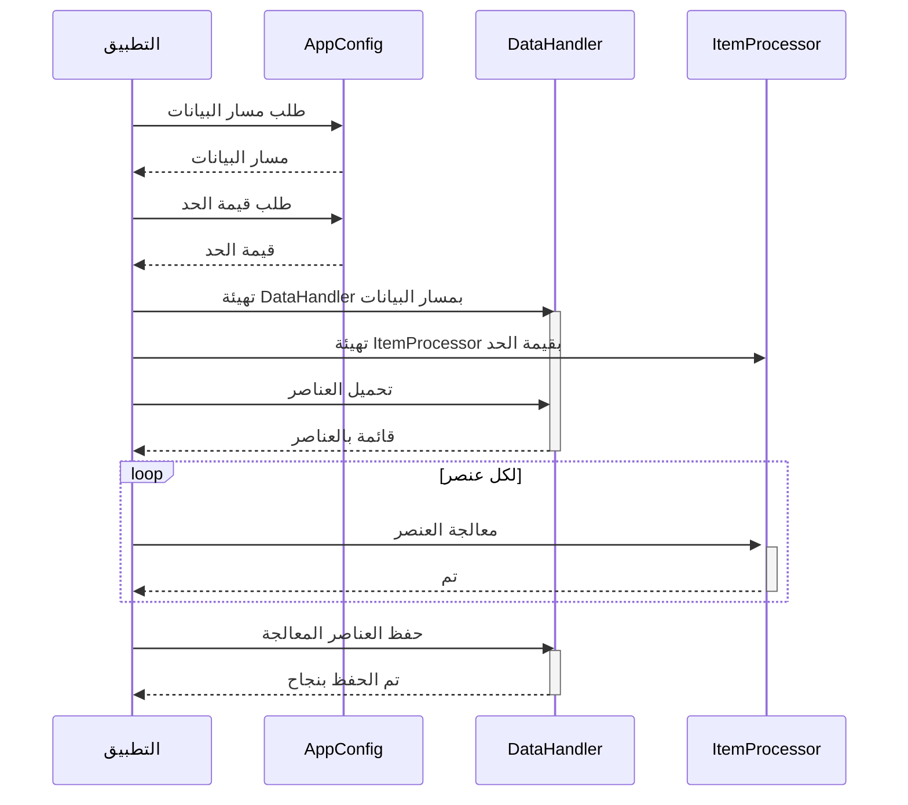

> Previously, we looked at [حزمة سويفت](02_حزمة-سويفت.md).

# Chapter 6: خط أنابيب المعالجة الرئيسي
Let's begin exploring this concept. في هذا الفصل، سنتعرف على خط أنابيب المعالجة الرئيسي في تطبيق `20250704_1347_code-swift-sample-project`. هدفنا هو فهم دوره في تنسيق تدفق البيانات ومعالجتها داخل التطبيق.
**الدافع والهدف**
لماذا نحتاج إلى خط أنابيب معالجة رئيسي؟ تخيل أنك في مصنع. المواد الخام تدخل من جهة، وتمر عبر عدة مراحل من المعالجة (التنظيف، التشكيل، التعبئة، إلخ)، ثم تخرج المنتجات النهائية من الجهة الأخرى. خط أنابيب المعالجة الرئيسي في تطبيقنا يشبه هذا المصنع. إنه يضمن أن البيانات تمر عبر سلسلة من الخطوات المنظمة: التحميل، المعالجة، الحفظ، لإنتاج النتيجة المطلوبة. بدون هذا الخط، ستكون العملية فوضوية وغير فعالة.
**المفاهيم الأساسية**
خط أنابيب المعالجة الرئيسي (`main.swift`) هو نقطة البداية لتنفيذ التطبيق. يتضمن عادةً الخطوات التالية:
1.  **التهيئة (Initialization):** يقوم بتهيئة المكونات الرئيسية مثل معالج البيانات (`DataHandler`) ومعالج العناصر (`ItemProcessor`). يتم ذلك عادةً باستخدام الإعدادات من `AppConfig`.
2.  **تحميل البيانات (Data Loading):** يقوم بتحميل البيانات الأولية التي سيتم معالجتها. في مثالنا، يتم تحميل عناصر (`Item`) من مصدر بيانات.
3.  **معالجة البيانات (Data Processing):** يقوم بتطبيق منطق المعالجة على البيانات المحملة. في مثالنا، يتم معالجة كل عنصر باستخدام `ItemProcessor`.
4.  **حفظ البيانات (Data Saving):** يقوم بحفظ البيانات المعالجة. في مثالنا، يتم حفظ العناصر المعالجة مرة أخرى إلى مصدر البيانات.
5.  **معالجة الأخطاء (Error Handling):** يتعامل مع أي أخطاء قد تحدث أثناء العملية.
**الاستخدام وكيفية العمل**
الدالة `runProcessingPipeline()` في الملف `main.swift` هي التي تنفذ خط الأنابيب بالكامل. تقوم بتهيئة المكونات، وتحميل البيانات، ومعالجتها، وحفظها. إذا حدث أي خطأ أثناء أي من هذه الخطوات، فإنه يتعامل معه بشكل مناسب.
**أمثلة من التعليمات البرمجية**
هذا مثال مبسط للدالة `runProcessingPipeline()`:
```swift
// Sources/SampleProject2/main.swift
import Foundation
/// Executes the main data processing pipeline.
func runProcessingPipeline() {
    print("Starting Sample Project 2 processing pipeline...")
    do {
        // 1. Initialize components using configuration
        let dataPath = AppConfig.getDataPath()  // تهيئة مسار البيانات
        let threshold = AppConfig.getThreshold() // تهيئة قيمة الحد
        let dataHandler = DataHandler(dataSourcePath: dataPath) // تهيئة معالج البيانات
        let itemProcessor = ItemProcessor(threshold: threshold) // تهيئة معالج العناصر
        // 2. Load data
        let itemsToProcess = dataHandler.loadItems() // تحميل البيانات
        guard !itemsToProcess.isEmpty else {
            print("No items loaded. Exiting pipeline.")
            return
        }
        print("Successfully loaded \(itemsToProcess.count) items.")
        // 3. Process data items
        for item in itemsToProcess {
            print("Passing item to processor: \(item)")
            _ = itemProcessor.processItem(item: item) // معالجة كل عنصر
        }
        // 4. Save processed data
        let saveSuccess = dataHandler.saveItems(items: itemsToProcess) // حفظ البيانات المعالجة
        if saveSuccess {
            print("Processed items saved successfully.")
        } else {
            print("Failed to save processed items.")
        }
    } catch {
        // Swift's structured error handling
        print("A critical error occurred: \(error.localizedDescription)")
    }
    print("Sample Project 2 processing pipeline finished.")
}
// Run the main function
runProcessingPipeline()
```
يوضح هذا الكود كيف يتم تهيئة المكونات، وتحميل البيانات، ومعالجتها، وحفظها. لاحظ استخدام `AppConfig` للحصول على الإعدادات، و `DataHandler` لتحميل وحفظ البيانات، و `ItemProcessor` لمعالجة العناصر.

هذا الرسم التوضيحي يوضح تسلسل العمليات في خط أنابيب المعالجة. يوضح كيف يتفاعل التطبيق مع المكونات الأخرى لتحميل البيانات ومعالجتها وحفظها.
**العلاقات والربط التشعبي**
يرتبط هذا الفصل ارتباطًا وثيقًا بـ [إعدادات التطبيق](02_إعدادات-التطبيق.md) حيث يتم تحديد الإعدادات المستخدمة في خط الأنابيب. كما أنه يعتمد على [معالج البيانات](04_معالج-البيانات.md) لتحميل البيانات وحفظها، وعلى [معالج العناصر](05_معالج-العناصر.md) لمعالجة العناصر الفردية. وأيضا [نموذج العنصر](03_نموذج-العنصر.md) الذي يصف كيفية تمثيل البيانات.
**الخلاصة**
خط أنابيب المعالجة الرئيسي هو العمود الفقري لتطبيقنا. إنه يضمن أن البيانات تمر عبر سلسلة من الخطوات المنظمة من البداية إلى النهاية. من خلال فهم كيفية عمل خط الأنابيب، يمكنك فهم كيفية عمل التطبيق بأكمله.
This concludes our look at this topic.

> Next, we will examine [معالج البيانات](04_معالج-البيانات.md).


---

*Generated by [SourceLens AI](https://github.com/openXFlow/sourceLensAI) using LLM: `gemini` (cloud) - model: `gemini-2.0-flash` | Language Profile: `Python`*